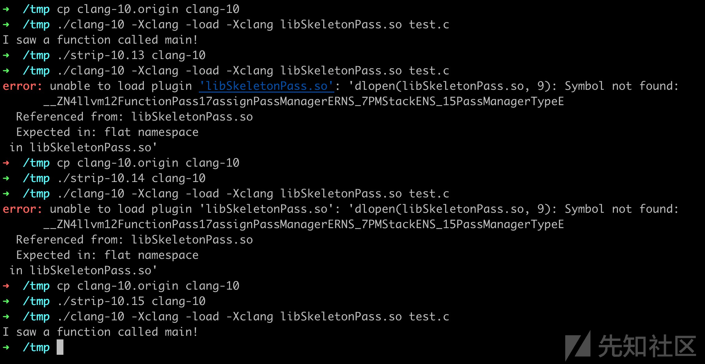

> 转载 : https://xz.aliyun.com/t/6643

关键词：
* 不需要编译llvm
* 仅依赖NDK，不需要额外的其他环境
* 不会遇到配置引起的符号NotFound问题
* 不污染NDK
<!-- TOC -->

- [一、背景介绍](#一背景介绍)
- [二、使用NDK的环境编译一个pass](#二使用ndk的环境编译一个pass)
- [三、使用NDK的环境加载一个pass](#三使用ndk的环境加载一个pass)
- [四、当我们来到macOS上](#四当我们来到macos上)
- [五、当我们来到Windows](#五当我们来到windows)
- [六、其他](#六其他)

<!-- /TOC -->


# 一、背景介绍
现在代码保护技术很多是在llvm上实现的，例如 ollvm 和 hikari，作者给出的实现是将源码混杂在llvm中，这样做非常不优雅。近来越来越多安全工作者都开始接触和研究基于llvm的代码保护，工欲善其事必先利其器，在编译、运行均是本机的环境下，不会出问题，因此本文介绍的是，如何优雅地在NDK中加载pass。

安卓开发者使用混淆技术来保护native代码时，一般有两种选择：

第一个选择是获得git上 ollvm 或 hikari 的代码，编译后，替换掉NDK中原先的toolchain。
这是最不优雅的方式，因为维护起来很麻烦，因为需要编译整个llvm工程，并且对NDK有侵入性，无法保证修改前和修改后NDK的功能不发生变化。

第二个选择是，编译llvm工程，替换掉NDK中原先的toolchain，并且在相同环境下，移植 ollvm 或hikari 为独立的plugin，（移植方案我的github里有写 https://github.com/LeadroyaL/llvm-pass-tutorial ）用编译为插件的形式，动态加载插件。
相比第一个方案，极大降低维护的代价，只编译一个pass即可，但仍然对NDK有侵入性。

这两种方案的共同特点是：都需要编译整个llvm项目，初次部署时要消耗大量的时间和资源，另外在选择llvm版本时，也会纠结适配性的问题（虽然通常不会出现适配问题）

笔者曾经使用的是第二种方案，经过研究，本文提出第三种方案，使用NDK中的环境编译pass并加载pass，优雅程度上来看，有以下的特点：

* 最最重要的，不需要编译llvm项目，节省巨大的时间和资源消耗；
* 其次，不修改原先的NDK运行环境，和原生的NDK是最像的，没有侵入性；
* 再次，上下文均和NDK完全一致，不需要担心符号问题，不需要额外安装软件和环境，有NDK的环境就足矣；

本文演示的环境是：ubuntu18.04（任意linux均可）、ndk-r20（任意NDK版本均可）、cmake（选择较高版本）

# 二、使用NDK的环境编译一个pass
众所周知，编译Pass时需要使用llvm的环境，由于NDK中的llvm环境是破损的，所以开发者一般自己编译一份llvm环境出来，替换掉NDK中的llvm环境，包括我本人之前也是这样处理的，这样做的原因是NDK中的llvm是破损的，因为NDK来自AOSP编译好的toolchain，而AOSP在制作toolchain的过程中是移除了部分文件的。

上文提到，本文的方案是不需要亲自编译llvm的，因此就需要使用NDK中的破损的llvm环境来编译一个pass。

根据对 https://android.googlesource.com/toolchain/llvm_android/ 的阅读和调试，NDK中的llvm缺失的是一部分binary文件、全部静态链接库文件、全部头文件，采用的是静态连接的方式，它的clang是较为独立的文件（它会依赖libc++，因此成为较为独立）。

平时编译Pass时，需要使用cmake并且导入各种cmake相关的环境，通常写如下的配置文件，https://github.com/abenkhadra/llvm-pass-tutorial/blob/master/CMakeLists.txt
```
cmake_minimum_required(VERSION 3.4)

# we need LLVM_HOME in order not automatically set LLVM_DIR
if(NOT DEFINED ENV{LLVM_HOME})
    message(FATAL_ERROR "$LLVM_HOME is not defined")
else ()
    set(ENV{LLVM_DIR} $ENV{LLVM_HOME}/lib/cmake/llvm)
endif()

find_package(LLVM REQUIRED CONFIG)
add_definitions(${LLVM_DEFINITIONS})
include_directories(${LLVM_INCLUDE_DIRS})
link_directories(${LLVM_LIBRARY_DIRS})

add_subdirectory(skeleton)  # Use your pass name here.
```
**幸运的是** ，NDK中的lib/cmake/llvm还在，里面的cmake文件都是原汁原味的的。

**不幸的是** ，由于AOSP在编译toolchain时设置了 `defines['LLVM_LIBDIR_SUFFIX'] = '64'` ，导致find_package的路径应该是 `lib64/cmake/llvm` ，需要稍加修改

之后进行 `mkdir b;cd b;cmake ..`

会报如下的错误：
```
➜  b git:(master) ✗ cmake ..
CMake Error at /home/leadroyal/Android/Sdk/ndk/20.0.5594570/toolchains/llvm/prebuilt/linux-x86_64/lib64/cmake/llvm/LLVMExports.cmake:806 (message):
  The imported target "LLVMDemangle" references the file

     "/home/leadroyal/Android/Sdk/ndk/20.0.5594570/toolchains/llvm/prebuilt/linux-x86_64/lib64/libLLVMDemangle.a"
  but this file does not exist.  Possible reasons include:
  * The file was deleted, renamed, or moved to another location.
  * An install or uninstall procedure did not complete successfully.
  * The installation package was faulty and contained
     "/home/leadroyal/Android/Sdk/ndk/20.0.5594570/toolchains/llvm/prebuilt/linux-x86_64/lib64/cmake/llvm/LLVMExports.cmake"

  but not all the files it references.
Call Stack (most recent call first):
  /home/leadroyal/Android/Sdk/ndk/20.0.5594570/toolchains/llvm/prebuilt/linux-x86_64/lib64/cmake/llvm/LLVMConfig.cmake:173 (include)
  CMakeLists.txt:8 (find_package)

-- Configuring incomplete, errors occurred!
See also "/home/leadroyal/llvm-pass-tutorial/b/CMakeFiles/CMakeOutput.log".
```
因为NDK不含有.a文件，而cmake会检查这些文件，用于静态连接，被认为初始化失败，出错。

看源码对应的位置：
```
# Loop over all imported files and verify that they actually exist
foreach(target ${_IMPORT_CHECK_TARGETS} )
  foreach(file ${_IMPORT_CHECK_FILES_FOR_${target}} )
    if(NOT EXISTS "${file}" )
      message(FATAL_ERROR "The imported target \"${target}\" references the file
   \"${file}\"
but this file does not exist.  Possible reasons include:
* The file was deleted, renamed, or moved to another location.
* An install or uninstall procedure did not complete successfully.
* The installation package was faulty and contained
   \"${CMAKE_CURRENT_LIST_FILE}\"
but not all the files it references.
")
    endif()
  endforeach()
  unset(_IMPORT_CHECK_FILES_FOR_${target})
endforeach()
```
在文件不存在时，报 `message(FATAL_ERROR xxxxxx)`，从而中断编译，但我们本来就是编译动态链接库的，不需要.a文件，所以这里做一个patch，降低log_level，使用WARNING等级。
```
- message(FATAL_ERROR "The imported target \"${target}\" references the file
+ message(WARNING "The imported target \"${target}\" references the file
```
接下来面对第二个问题，之前提到过，NDK中缺失我们需要的头文件，它们本该出现在 `include/llvm` 中，因此这句话失效了
```
include_directories(${LLVM_INCLUDE_DIRS})
```
但我们又不能随便找一堆头文件过来，版本之间可能有变更，万一用到一些配置不一样的头文件，就会出现非预期（例如经常出错的LLVM_ENABLE_ABI_BREAKING_CHECKS配置）

此时的思路是，找到NDK中llvm生成时的那份commit，从中获取include文件，有两个方案

* 第一个方案是找到源码并使用cmake帮我们提取一遍。
* 第二个方案是直接使用aosp提供的prebuilt文件，显然为了方便我们选择后者。
toolchain 在生成时会有一份描述版本信息的文件，在ndk生成时也被拷贝过来了
```
➜  linux-x86_64 cat /home/leadroyal/Android/Sdk/ndk/20.0.5594570/toolchains/llvm/prebuilt/linux-x86_64/AndroidVersion.txt 
8.0.7
based on r346389c
```
**【AOSP相关访问google的前提条件你懂的】**

`r346389c` 就是这份toolchain的唯一标识，它与出现在 https://android.googlesource.com/platform/prebuilts/clang/host/linux-x86/ 中的一系列clang-rxxxx是一回事，由于这个README.md经常被更新，我们需要checkout到对应的tag才可以找到它，https://android.googlesource.com/platform/prebuilts/clang/host/linux-x86/+/refs/tags/ndk-r20。

于是在 https://android.googlesource.com/platform/prebuilts/clang/host/linux-x86/+/refs/tags/ndk-r20/clang-r346389c/include/ 中我们非常轻易就获取到了那份编译时刻的 `include/llvm` 和 `include/llvm-c` 文件，使用点击右上角的 tgz ，有用的只有 `llvm` 和 `llvm-c` ，另外的 `clang` 、`clang-c` 、`lld` 我们用不到我就不下载了。

https://android.googlesource.com/platform/prebuilts/clang/host/linux-x86/+archive/refs/tags/ndk-r20/clang-r346389c/include/llvm.tar.gz

https://android.googlesource.com/platform/prebuilts/clang/host/linux-x86/+archive/refs/tags/ndk-r20/clang-r346389c/include/llvm-c.tar.gz

即可获得到这个目录的压缩包。

mac 对应的目录是
https://android.googlesource.com/platform/prebuilts/clang/host/darwin-x86/+/refs/tags/ndk-r20/clang-r346389c/include/

如果可以接受NDK被污染（我使用的是这个方案），可以将它放到NDK的toolchain中，这样就可以继续使用 `${LLVM_INCLUDE_DIRS} `这个变量；

如果不能接受NDK被污染，就随便放个目录，使用 `include_directories(/path/to/clang-r346389c/include)`

比如放在NDK里的include里，是这个样子（c++目录本来就有）
```
➜  include lsa
total 5.4M
drwxr-xr-x  8 leadroyal leadroyal 4.0K Oct 21 02:13 .
drwxr-xr-x 15 leadroyal leadroyal 4.0K Oct 20 23:16 ..
drwxr-xr-x  4 leadroyal leadroyal 4.0K Oct 21 02:12 c++
drwxr-xr-x 33 leadroyal leadroyal 4.0K Oct 21 02:12 llvm
drwxr-xr-x  3 leadroyal leadroyal 4.0K Oct 21 02:12 llvm-c
```
然后有几率遇到C++版本的问题，llvm10以上需要添加
```
set(CMAKE_CXX_STANDARD 14)
```
在这在情况下使用的CMakeLists.txt最终是：
```
cmake_minimum_required(VERSION 3.4)
if(NOT DEFINED ENV{LLVM_HOME})
    message(FATAL_ERROR "$LLVM_HOME is not defined")
endif()
if(NOT DEFINED ENV{LLVM_DIR})
    set(ENV{LLVM_DIR} $ENV{LLVM_HOME}/lib64/cmake/llvm)
endif()
find_package(LLVM REQUIRED CONFIG)
add_definitions(${LLVM_DEFINITIONS})
include_directories(${LLVM_INCLUDE_DIRS})

set(CMAKE_CXX_STANDARD 14)
add_subdirectory(skeleton)  # Use your pass name here.
```
修复完include问题后，就可以舒舒服服地使用cmake来生成demo了，如下：
```
export LLVM_HOME=/home/leadroyal/Android/Sdk/ndk/20.0.5594570/toolchains/llvm/prebuilt/linux-x86_64
➜  b git:(master) ✗ cmake ..       
-- The C compiler identification is GNU 7.4.0
-- The CXX compiler identification is GNU 7.4.0
-- Check for working C compiler: /usr/bin/cc
-- Check for working C compiler: /usr/bin/cc -- works
-- Detecting C compiler ABI info
-- Detecting C compiler ABI info - done
-- Detecting C compile features
-- Detecting C compile features - done
-- Check for working CXX compiler: /usr/bin/c++
-- Check for working CXX compiler: /usr/bin/c++ -- works
-- Detecting CXX compiler ABI info
-- Detecting CXX compiler ABI info - done
-- Detecting CXX compile features
-- Detecting CXX compile features - done
-- Configuring done
-- Generating done
-- Build files have been written to: /home/leadroyal/llvm-pass-tutorial/b
➜  b git:(master) ✗ cmake --build .                    
Scanning dependencies of target SkeletonPass
[ 50%] Building CXX object skeleton/CMakeFiles/SkeletonPass.dir/Skeleton.cpp.o
[100%] Linking CXX shared module libSkeletonPass.so
[100%] Built target SkeletonPass
```

# 三、使用NDK的环境加载一个pass
编译部分完成了，接下来是加载部分，我们随便找一个android native项目，修改build.gradle中的flag
```
externalNativeBuild {
    cmake {
        cppFlags "-Xclang -load -Xclang /home/leadroyal/llvm-pass-tutorial/b/skeleton/libSkeletonPass.so"
    }
}
```
`gradle build` 命令后，可能会如下报错（当编译pass时使用了GNU系列的c++时候会遇到，常见于ubuntu，因为NDK使用的是llvm系列的c++）
如果出现如下报错的话，解决方案如下，如果没有报错，请跳过这部分

通常被搜索的关键词是：`_ZNK4llvm12FunctionPass17createPrinterPassERNS_11raw_ostreamERKNSt7__cxx1112basic_stringIcSt11char_traitsIcESaIcEEE`

**========GNU使用兼容libc++的方案（没遇到可以跳过） =======**
```
./gradlew build
  error: unable to load plugin '/home/leadroyal/llvm-pass-tutorial/b/skeleton/libSkeletonPass.so': '/home/leadroyal/llvm-pass-tutorial/b/skeleton/libSkeletonPass.so: undefined symbol: _ZNK4llvm12FunctionPass17createPrinterPassERNS_11raw_ostreamERKNSt7__cxx1112basic_stringIcSt11char_traitsIcESaIcEEE'
```
很奇怪，提醒这个符号找不到，但是我们编译时能找到、连接时找不到，就很奇怪。

demangle一下：
```
c++filt _ZNK4llvm12FunctionPass17createPrinterPassERNS_11raw_ostreamERKNSt7__cxx1112basic_stringIcSt11char_traitsIcESaIcEEE
llvm::FunctionPass::createPrinterPass(llvm::raw_ostream&, std::__cxx11::basic_string<char, std::char_traits<char>, std::allocator<char> > const&) const
```
去NDK的相关目录下grep，发现了该符号：
```
➜  lib64 pwd
/home/leadroyal/Android/Sdk/ndk/20.0.5594570/toolchains/llvm/prebuilt/linux-x86_64/lib64
➜  lib64 strings * | grep _ZNK4llvm12FunctionPass17createPrinterPass
strings: Warning: 'clang' is a directory
strings: Warning: 'cmake' is a directory
_ZNK4llvm12FunctionPass17createPrinterPassERNS_11raw_ostreamERKNSt3__112basic_stringIcNS3_11char_traitsIcEENS3_9allocatorIcEEEE
```
demangle一下：
```
c++filt _ZNK4llvm12FunctionPass17createPrinterPassERNS_11raw_ostreamERKNSt3__112basic_stringIcNS3_11char_traitsIcEENS3_9allocatorIcEEEE
llvm::FunctionPass::createPrinterPass(llvm::raw_ostream&, std::__1::basic_string<char, std::__1::char_traits<char>, std::__1::allocator<char> > const&) const
```
对比一下二者，注意一个细节，参数命名空间不一致：
NDK里的叫 `std::__1::basic_string` ，我们编出来的叫 `std::__cxx11::basic_string`

NDK里的叫 `std::__1::char_traits` ，我们编出来的叫 `std::char_traits`

如果是老司机的话，一眼就知道它们使用了不同版本的c++，最初的源码是一致的，解决起来不难。

用 `__cxx11` 的叫 `libc++`，用 `__1` 叫 `libstdc++`。

解决方案是在连接时使用 `libc++` ，`set(CMAKE_CXX_FLAGS "${CMAKE_CXX_FLAGS} -stdlib=libc++")` ，但由于ubuntu装的一般是gcc系列，而gcc系列是没有libc++的，编译会crash如下：
```
Using built-in specs.
COLLECT_GCC=/usr/bin/c++
OFFLOAD_TARGET_NAMES=nvptx-none
OFFLOAD_TARGET_DEFAULT=1
c++: error: unrecognized command line option ‘-stdlib=libc++’
```
gcc没有libc++，只有llvm系列拥有libc++，所以需要将编译器切换到clang。

重申我们之前的原则：不需要安装额外的软件，恰好NDK提供了一个clang给我们，为了方便我就用它提供的了（毕竟安装一个clang也挺麻烦的）

再使用libc++的头文件，也直接从对应的地方下载，但千万别和NDK的放在一起，因为 `libc++` 的 `c++/v11` 和NDK的 `c++/4.9.x`，放一起会冲突
https://android.googlesource.com/platform/prebuilts/clang/host/linux-x86/+archive/refs/tags/ndk-r20/clang-r346389c/include/c++.tar.gz

我把libc++的头文件放在 `/home/leadroyal/Android/Sdk/r346389c/include/` 下

放好后对它进行include，在这在情况下使用的CMakeLists.txt最终是：
```
cmake_minimum_required(VERSION 3.4)
set(CMAKE_C_COMPILER /home/leadroyal/Android/Sdk/ndk/20.0.5594570/toolchains/llvm/prebuilt/linux-x86_64/bin/clang)
set(CMAKE_CXX_COMPILER /home/leadroyal/Android/Sdk/ndk/20.0.5594570/toolchains/llvm/prebuilt/linux-x86_64/bin/clang++)
if(NOT DEFINED ENV{LLVM_HOME})
    message(FATAL_ERROR "$LLVM_HOME is not defined")
endif()
if(NOT DEFINED ENV{LLVM_DIR})
    set(ENV{LLVM_DIR} $ENV{LLVM_HOME}/lib64/cmake/llvm)
endif()
find_package(LLVM REQUIRED CONFIG)
add_definitions(${LLVM_DEFINITIONS})
include_directories(${LLVM_INCLUDE_DIRS})
include_directories(/home/leadroyal/Android/Sdk/r346389c/include/c++/v1)

set(CMAKE_CXX_STANDARD 14)
set(CMAKE_CXX_FLAGS "${CMAKE_CXX_FLAGS} -stdlib=libc++")
add_subdirectory(skeleton)  # Use your pass name here.
```
我们使用gcc和clang编译两份pass出来，对比一下前后的区别：

使用GCC编译出来的文件
```
➜  b git:(master) ✗ ldd skeleton/libSkeletonPass.so
    linux-vdso.so.1 (0x00007ffc3c3d5000)
    libstdc++.so.6 => /usr/lib/x86_64-linux-gnu/libstdc++.so.6 (0x00007ff114c76000)
    libgcc_s.so.1 => /lib/x86_64-linux-gnu/libgcc_s.so.1 (0x00007ff114a5e000)
    libc.so.6 => /lib/x86_64-linux-gnu/libc.so.6 (0x00007ff11466d000)
    libm.so.6 => /lib/x86_64-linux-gnu/libm.so.6 (0x00007ff1142cf000)
    /lib64/ld-linux-x86-64.so.2 (0x00007ff115205000)
```
使用clang编译出来的文件
```
➜  b git:(master) ✗ ldd skeleton/libSkeletonPass.so
    linux-vdso.so.1 (0x00007ffc369e2000)
    libc++.so.1 => not found
    libm.so.6 => /lib/x86_64-linux-gnu/libm.so.6 (0x00007f002042c000)
    libgcc_s.so.1 => /lib/x86_64-linux-gnu/libgcc_s.so.1 (0x00007f0020214000)
    libc.so.6 => /lib/x86_64-linux-gnu/libc.so.6 (0x00007f001fe23000)
    /lib64/ld-linux-x86-64.so.2 (0x00007f00209d3000)
```
虽然后者提醒libc++.so.1找不到，感觉很诧异，于是去查ndk clang的依赖
```
➜  bin ldd /home/leadroyal/Android/Sdk/ndk/20.0.5594570/toolchains/llvm/prebuilt/linux-x86_64/bin/clang
    linux-vdso.so.1 (0x00007ffc99bc7000)
    libpthread.so.0 => /lib/x86_64-linux-gnu/libpthread.so.0 (0x00007f3bb9d24000)
    libz.so.1 => /lib/x86_64-linux-gnu/libz.so.1 (0x00007f3bb9b07000)
    librt.so.1 => /lib/x86_64-linux-gnu/librt.so.1 (0x00007f3bb98ff000)
    libdl.so.2 => /lib/x86_64-linux-gnu/libdl.so.2 (0x00007f3bb96fb000)
    libm.so.6 => /lib/x86_64-linux-gnu/libm.so.6 (0x00007f3bb935d000)
    libc++.so.1 => /home/leadroyal/Android/Sdk/ndk/20.0.5594570/toolchains/llvm/prebuilt/linux-x86_64/bin/../lib64/libc++.so.1 (0x00007f3bba07e000)
    libgcc_s.so.1 => /lib/x86_64-linux-gnu/libgcc_s.so.1 (0x00007f3bb9145000)
    libc.so.6 => /lib/x86_64-linux-gnu/libc.so.6 (0x00007f3bb8d54000)
    /lib64/ld-linux-x86-64.so.2 (0x00007f3bb9f43000)
```
发现在NDK里确实存在libc++.so.1环境，问题解决，我们回归主题，最后一步，使用NDK加载它！

========GNU使用兼容libc++的方案 end =======
我们先用简单的c文件验证我们的pass，没有任何问题
```
➜  /tmp cat test.c
#include<stdio.h>
int main(){
printf("HelloWorld\n");
return 0;
}
➜  /tmp /home/leadroyal/Android/Sdk/ndk/20.0.5594570/toolchains/llvm/prebuilt/linux-x86_64/bin/clang -Xclang -load -Xclang /home/leadroyal/llvm-pass-tutorial/b/skeleton/libSkeletonPass.so test.c 
I saw a function called main!
➜  /tmp ./a.out 
HelloWorld
```
最后一步，见证奇迹的时刻！
```
➜  MyApplication ./gradlew clean build
............
> Task :app:externalNativeBuildDebug
Build native-lib_armeabi-v7a
ninja: Entering directory `/home/leadroyal/AndroidStudioProjects/MyApplication/app/.cxx/cmake/debug/armeabi-v7a'
[1/2] Building CXX object CMakeFiles/native-lib.dir/native-lib.cpp.o
I saw a function called Java_com_example_myapplication_MainActivity_stringFromJNI!
I saw a function called _ZNSt6__ndk112basic_stringIcNS_11char_traitsIcEENS_9allocatorIcEEEC2EPKc!
I saw a function called _ZN7_JNIEnv12NewStringUTFEPKc!
I saw a function called _ZNKSt6__ndk112basic_stringIcNS_11char_traitsIcEENS_9allocatorIcEEE5c_strEv!
I saw a function called _ZNSt6__ndk112basic_stringIcNS_11char_traitsIcEENS_9allocatorIcEEED2Ev!
```
泪流满面！我们终于成功编译并且加载了这个Pass!

# 四、当我们来到macOS上
同Linux一样，先修复cmake文件，再下载include/llvm和incude/llvm-c，因为macOS默认就是clang了，所以不会存在libstdc++和libc++冲突的问题，编译过程全程没有任何障碍。

但是在加载时却遇到了如下的错误，也是在网上经常被贴出来问问题的报错
```
➜  /tmp $ANDROID_NDK/20.0.5594570/toolchains/llvm/prebuilt/darwin-x86_64/bin/clang -Xclang -load -Xclang /home/leadroyal/llvm-pass-tutorial/b/skeleton/libSkeletonPass.so test.c
error: unable to load plugin '/home/leadroyal/llvm-pass-tutorial/b/skeleton/libSkeletonPass.so':
      'dlopen(/home/leadroyal/llvm-pass-tutorial/b/skeleton/libSkeletonPass.so, 9): Symbol not found:
      __ZN4llvm12FunctionPass17assignPassManagerERNS_7PMStackENS_15PassManagerTypeE
  Referenced from: /home/leadroyal/llvm-pass-tutorial/b/skeleton/libSkeletonPass.so
  Expected in: flat namespace
 in /home/leadroyal/llvm-pass-tutorial/b/skeleton/libSkeletonPass.so'
```
demangle一下
```
c++filt __ZN4llvm12FunctionPass17assignPassManagerERNS_7PMStackENS_15PassManagerTypeE
llvm::FunctionPass::assignPassManager(llvm::PMStack&, llvm::PassManagerType)
```
这个符号是llvm中导出的符号，供开发者调用，libSkeletonPass.so需要该符号，但是clang的进程空间里没有这个符号。

经过仔细对照，发现不仅仅缺失这一个符号，缺失的是一大堆相关的符号，而且都是较为基础的符号，只是最先被寻找的是这个就停下来了。
【先剧透一下，这个符号缺失是apple基础工具的bug，但是google没有发现这个bug，已报告https://issuetracker.google.com/issues/143160164】

这时有另一个线索：我们自己编译出来的pass是可以正常加载pass的，一定是AOSP动了手脚，这里省去大量的diff时间，直接说结果。

记作X：使用llvm默认配置（与Android无关）编译出来的clang，可以找到符号

记作Y：使用AOSP得到的stage2-install/bin/clang，可以找到符号

记作Z：使用AOSP得到的toolchain中的clang，无法找到符号

X/Y 可以说明， https://android.googlesource.com/toolchain/llvm_android/ 中对llvm的编译配置，是不影响符号的
Y/Z 可以说明，strip前和strip后会导致符号缺失。在ubuntu上符号仍然被保留，在macOS上符号会消失。

代码如下 https://android.googlesource.com/toolchain/llvm_android/+/refs/heads/master/build.py
```
for bin_filename in os.listdir(bin_dir):
        binary = os.path.join(bin_dir, bin_filename)
        if os.path.isfile(binary):
            if bin_filename not in necessary_bin_files:
                remove(binary)
            elif strip and bin_filename not in script_bins:
                check_call(['strip', binary])
```
之后我将X进行 `/usr/bin/strip` ，发现仍然可以加载pass，这时就开始犯晕，开始缺乏思路。

于是出现了另一个可能引发问题的原因：我编译X、strip-X都是在CommandLineTools 10.15上完成的，但编译Y、strip-Y是在CommandLineTools 10.13上完成的，二者的strip不完全一致！

经过最后一个实验，发现低版本的/usr/bin/strip会错误地移除掉很多符号，导致加载失败，日志如下，我分别用10.13/10.14/10.15的strip去处理stage2-install/bin/clang文件，发现10.13/14处理出来的文件是错误的。



至此，真相大白，失败的原因是：AOSP在编译NDK时触发了macOS自带的strip的bug。

最后的挣扎：NDK中存在一个完备的、拥有符号的文件 LLVM.dylib 中的，如果我们让libSkeleton.so依赖它，从LLVM.dylib中获取符号会怎样？
最终结果是，关键变量PassManager在NDK-clang中是没有符号的，虽然在LLVM.dylib中可以找到，但二者已经完全不是同一个instance了。

因此，macOS宣告失败，等将来AOSP把这个bug修掉，就可以复用史上最优雅的方法了。

# 五、当我们来到Windows
对不起，能力有限告辞。。。

# 六、其他
不想看到的事情：

根据这次commit，开发者建议砍掉toolchain里的.cmake文件，因为作者已经砍掉.a文件了，防止.cmake加载失败引起的误会。我也是弄完这一系列才看到这条commit，于是想尽自己的绵薄之力回滚一下，希望能成功吧。

https://android.googlesource.com/toolchain/llvm_android/+/5e612035111cb9f4abad43697350d4ea644fce33
https://android-review.googlesource.com/c/toolchain/llvm_android/+/1139155
以及，开发者建议砍掉ndk里的.cmake文件，体现在这次commit里

https://android-review.googlesource.com/c/platform/ndk/+/1137192
反正ndk-r21肯定是没有cmake了，到时候就从toolchain里下载回来吧。

本文介绍了一种非常优雅的NDK加载Pass方案，目前从未听说国内外有人使用该方案，感觉非常有意义，在此分享出来，希望更多人可以用到它、共同推动安全行业的发展，完结撒花~

参考链接：https://leadroyal.cn