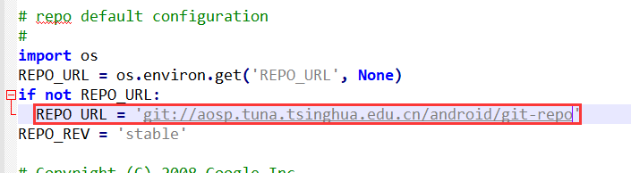
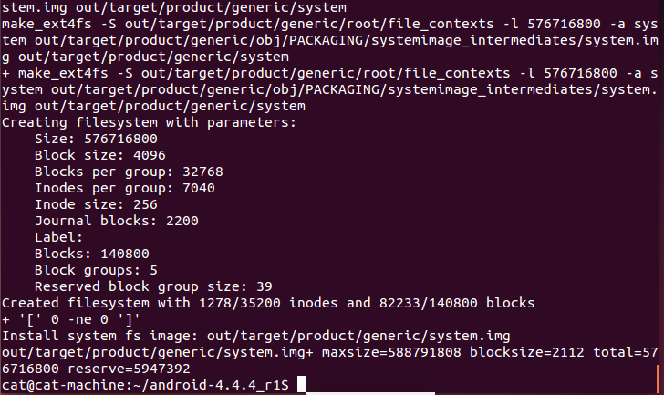

<!-- TOC -->

- [安卓4.4系统源码编译](#安卓44系统源码编译)
  - [一. 安装Java JDK 6环境](#一-安装java-jdk-6环境)
    - [1. 复制JDK到安装目录](#1-复制jdk到安装目录)
    - [2. 切换到桌面，复制安卓文件到安装目录](#2-切换到桌面复制安卓文件到安装目录)
    - [3. 安装jdk](#3-安装jdk)
    - [4. 配置环境变量](#4-配置环境变量)
  - [二、安装依赖库](#二安装依赖库)
  - [三、降级make](#三降级make)
  - [四、源码下载](#四源码下载)
  - [五、下载驱动](#五下载驱动)
  - [六、开始编译](#六开始编译)
  - [七、刷入目标机器](#七刷入目标机器)
  - [八、遇到的一些坑](#八遇到的一些坑)
    - [1. 编译过程种突然中止，怎么都找不到原因](#1-编译过程种突然中止怎么都找不到原因)
    - [2. adb和fastboot都没有权限](#2-adb和fastboot都没有权限)
    - [3. adb以及fastboot运行后提示需要安装](#3-adb以及fastboot运行后提示需要安装)
    - [4. 刷机后进不了系统，可能是fastboot版本过高的原因。](#4-刷机后进不了系统可能是fastboot版本过高的原因)

<!-- /TOC -->

# 安卓4.4系统源码编译

## 一. 安装Java JDK 6环境

### 1. 复制JDK到安装目录

假设JDK安装文件放在桌面，我们要安装的目录为：/usr/local/Java。 
我们先在 /usr/local/目录下创建java文件夹：
```
ckcat@ubuntu-machine:~$ cd /usr/local
ckcat@ubuntu-machine:/usr/local$ ls
bin  etc  games  include  lib  man  sbin  share  src
ckcat@ubuntu-machine:/usr/local$ sudo mkdir java
ckcat@ubuntu-machine:/usr/local$ ls
bin  etc  games  include  java  lib  man  sbin  share  src
```
### 2. 切换到桌面，复制安卓文件到安装目录
```
ckcat@ubuntu-machine:~$ sudo cp jdk-6u45-linux-x64.bin /usr/local/java
```

### 3. 安装jdk
```
ckcat@ubuntu-machine:~$ cd /usr/local
ckcat@ubuntu-machine:/usr/local$ ls
bin  etc  games  include  java  lib  man  sbin  share  src
ckcat@ubuntu-machine:/usr/local$ cd java/
ckcat@ubuntu-machine:/usr/local/java$ sudo chmod 777 jdk-6u45-linux-x64.bin 
ckcat@ubuntu-machine:/usr/local/java$ sudo ./jdk-6u45-linux-x64.bin  
```
### 4. 配置环境变量

1. 打开/ect/profile 文件
```
sudo gedit /etc/profile
```

2. 添加下面的环境变量，要根据安装目录修改，并保存。
```
# Java Environment
export JAVA_HOME=/usr/local/java/jdk1.6.0_45  
export JRE_HOME=/usr/local/java/jdk1.6.0_45/jre  
export CLASSPATH=.:$JAVA_HOME/lib:$JRE_HOME/lib:$CLASSPATH  
export PATH=$JAVA_HOME/bin:$JRE_HOME/bin:$JAVA_HOME:$PATH   
```
3. 重启后使其生效并进行验证 
也可使用下面的命令不重启使其生效，不过只针对当前域有效。
```
ckcat@ubuntu-machine:/usr/local/java$ source /etc/profile
ckcat@ubuntu-machine:/usr/local/java$ 
```
输入java -version 进行验证，成功后如下：
```
ckcat@ubuntu-machine:~$ java -version
java version "1.6.0_45"
Java(TM) SE Runtime Environment (build 1.6.0_45-b06)
Java HotSpot(TM) 64-Bit Server VM (build 20.45-b01, mixed mode)
```

4. 设置默认的Java版本
```
sudo update-alternatives --config java
sudo update-alternatives --config javac
```


## 二、安装依赖库
```
sudo apt-get install -y git flex bison gperf build-essential libncurses5-dev:i386 
sudo apt-get install libx11-dev:i386 libreadline6-dev:i386 libgl1-mesa-dev g++-multilib 
sudo apt-get install tofrodos python-markdown libxml2-utils xsltproc zlib1g-dev:i386 
sudo apt-get install dpkg-dev libsdl1.2-dev libesd0-dev
sudo apt-get install git-core gnupg flex bison gperf build-essential  
sudo apt-get install zip curl zlib1g-dev gcc-multilib g++-multilib 
sudo apt-get install libc6-dev-i386 
sudo apt-get install lib32ncurses5-dev x11proto-core-dev libx11-dev 
sudo apt-get install lib32z-dev ccache
sudo apt-get install libgl1-mesa-dev libxml2-utils xsltproc unzip m4
```
Ubuntu 16.04以上的系统请务必使用上面的依赖，Ubuntu 16.04需要的依赖和Ubuntu 14.04所需要的依赖是不同的。
以下是Ubuntu 14.04所需要的依赖：
```
sudo apt-get install git-core gnupg flex bison gperf build-essential \
    zip curl zlib1g-dev gcc-multilib g++-multilib libc6-dev-i386 \
    lib32ncurses5-dev x11proto-core-dev libx11-dev lib32z-dev ccache \
    libgl1-mesa-dev libxml2-utils xsltproc unzip
```

## 三、降级make
编译android4.4.4需要make 3.81或3.82 ，所以要降级make。
> 下载  make-3.82.tar.gz

> ftp://ftp.gnu.org/gnu/make/
```
tar -zxvf make-3.82.tar.gz
cd make-3.82
sudo ./configure
sudo make
sudo make install
```
如果出现错误，可以按如下方式修改源码：
```
diff --git a/glob/glob.c b/glob/glob.c
index f3911bc..e4d551e 100644
--- a/glob/glob.c
+++ b/glob/glob.c
@@ -208,8 +208,6 @@ my_realloc (p, n)
    #endif /* __GNU_LIBRARY__ || __DJGPP__ */


-#if !defined __alloca && !defined __GNU_LIBRARY__
-
    # ifdef    __GNUC__
    #  undef alloca
    #  define alloca(n)        __builtin_alloca (n)
@@ -229,8 +227,6 @@ extern char *alloca ();

    # define __alloca  alloca

-#endif
-
    #ifndef __GNU_LIBRARY__
    # define __stat stat
    # ifdef STAT_MACROS_BROKEN
```
## 四、源码下载
1. 使用已经打包好的源码
[下载地址](https://testerhome.com/topics/2229)

2. 使用清华源下载
 * 使用curl下载repo到指定的目录
 `curl https://storage-googleapis.lug.ustc.edu.cn/git-repo-downloads/repo > ~/AOSP/repo`
 * 修改repo文件：是以哦那个清华源下载
 `sudo gedit ~/AOSP/repo`
 设置REPO_URL 为：`git://aosp.tuna.tsinghua.edu.cn/android/git-repo`

    

 * 添加权限
     `chmod a+x ~/AOSP/repo`
 * 初始化仓库
 `repo init -u git://aosp.tuna.tsinghua.edu.cn/android/platform/manifest -b android-4.4.4_r1`
 后面 -b 参数 是取的源码中的一个分支，较稳定的版本，而不加 -b 则会下载Android主线上正在开发中的最新代码.可以参看[Android版本与代号对应关系 ](https://source.android.com/source/build-numbers)。
 如果提示需要验证信息，使用命令：
 `git config --global user.email "your email address"`
 `git config --global user.name "your name"`
 * 开始漫长的下载
 `repo sync`
 如果中途中断，重新执行repo sync即可。以后需要更新代码的话，同样运行这个命令即可。

## 五、下载驱动
  * 由于我使用的是NEXUS 5 设备，并且打算编译Android 4.4.4_r1版本，所以去官方 Nexus 和 Pixel 设备的二进制驱动下载页面：https://developers.google.com/android/drivers 下载了相应的二进制驱动。
  * 将三个压缩包解压出的自解压脚本放在源码树的根目录下并运行将会得到一个`Vendor`目录 。

## 六、开始编译

  * 命令删除所有以前编译操作的已有输出：
  `make clobber`

  * 使用` build`目录中的`envsetup.sh `脚本初始化环境
  `source build/envsetup.sh`
 
  * 使用lunch选择要编译的目标
  `lunch`
  选择你想编译的版本，这里我选的是 aosp_hammerhead-userdebug,所以输入13，

  * 编译代码
  `make -j4`
  -j4的意思是4个线程同步编译
  关于cpu个数，可以用下面命令查看:
  `cat /proc/cpuinfo | grep processor`
  经过漫长的等待后就编译完成界面，如果中途出错就根据错误信息谷歌一下或者重新编译。


## 七、刷入目标机器
1. 手机开启调试模式，连上电脑，执行`adb devices`命令将会显示连接的机器。


2. 以fastboot模式启动手机，然后进行刷机
    `adb reboot bootloader`
    
3. 刷机
    `fastboot -w flashall`

至此整个编译源码并刷机的过成圆满结束了。

## 八、遇到的一些坑
### 1. 编译过程种突然中止，怎么都找不到原因
 * 可能是给的内存太小，重新编译几次就好了。


### 2. adb和fastboot都没有权限

> 可以参考https://github.com/snowdream/51-android

### 3. adb以及fastboot运行后提示需要安装
此时可以到android源码目录运行` build`目录中的`envsetup.sh `脚本初始化环境
    `source build/envsetup.sh` 并 `lunch` 。


### 4. 刷机后进不了系统，可能是fastboot版本过高的原因。

**参考：**

[xposed源码编译与集成](https://www.jianshu.com/p/6471bab49cb1)

[记一次安卓系统源码下载过程](https://bbs.pediy.com/thread-218366.htm)

[记一次安卓系统源码编译刷机过程](https://bbs.pediy.com/thread-218513.htm)

[记一次安卓内核源码编译刷机过程(修改反调试标志位)](https://bbs.pediy.com/thread-219233.htm)
