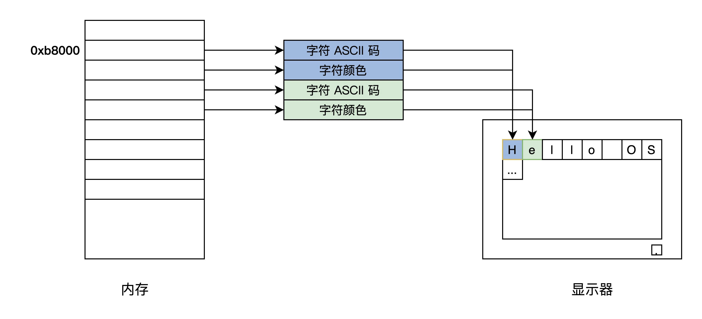
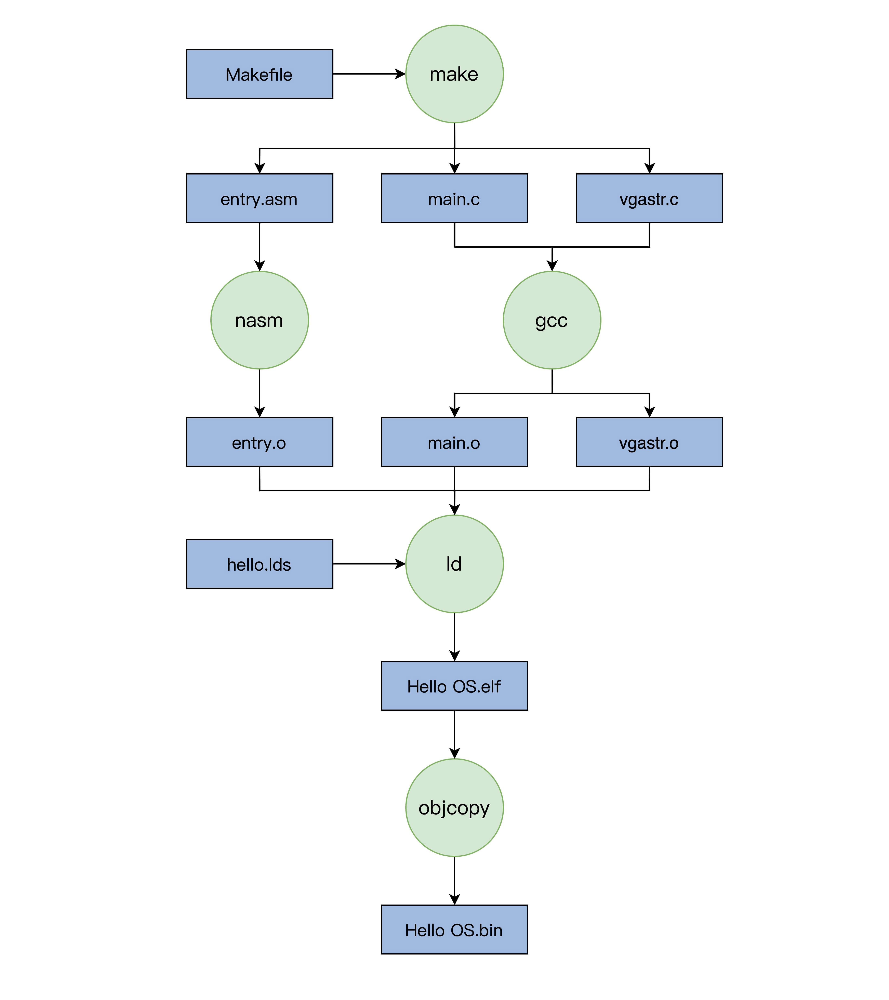
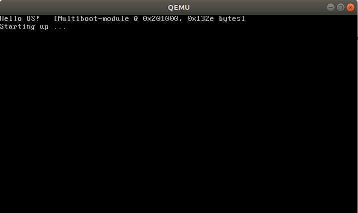
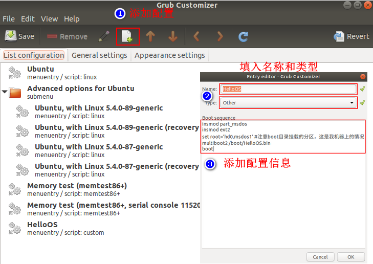
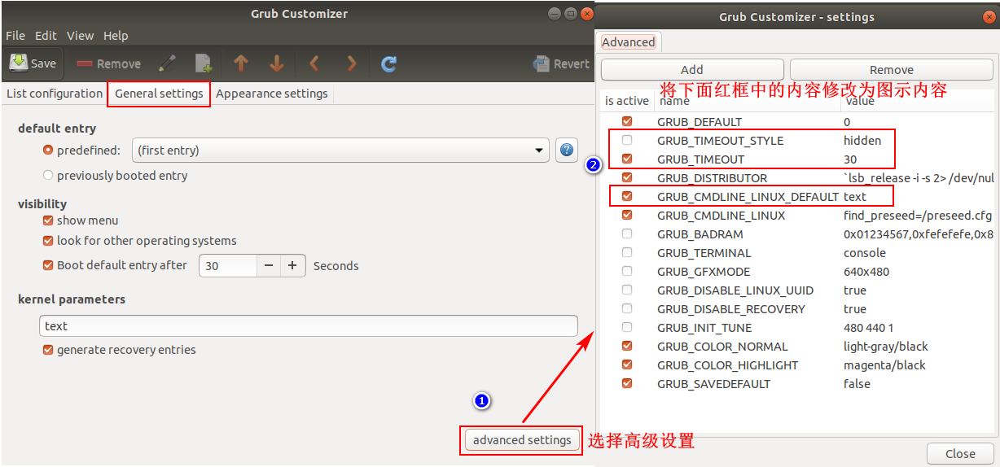
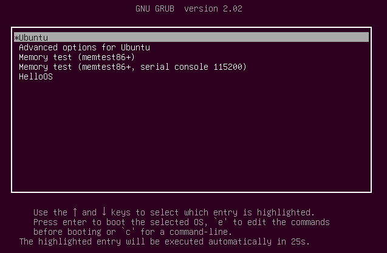

# HelloOS
这里所有的测试环境都在 Ubuntu18.04 虚拟机中。

## HelloOS 构成
这里使用的是第二讲的[代码](https://github.com/CKCat/learnOS/tree/master/lesson02/HelloOS)，代码结构如下所示：
```bash
➜  HelloOS tree
.
├── entry.asm
├── floppy.img
├── hello.lds
├── main.c
├── Makefile
├── vgastr.c
└── vgastr.h
```
- `entry.asm` 为供 grub 调用的引导程序，用于设置 CPU 工作模式与工作环境，并调用 C 语言编写的 main 函数。
- `main.c` 实现 main 函数，此处用于打印字符串。
- `vgastr.c / vgastr.h` 实现字符串在显示器上的输出。
- `hello.lds` 链接器脚本，用于指导链接过程，设定不同程序段的布局。
- `Makefile` 编译脚本，用于指导编译过程。
- `floppy.img` 用于 qemu 启动。

关于输出字符串的函数需要说明一下：
1. 写入字符 ASCII 码的目标地址为 0xb8000 起始的内存，映射到该地址的是显卡字符模式下的显存。
2. 每显示一个字符将 p_strdst + 2 ，是因为显存中每个字符对应 2 字节，分别为字符编码和字符显示属性。



## HelloOS 编译
HelloOS编译过程如下图所示。



首先安装编译源码需要的工具。
```bash
sudo apt install gcc         # 编译器
sudo apt install make        # 自动化构建工具        
sudo apt-get install nasm    # 汇编工具
```
安装好相关环境后，直接在源码目录执行 make 命令即可，编译完成后的目录结构。
```bash
➜  HelloOS tree
.
├── entry.asm
├── entry.o
├── floppy.img
├── hello.lds
├── HelloOS.bin
├── HelloOS.elf
├── HelloOS.map
├── main.c
├── main.o
├── Makefile
├── vgastr.c
├── vgastr.h
└── vgastr.o
```
`HelloOS.elf、HelloOS.bin` 为编译的最终产物，即我们的“操作系统”。
`HelloOS.map` 为链接过程中，生成链接布局文件，通过该文件可知 HelloOS 的内存映射布局。
`main.o、vgastr.o、entry.o` 为可链接的二进制程序。

# 安装 HelloOS

## 使用 qemu 安装
安装 qemu 环境。
```bash
sudo apt install qemu        # qemu 模拟器
```
相关的环境配置都已经写在 Makefile 文件中，这里只需要在源码目录下执行 make 命令。
```bash
➜  HelloOS make update_image    # 需要输入用户密码
```
最后执行 make qemu 命令，qemu 将加载我“操作系统”，在屏幕上输出 Hello OS!



## 使用 Grub
这里直接使用 Grub Customizer 工具修改 Grub 设置。

安装 Grub Customizer 
```bash
# 安装
sudo add-apt-repository ppa:danielrichter2007/grub-customizer
sudo apt-get update
sudo apt-get install grub-customizer
# 卸载
sudo apt-get remove --autoremove grub-customizer
```

将我们编译的系统移动到 boot 目录。
```bash
➜  HelloOS sudo cp HelloOS.bin /boot 
```

启动Grub Customizer，新增一个 Grub 配置，如下图所示。


设置 grub 引导菜单，如下图所示：



修改成功后，重启系统将出现下图所示的界面，然后选中 HelloOS 即可启动我们自己的系统。


下面为新增的 Grub 配置信息。
```bash
insmod part_msdos #GRUB加载分区模块识别分区
insmod ext2 #GRUB加载ext文件系统模块识别ext文件系统
set root='hd0,msdos4' #注意boot目录挂载的分区，这是我机器上的情况
multiboot2 /boot/HelloOS.bin #GRUB以multiboot2协议加载HelloOS.bin
boot #GRUB启动HelloOS.bin
```
其中 `set root='hd0,msdos1'` 需要根据自己的实际情况设置。一般可以通过 `df /boot/` 查看 boot 目录挂载的分区。
```bash
➜  ~ df /boot/                   
Filesystem     1K-blocks    Used Available Use% Mounted on
/dev/sda1       20509264 8205604  11238804  43% /
```
这里 `sda1` 表示硬盘的第一分区，在 Grub 中需要写成 `hd0,msdos1`,表示第一块硬盘的第一个分区。如果是其他硬盘的其他分区，则需要根据实际情况进行改写。例如第一个硬盘的第四个分区则应该这样写 `hd0,msdos4`，更多的细节可以自行了解。

