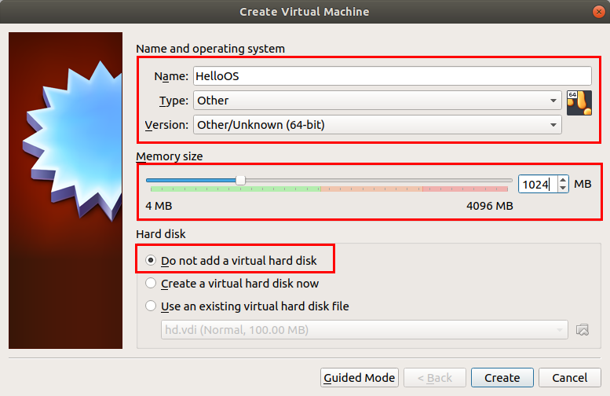
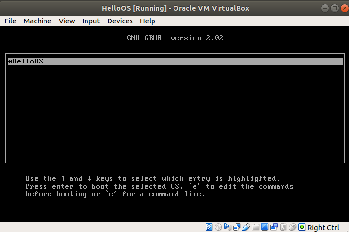
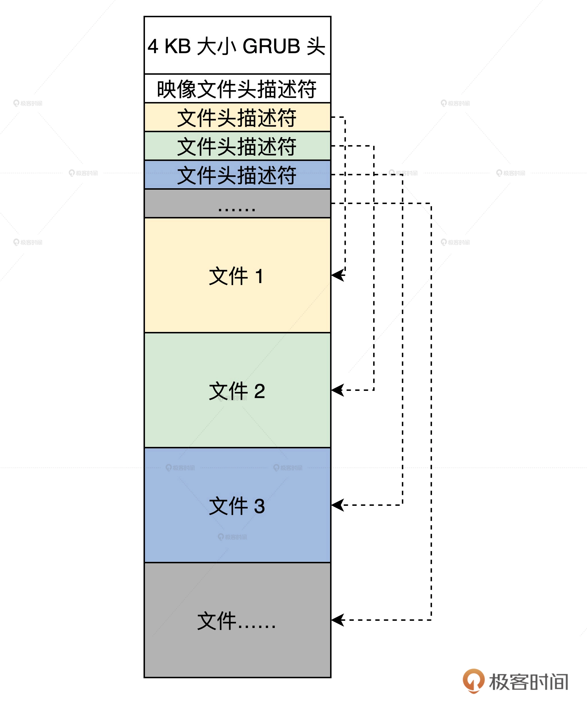

# 建立虚拟电脑
首先允许硬件虚拟化，选中 ubuntu18.04 虚拟机，虚拟机设置->硬件->处理器->虚拟化引擎，这里一般会有三个选项，全都勾上即可。

然后直接在 ubuntu18.04 的 Ubuntu Software 应用中搜索并安装 VirtualBox（版本号为 5.2.42），然后启动它，新建一个虚拟机，设置如下图所示。




## 生产虚拟硬盘

### 创建一个 100MB 的空文件
```bash
➜  ~ dd bs=512 if=/dev/zero of=hd.img count=204800
204800+0 records in
204800+0 records out
104857600 bytes (105 MB, 100 MiB) copied, 0.857703 s, 122 MB/s
```
参数说明：
- bs : 表示块大小，这里是 512 字节。
- if : 表示输入文件，`/dev/zero` 就是 Linux 下专门返回 0 数据的设备文件，读取它就返回 0。
- of : 表示输出文件，即我们的硬盘文件。
- count : 表示输出多少块。

### 格式化虚拟硬盘
```bash
➜  ~ sudo losetup /dev/loop0 hd.img
losetup: hd.img: failed to set up loop device: Device or resource busy
```
直接使用回环设备 `/dev/loop0` 可能会出错，此时不要慌，直接复制错误信息搜索相关的问题，上面的错误表明 `/dev/loop0` 正在使用中，可以用下面方法解决。

使用 `df -h` 查看 `/dev/loop#` 所有被挂载的回环设备，我们选择一个没有挂载的 `/dev/loop#` 回环设备即可。
```bash
➜  ~ df -h
Filesystem      Size  Used Avail Use% Mounted on
udev            1.9G     0  1.9G   0% /dev
tmpfs           391M  2.1M  389M   1% /run
/dev/sda1        20G  8.1G   11G  44% /
tmpfs           2.0G   26M  1.9G   2% /dev/shm
tmpfs           5.0M  4.0K  5.0M   1% /run/lock
tmpfs           2.0G     0  2.0G   0% /sys/fs/cgroup
/dev/loop0      2.7M  2.7M     0 100% /snap/gnome-system-monitor/169
/dev/loop2       62M   62M     0 100% /snap/core20/1169
/dev/loop1       33M   33M     0 100% /snap/snapd/13640
/dev/loop3      2.5M  2.5M     0 100% /snap/gnome-calculator/748
/dev/loop4       33M   33M     0 100% /snap/snapd/13270
/dev/loop5       56M   56M     0 100% /snap/core18/1885
/dev/loop6      384K  384K     0 100% /snap/gnome-characters/550
/dev/loop7      768K  768K     0 100% /snap/gnome-characters/726
/dev/loop8      1.0M  1.0M     0 100% /snap/gnome-logs/100
/dev/loop9       66M   66M     0 100% /snap/gtk-common-themes/1519
/dev/loop10      56M   56M     0 100% /snap/core18/2128
/dev/loop11     243M  243M     0 100% /snap/gnome-3-38-2004/76
/dev/loop12     256M  256M     0 100% /snap/gnome-3-34-1804/36
/dev/loop13     640K  640K     0 100% /snap/gnome-logs/106
/dev/loop14      63M   63M     0 100% /snap/gtk-common-themes/1506
/dev/loop16     128K  128K     0 100% /snap/bare/5
/dev/loop15     2.5M  2.5M     0 100% /snap/gnome-calculator/884
/dev/loop17     219M  219M     0 100% /snap/gnome-3-34-1804/72
/dev/loop18     2.5M  2.5M     0 100% /snap/gnome-system-monitor/163
tmpfs           391M   16K  391M   1% /run/user/121
tmpfs           391M   28K  391M   1% /run/user/1000
```
可以发现 0~18 相关的回环设备都被使用了，那么我们直接使用第 19 个回环设备 `/dev/loop19` 。
```bash
➜  ~ sudo losetup /dev/loop19 hd.img
```

### 格式化并挂载回环设备
使用 `mkfs.ext4` 命令格式化这个 `/dev/loop19` 回环块设备。
```bash
➜  ~ sudo mkfs.ext4 -q /dev/loop19
```

事先建立 hdisk 目录，并在其中建立一个 boot 目录。
```bash
➜  ~ mkdir hdisk
➜  ~ mkdir hdisk/boot
```

使用 mount 命令挂载硬盘文件。
```bash
➜  ~ sudo mount -o loop ./hd.img ./hdisk/
```

### 安装 GRUB
安装 GRUB 之前需要挂载虚拟硬盘文件为回环设备，即前面的那些操作。
```bash
➜  ~ sudo grub-install --boot-directory=./hdisk/boot/ --force --allow-floppy /dev/loop19
Installing for i386-pc platform.
grub-install: warning: File system `ext2' doesn't support embedding.
grub-install: warning: Embedding is not possible.  GRUB can only be installed in this setup by using blocklists.  However, blocklists are UNRELIABLE and their use is discouraged..
Installation finished. No error reported.
```
参数说明：
- `--boot-directory` : 指向先前我们在虚拟硬盘中建立的 boot 目录。
- `--force --allow-floppy` : 指向我们的虚拟硬盘设备文件 `/dev/loop19`。

可以看到，现在 `hdisk/boot/` 目录下多了一个 grub 目录，表示我们的 GRUB 安装成功。请注意，这里还要在 `hdisk/boot/grub/` 目录下建立一个 `grub.cfg` 文本文件，GRUB 正是通过这个文件内容，查找到我们的操作系统映像文件的。

我们需要在这个文件里写入如下内容。
```bash
menuentry 'HelloOS' {
insmod part_msdos
insmod ext2
set root='hd0,msdos1'         #我们的硬盘只有一个分区所以是'hd0,msdos1'
multiboot2 /boot/HelloOS.eki  #加载boot目录下的HelloOS.eki文件
boot                          #引导启动
}
set timeout_style=menu
if [ "${timeout}" = 0 ]; then
  set timeout=10              #等待10秒钟自动启动
fi
```

### 转换虚拟硬盘格式
虚拟机提供了专用的转换格式的工具，我们只要输入一行命令即可。
```bash
➜  ~ VBoxManage convertfromraw ./hd.img --format VDI ./hd.vdi
Converting from raw image file="./hd.img" to file="./hd.vdi"...
Creating dynamic image with size 104857600 bytes (100MB)...
```
- `convertfromraw` : 指向原始格式文件。
- `--format VDI` : 表示转换成虚拟需要的 VDI 格式。

### 安装虚拟硬盘
直接使用下面的命令安装虚拟硬盘。
```bash
# 第一步 SATA 的硬盘其控制器是 intelAHCI
VBoxManage storagectl HelloOS --name "SATA" --add sata --controller IntelAhci --portcount 1
# 第二步 删除虚拟硬盘UUID并重新分配
VBoxManage closemedium disk ./hd.vdi
# 第三步 将虚拟硬盘挂到虚拟机的硬盘控制器
VBoxManage storageattach HelloOS --storagectl "SATA" --port 1 --device 0 --type hdd --medium ./hd.vdi
```
这里也可以通过 VirtualBox 设置进行操作，选择 HelloOS 进入 settings 界面，选中 Storage，在 Storage Devices 中添加之前的虚拟硬盘 `hd.vdi` 。

### 启动虚拟机
以上所有设置完成后，可以执行下面的命令启动虚拟机，也可以通过 VirtualBox 界面进行启动。
```bash
VBoxManage startvm HelloOS 
```
启动完成后，出现下面的界面即表示我们的虚拟机创建成功了。



# 内核映像格式
为了不让 GRUB 老哥加载多个文件，我们决定让 GRUB 只加载一个文件。这个文件我们称为内核映像文件，其中包含二级引导器的模块，内核模块，图片和字库文件。为了这映像文件能被 GRUB 加载，并让它自身能够解析其中的内容，我们就要定义好具体的格式。如下图所示。



映像文件头描述符和文件描述符是两个 C 语言结构体，如下所示。
```cpp
//映像文件头描述符
typedef struct s_mlosrddsc
{
    u64_t mdc_mgic;             //映像文件标识
    u64_t mdc_sfsum;            //未使用
    u64_t mdc_sfsoff;           //未使用
    u64_t mdc_sfeoff;           //未使用
    u64_t mdc_sfrlsz;           //未使用
    u64_t mdc_ldrbk_s;          //映像文件中二级引导器的开始偏移
    u64_t mdc_ldrbk_e;          //映像文件中二级引导器的结束偏移
    u64_t mdc_ldrbk_rsz;        //映像文件中二级引导器的实际大小
    u64_t mdc_ldrbk_sum;        //映像文件中二级引导器的校验和
    u64_t mdc_fhdbk_s;          //映像文件中文件头描述的开始偏移
    u64_t mdc_fhdbk_e;          //映像文件中文件头描述的结束偏移
    u64_t mdc_fhdbk_rsz;        //映像文件中文件头描述的实际大小
    u64_t mdc_fhdbk_sum;        //映像文件中文件头描述的校验和
    u64_t mdc_filbk_s;          //映像文件中文件数据的开始偏移
    u64_t mdc_filbk_e;          //映像文件中文件数据的结束偏移
    u64_t mdc_filbk_rsz;        //映像文件中文件数据的实际大小
    u64_t mdc_filbk_sum;        //映像文件中文件数据的校验和
    u64_t mdc_ldrcodenr;        //映像文件中二级引导器的文件头描述符的索引号
    u64_t mdc_fhdnr;            //映像文件中文件头描述符有多少个
    u64_t mdc_filnr;            //映像文件中文件头有多少个
    u64_t mdc_endgic;           //映像文件结束标识
    u64_t mdc_rv;               //映像文件版本
}mlosrddsc_t;
#define FHDSC_NMAX 192          //文件名长度
//文件头描述符
typedef struct s_fhdsc
{
    u64_t fhd_type;             //文件类型
    u64_t fhd_subtype;          //文件子类型
    u64_t fhd_stuts;            //文件状态
    u64_t fhd_id;               //文件id
    u64_t fhd_intsfsoff;        //文件在映像文件位置开始偏移
    u64_t fhd_intsfend;         //文件在映像文件的结束偏移
    u64_t fhd_frealsz;          //文件实际大小
    u64_t fhd_fsum;             //文件校验和
    char   fhd_name[FHDSC_NMAX];//文件名
}fhdsc_t;
```
有了映像文件格式，我们还要有个打包映像的工具，这里直接使用作者提供的 lmoskrlimg 打包工具，使用方法如下：
```bash
lmoskrlimg -m k -lhf GRUB头文件 -o 映像文件 -f 输入的文件列表
```
参数功能：
- `-m` : 表示模式 只能是 `k` 内核模式。
- `-lhf` : 表示后面跟上 GRUB 头文件。
- `-o` : 表示输出的映像文件名。
- `-f` : 表示输入文件列表。

例如：
```bash
lmoskrlimg -m k -lhf grubhead.bin -o kernel.img -f file1.bin file2.bin file3.bin file4.bin 
```

