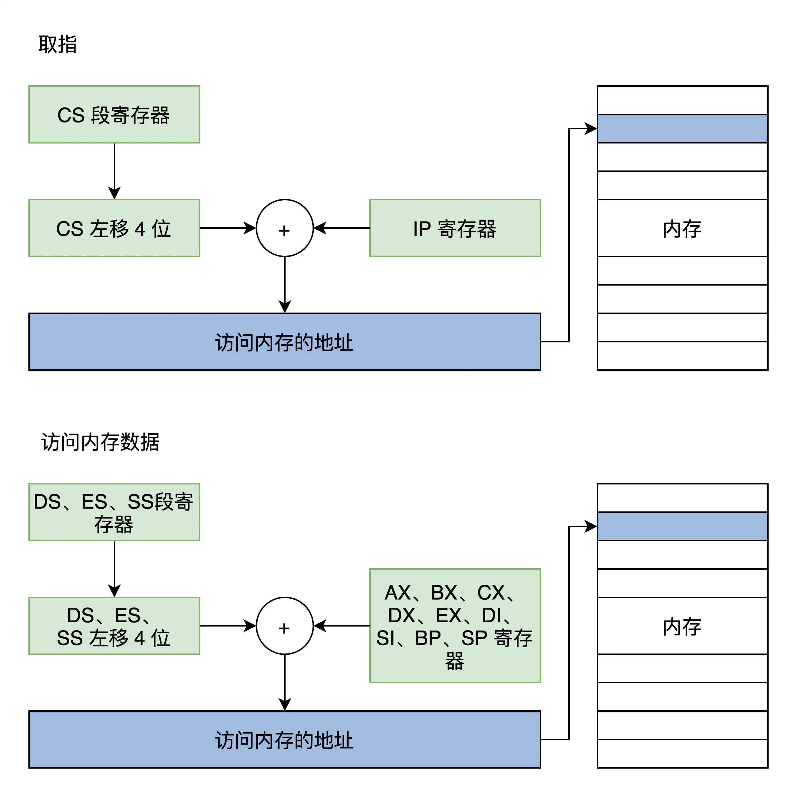
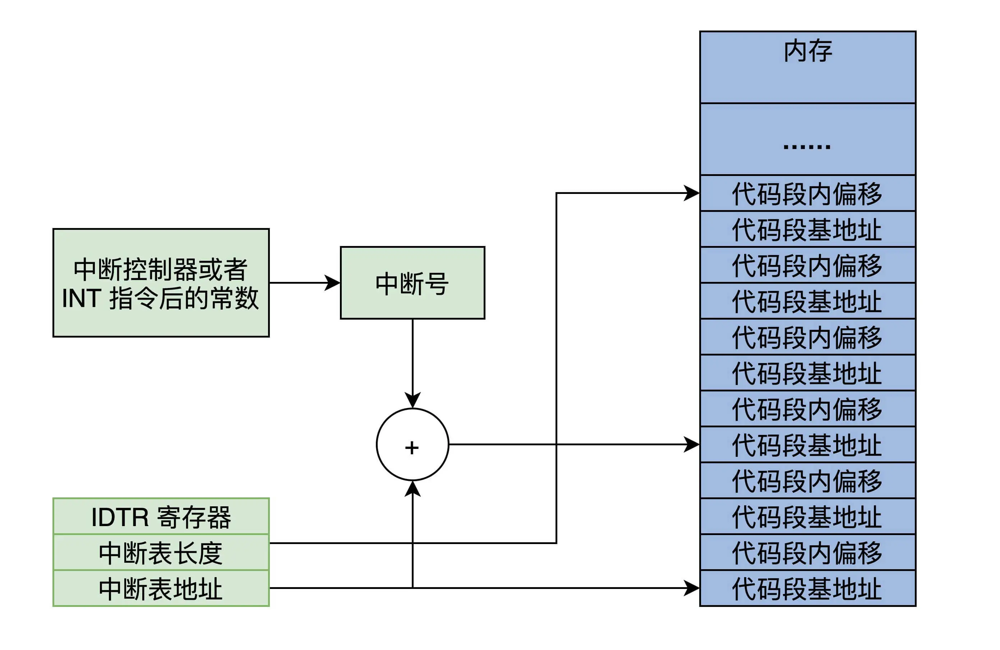
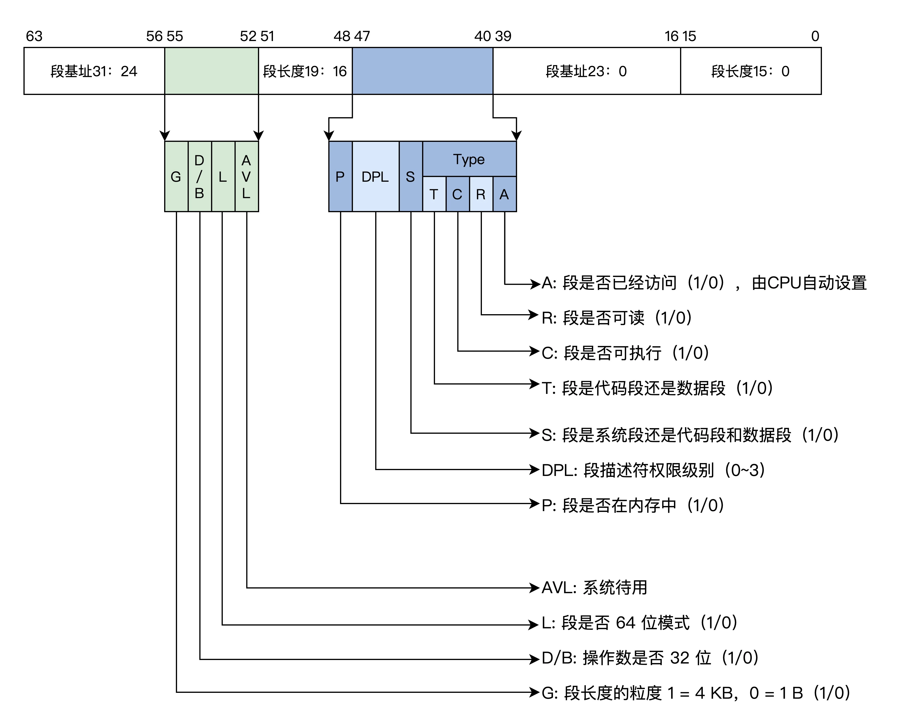
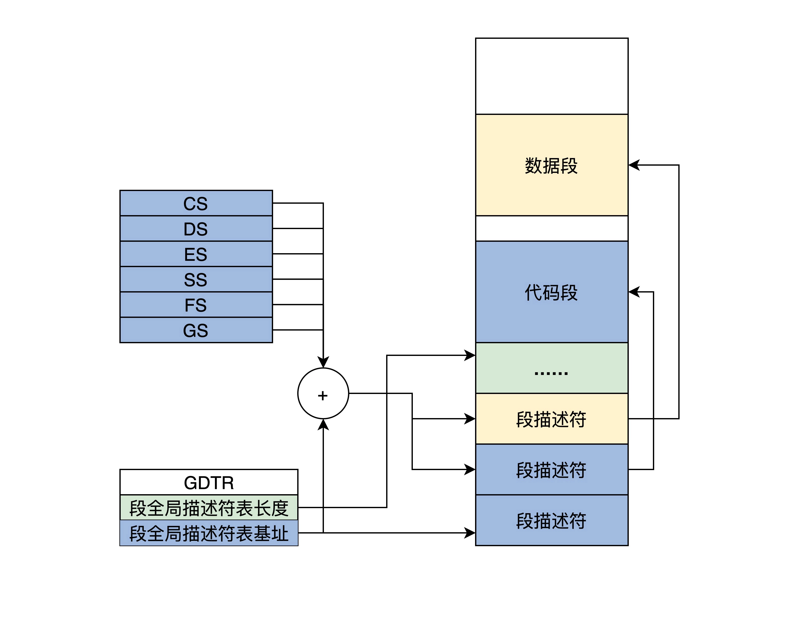
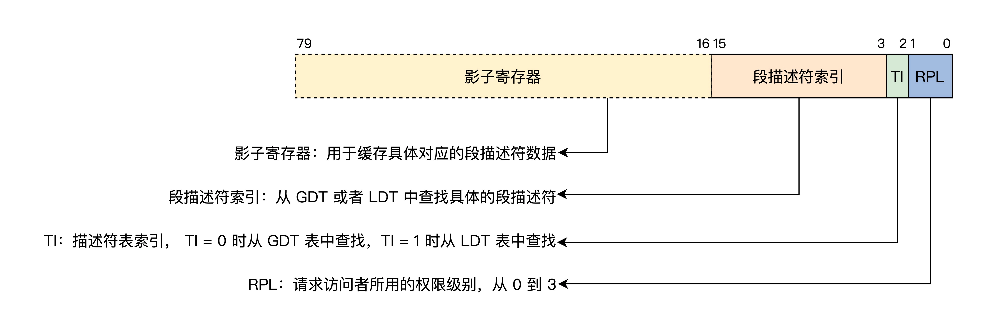
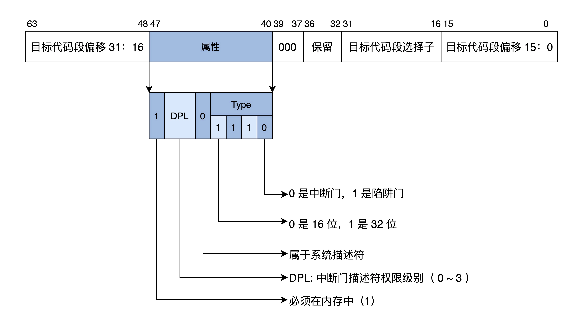
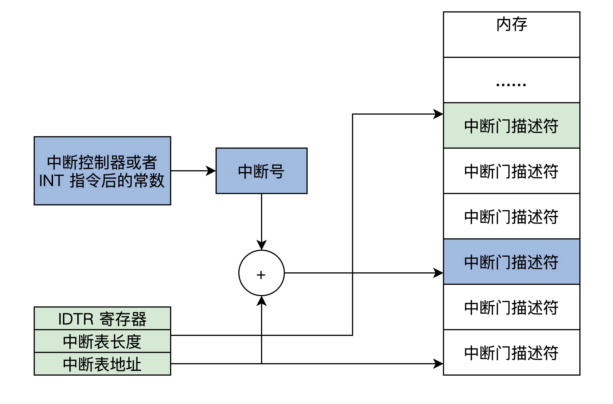
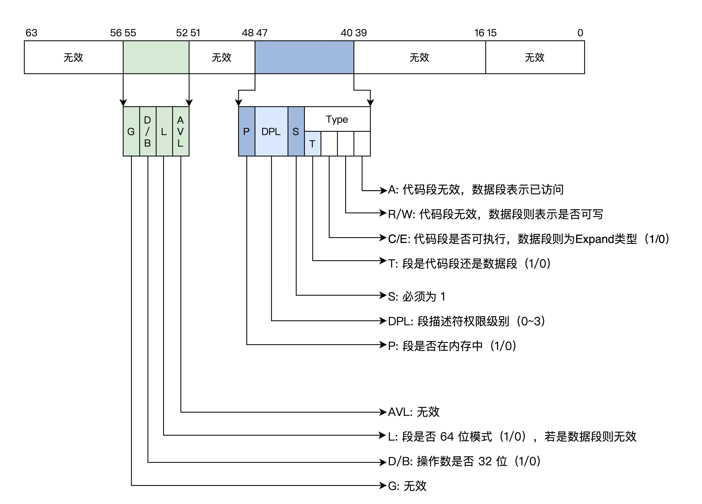
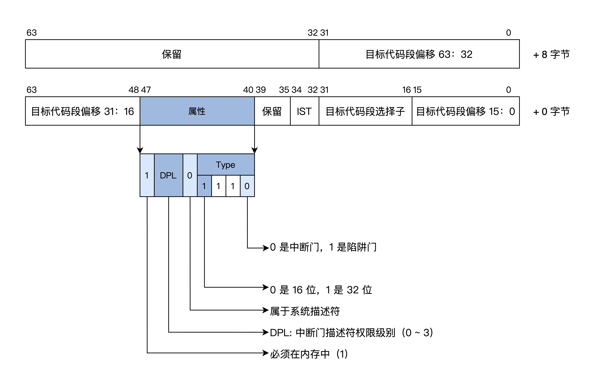

# CPU工作模式
## 实模式
实模式又称实地址模式，在该模式下可以执行所有的指令，并且可以直接访问物理内存。计算机每次通电或重置都会进入到实模式。

### 实模式寄存器
x86 CPU 在实模式下的寄存器如下表所示，表中所有的寄存器都是 16 位的。

寄存器 | 描述
--|--
AX、BX、CX、DX、DI、SI、BP | 通用寄存器，可以存放数据、地址，参与运算。
IP | 程序指针寄存器，始终指向下一条指令的地址。
SP | 栈指针寄存器，始终指向当前栈顶。
CS、DS、ES、SS | 段寄存器，里面存放一个内存段的基地址。
EFLAGS | CPU 标志寄存器，里面存放 CPU 执行运算指令产生的状态位。

### 实模式下访问内存
实模式下所有的内存地址都是由段寄存器左移 4 位，再加上一个通用寄存器中的值或者常数形成地址，然后通过这个地址去访问内存，这就是大名鼎鼎的分段内存管理模式，在这种模式下可以访问 2^20（1MB） 的内存大小。可以阅读王爽的《汇编语言》了解相关的知识。



### 实模式中断
中断即中止执行当前程序，转而跳转到另一个特定的地址上，去运行特定的代码。在实模式下它的实现过程是先保存 CS 和 IP 寄存器，然后装载新的 CS 和 IP 寄存器，这里有点类似函数调用。

中断分为硬件中断和软件中断，硬件中断：可简单理解为和 CPU 关联的外部设备产生的中断。软中断是通过 int 指令引起的中断处理。

为了实现中断，就需要在内存中放一个中断向量表，这个表的地址和长度由 CPU 的特定寄存器 IDTR 指向。



有了中断号以后，CPU 就能根据 IDTR 寄存器中的信息，计算出中断向量中的条目，进而装载 CS、IP寄存器，最终响应中断。

## 保护模式

### 保护模式寄存器
保护模式相比于实模式，增加了一些控制寄存器和段寄存器，扩展通用寄存器的位宽，所有的通用寄存器都是 32 位的，还可以单独使用低 16 位，这个低 16 位又可以拆分成两个 8 位寄存器，如下表。

寄存器 | 描述
-- | --
EAX、EBX、ECX、EDX、EDI、ESI、EBP | 32 位通用寄存器，可以存放数据、地址、参与运算
EIP | 32 位程序指针寄存器，始终指向下一条指令的地址
ESP | 栈指针寄存器，始终指向当前栈顶
CS、DS、ES、SS、FS、GS | 16 位寄存器，里面存放一个内存段的段描述符索引
EFLAGS | 32 位 CPU 标志寄存器，里面存放 CPU 执行运算指令产生的状态位
CR0、CR1、CR2、CR3 | 32 位 CPU 控制寄存器，控制 CPU 的功能控制特性，如开启保护模式等

### 保护模式特权级
为了区分哪些指令（如 in、out、cli）和哪些资源（如寄存器、I/O 端口、内存地址）可以被访问，CPU 实现了特权级。特权级分为 4 级，R0~R3，我们只需要关注 R0 和 R3 。

### 保护模式段描述符
由于 CPU 的扩展导致了 32 位的段基地址和段内偏移，还有一些其它信息，所以 16 位的段寄存器肯定放不下。放不下就要找内存借空间，然后把描述一个段的信息封装成特定格式的段描述符，放在内存中，其格式如下。



一个段描述符有 64 位 8 字节数据，里面包含了段基地址、段长度、段权限、段类型（可以是系统段、代码段、数据段）、段是否可读写，可执行等。

多个段描述符在内存中形成全局段描述符表，该表的基地址和长度由 CPU 和 GDTR 寄存器指示。如下图所示。



访问一个内存地址时，段寄存器中的索引首先会结合 GDTR 寄存器找到内存中的段描述符，再根据其中的段信息判断能不能访问成功。

### 保护模式段选择子
CS、DS、ES、SS、FS、GS 这些段寄存器它们是由影子寄存器、段描述符索引、描述符表索引、权限级别组成的。如下图所示。



影子寄存器是靠硬件来操作的，对系统程序员不可见，是硬件为了减少性能损耗而设计的一个段描述符的高速缓存，不然每次内存访问都要去内存中查表，那性能损失是巨大的，影子寄存器也正好是 64 位，里面存放了 8 字节段描述符数据。

低三位之所以能放 TI 和 RPL，是因为段描述符 8 字节对齐，每个索引低 3 位都为 0，我们不用关注 LDT，只需要使用 GDT 全局描述符表，所以 TI 永远设为 0。

通常情况下，CS 和 SS 中 RPL 就组成了 CPL（当前权限级别），所以常常是 RPL=CPL，进而 CPL 就表示发起访问者要以什么权限去访问目标段，当 CPL 大于目标段 DPL 时，则 CPU 禁止访问，只有 CPL 小于等于目标段 DPL 时才能访问。

> CPL: Current Privilege Level 
> RPL: Request Privilege Level 
> DPL: Descriptor Privilege Level

### 保护模式平坦模型
x86 CPU 并不能直接使用分页模型，而是要在分段模型的前提下，根据需要决定是否要开启分页。因为这是硬件的规定，程序员是无法改变的。但是我们可以简化设计，来使分段成为一种“虚设”，这就是保护模式的平坦模型。

根据前面的描述，我们发现 CPU 32 位的寄存器最多只能产生 4GB 大小的地址，而一个段长度也只能是 4GB，所以我们把所有段的基地址设为 0，段的长度设为 0xFFFFF，段长度的粒度设为 4KB，这样所有的段都指向同一个（0~4GB-1）字节大小的地址空间。

这里看一下 Hello OS 中段描述符表
```cpp

GDT_START:
knull_dsc: dq 0
;第一个段描述符CPU硬件规定必须为0
kcode_dsc: dq 0x00cf9e000000ffff
;段基地址=0，段长度=0xfffff
;G=1,D/B=1,L=0,AVL=0 
;P=1,DPL=0,S=1
;T=1,C=1,R=1,A=0
kdata_dsc: dq 0x00cf92000000ffff
;段基地址=0，段长度=0xfffff
;G=1,D/B=1,L=0,AVL=0 
;P=1,DPL=0,S=1
;T=0,C=0,R=1,A=0
GDT_END:

GDT_PTR:
GDTLEN  dw GDT_END-GDT_START-1
GDTBASE  dd GDT_START
```
上面代码中注释已经很明白了，段长度需要和 G 位配合，若 G 位为 1 则段长度等于 0xfffff 个 4KB。上面段描述符的 DPL=0，这说明需要最高权限即 CPL=0 才能访问。

### 保护模式中断
而保护模式下的中断要权限检查，还有特权级的切换，所以就需要扩展中断向量表的信息，即每个中断用一个中断门描述符来表示，也可以简称为中断门，中断门描述符依然有自己的格式，如下图所示。



同样的，保护模式要实现中断，也必须在内存中有一个中断向量表，同样是由 IDTR 寄存器指向，只不过中断向量表中的条目变成了中断门描述符，如下图所示。



产生中断后，CPU 首先会检查中断号是否大于最后一个中断门描述符，x86 CPU 最大支持 256 个中断源（即中断号：0~255），然后检查描述符类型（是否是中断门或者陷阱门）、是否为系统描述符，是不是存在于内存中。

接着，检查中断门描述符中的段选择子指向的段描述符。

最后做权限检查，如果 CPL 小于等于中断门的 DPL 并且 CPL 大于等于中断门中的段选择子，就指向段描述符的 DPL。

进一步的，CPL 等于中断门中的段选择子指向段描述符的 DPL，则为同级权限不进行栈切换，否则进行栈切换。如果进行栈切换，还需要从 TSS 中加载具体权限的 SS、ESP，当然也要对 SS 中段选择子指向的段描述符进行检查。做完这一系列检查之后，CPU 才会加载中断门描述符中目标代码段选择子到 CS 寄存器中，把目标代码段偏移加载到 EIP 寄存器中。

### 切换到保护模式
x86 CPU 在第一次加电和每次 reset 后，都会自动进入实模式，要想进入保护模式，就需要程序员写代码实现从实模式切换到保护模式。切换到保护模式的步骤如下。

```asm
; 准备全局段描述符表
GDT_START:
knull_dsc: dq 0
kcode_dsc: dq 0x00cf9e000000ffff
kdata_dsc: dq 0x00cf92000000ffff
GDT_END:
GDT_PTR:
GDTLEN  dw GDT_END-GDT_START-1
GDTBASE  dd GDT_START

; 加载设置 GDTR 寄存器，使之指向全局段描述符表
lgdt [GDT_PTR]

; 设置 CR0 寄存器，开启保护模式
; 开启 PE
mov eax, cr0
bts eax, 0                      ; CR0.PE =1
mov cr0, eax   

; 进行长跳转，加载 CS 段寄存器，即段选择子
jmp dword 0x8 :_32bits_mode ;_32bits_mode为32位代码标号即段偏移      
```

## 长模式
长模式又名 AMD64，因为这个标准是 AMD 公司最早定义的，它使 CPU 在现有的基础上有了 64 位的处理能力，既能完成 64 位的数据运算，也能寻址 64 位的地址空间。这在大型计算机上犹为重要，因为它们的物理内存通常有几百 GB。

### 长模式寄存器
长模式相比于保护模式，增加了一些通用寄存器，并扩展通用寄存器的位宽，所有的通用寄存器都是 64 位，还可以单独使用低 32 位。

这个低 32 位可以拆分成一个低 16 位寄存器，低 16 位又可以拆分成两个 8 位寄存器，如下表。

寄存器 | 描述
-- | --
RAX、RBX、RCX、RDX、RDI、RSI、RBP、R8~R15 | 64 位通用寄存器，可以存放数据、地址、参与运算
RIP | 64 位程序指针寄存器，始终指向下一条指令的地址
RSP | 栈指针寄存器，始终指向当前栈顶
CS、DS、ES、SS、FS、GS | 16 位段寄存器，里面存放一个内存段的描述符索引
RFLAGS | 64 位 CPU 标志寄存器，里面存放 CPU 执行运算指令产生的状态位
CR0、CR1、CR2、CR3、CR4 | 除了 CR0 仍是 32 位 CPU 控制寄存器，控制 CPU 的功能特性，其他都是64位寄存器

### 长模式段描述符

长模式依然具备保护模式绝大多数特性，如特权级和权限检查。相同的部分就不再重述了，这里只会说明长模式和保护模式下的差异。

下面我们来看看长模式下段描述的格式，如下图所示。



在长模式下，CPU 不再对段基址和段长度进行检查，只对 DPL 进行相关的检查，这个检查流程和保护模式下一样。

当描述符中的 L=1，D/B=0 时，就是 64 位代码段，DPL 还是 0~3 的特权级。然后有多个段描述在内存中形成一个全局段描述符表，同样由 CPU 的 GDTR 寄存器指向。

下面我们来写一个长模式下的段描述符表，加深一下理解，如下所示.

```cpp

ex64_GDT:
null_dsc:  dq 0
;第一个段描述符CPU硬件规定必须为0
c64_dsc:dq 0x0020980000000000  ;64位代码段
;无效位填0
;D/B=0,L=1,AVL=0 
;P=1,DPL=0,S=1
;T=1,C=0,R=0,A=0
d64_dsc:dq 0x0000920000000000  ;64位数据段
;无效位填0
;P=1,DPL=0,S=1
;T=0,C/E=0,R/W=1,A=0
eGdtLen   equ $ - null_dsc  ;GDT长度
eGdtPtr:dw eGdtLen - 1  ;GDT界限
     dq ex64_GDT
```
上面代码中注释已经很清楚了，段长度和段基址都是无效的填充为 0，CPU 不做检查。但是上面段描述符的 DPL=0，这说明需要最高权限即 CPL=0 才能访问。若是数据段的话，G、D/B、L 位都是无效的。

### 长模式中断
保护模式下为了实现对中断进行权限检查，实现了中断门描述符，在中断门描述符中存放了对应的段选择子和其段内偏移，还有 DPL 权限，如果权限检查通过，则用对应的段选择子和其段内偏移装载 CS:EIP 寄存器。

如果你还记得中断门描述符，就会发现其中的段内偏移只有 32 位，但是长模式支持 64 位内存寻址，所以要对中断门描述符进行修改和扩展，下面我们就来看看长模式下的中断门描述符的格式，如下图所示。



结合上图，我们可以看出长模式下中断门描述符的格式变化。

首先为了支持 64 位寻址中断门描述符在原有基础上增加 8 字节，用于存放目标段偏移的高 32 位值。其次，目标代码段选择子对应的代码段描述符必须是 64 位的代码段。最后其中的 IST 是 64 位 TSS 中的 IST 指针，因为我们不使用这个特性，所以不作详细介绍。

长模式也同样在内存中有一个中断门描述符表，只不过表中的条目（如上图所示）是 16 字节大小，最多支持 256 个中断源，对中断的响应和相关权限的检查和保护模式一样，这里不再赘述。

### 切换到长模式
我们既可以从实模式直接切换到长模式，也可以从保护模式切换长模式。切换到长模式的步骤如下。

第一步，准备长模式全局段描述符表。
```cpp
ex64_GDT:
null_dsc: dq 0
;第一个段描述符CPU硬件规定必须为0
c64_dsc:dq 0x0020980000000000 ;64位代码段
d64_dsc:dq 0x0000920000000000 ;64位数据段
eGdtLen equ $ - null_dsc ;GDT长度
eGdtPtr:dw eGdtLen - 1 ;GDT界限
dq ex64_GDT
```
第二步，准备长模式下的 MMU 页表，这个是为了开启分页模式，切换到长模式必须要开启分页，想想看，长模式下已经不对段基址和段长度进行检查了，那么内存地址空间就得不到保护了。

而长模式下内存地址空间的保护交给了 MMU，MMU 依赖页表对地址进行转换，页表有特定的格式存放在内存中，其地址由 CPU 的 CR3 寄存器指向，这在后面讲 MMU 的那节课会专门讲。
```cpp
mov eax, cr4
bts eax, 5 ;CR4.PAE = 1
mov cr4, eax ;开启 PAE
mov eax, PAGE_TLB_BADR ;页表物理地址
mov cr3, eax
```

开启长模式，要同时开启保护模式和分页模式，在实现长模式时定义了 MSR 寄存器，需要用专用的指令 rdmsr、wrmsr 进行读写，IA32_EFER 寄存器的地址为 0xC0000080，它的第 8 位决定了是否开启长模式。
```cpp
;开启 64位长模式
mov ecx, IA32_EFER
rdmsr
bts eax, 8 ;IA32_EFER.LME =1
wrmsr
;开启 保护模式和分页模式
mov eax, cr0
bts eax, 0 ;CR0.PE =1
bts eax, 31
mov cr0, eax
```
进行跳转，加载 CS 段寄存器，刷新其影子寄存器。
```cpp
jmp 08:entry64 ;entry64为程序标号即64位偏移地址
```
切换到长模式和切换保护模式的流程差不多，只是需要准备的段描述符有所区别，还有就是要注意同时开启保护模式和分页模式。原因在上面已经说明了。
