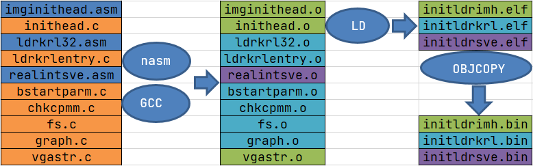
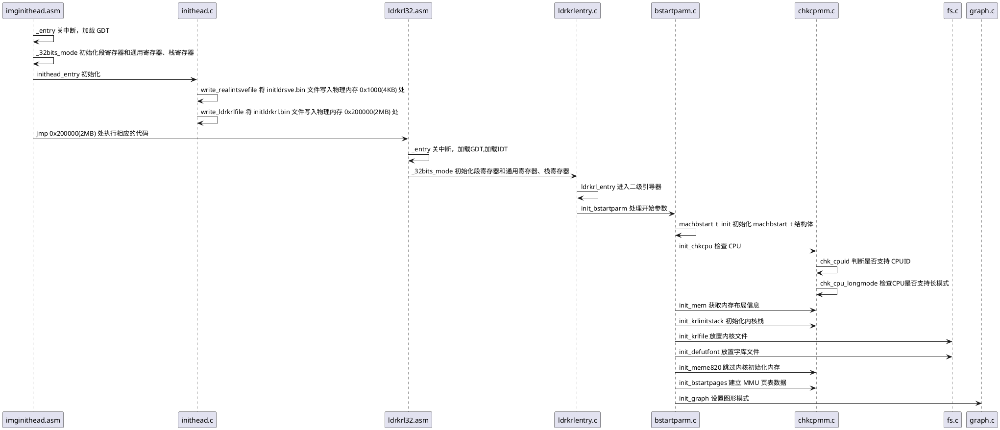

二级引导器作为操作系统的先驱，它需要收集机器信息，确定这个计算机能不能运行我们的操作系统，对 CPU、内存、显卡进行一些初级的配置，放置好内核相关的文件。

# 二级引导器
我们的二级引导器不是执行具体的加载任务，而是解析内核文件、收集机器环境信息。

二级引导器作为操作系统的先驱，它需要收集机器信息，确定这个计算机能不能运行我们的操作系统，对 CPU、内存、显卡进行一些初级的配置，放置好内核相关的文件。

## 设计机器信息结构
二级引导器的功能是收集信息，这里就需要设计一个数据结构存放相应的信息。我们将这个结构放在内存 1MB 的地方，方便以后传给我们的操作系统。

这个数据结构的关键代码如下所示。
```cpp
// Cosmos/initldr/include/ldrtype.h
typedef struct s_MACHBSTART
{
    u64_t    mb_krlinitstack;    // 内核栈地址
    u64_t    mb_krlitstacksz;    // 内核栈大小
    u64_t    mb_imgpadr;         // 操作系统映像
    u64_t    mb_imgsz;           // 操作系统映像大小
    u64_t    mb_bfontpadr;       // 操作系统字体地址
    u64_t    mb_bfontsz;         // 操作系统字体大小
    u64_t    mb_fvrmphyadr;      // 机器显存地址
    u64_t    mb_fvrmsz;          // 机器显存大小
    u64_t    mb_cpumode;         // 机器CPU工作模式
    u64_t    mb_memsz;           // 机器内存大小
    u64_t    mb_e820padr;        // 机器e820数组地址
    u64_t    mb_e820nr;          // 机器e820数组元素个数
    u64_t    mb_e820sz;          // 机器e820数组大小
    //……
    u64_t    mb_pml4padr;        // 机器页表数据地址
    u64_t    mb_subpageslen;     // 机器页表个数
    u64_t    mb_kpmapphymemsz;   // 操作系统映射空间大小
    //……
    graph_t mb_ghparm;           // 图形信息
}__attribute__((packed)) machbstart_t;
```

## 规划二级引导器

首先整体划分一下二级引导器的功能模块，从全局了解下功能应该怎么划分，如下表所示。

文件名 | 功能
-- | --
imginithead.asm |  GRUB 头的汇编部分
inithead.c | GRUB 头的 C 语言部分，用于放置二级引导器到指定的内存中
realintsve.asm | 实现调用 BIOS 中断功能
ldrkrl32.asm | 二级引导器核心入口汇编部分
ldrkrlentry.c | 二级引导器核心入口
bstartparm.c | 实现收集机器信息建立页面数据
chkcpmm.c | 实现检查 CPU 工作模式和内存视图
fs.c | 实现解析映像文件的功能
graph.c | 实现切换显卡图形模式
vgastr.c | 实现字符串输出

它们在编译之后会形成三个文件，编译脚本我已经写好了，下面我们用一幅图来展示这个编译过程。



下面为二级引导器的整个执行时序图。


下面开始细节的讲解。

## 实现 GRUB 头
我们的 GRUB 头有两个文件组成，一个 `imginithead.asm` 汇编文件，它主要工作是初始化 CPU 的寄存器，加载 GDT，切换到 CPU 的保护模式；第二就是 `inithead.c` 文件，它的主要功能是查找二级引导器的核心文件 `initldrkrl.bin` ，然后把它放置到特定的内存地址上。

首先需要 GRUB1 和 GRUB2 两个头结构，这里不用去深究，按规范定义即可，代码如下。
```asm

MBT_HDR_FLAGS  EQU 0x00010003
MBT_HDR_MAGIC  EQU 0x1BADB002
MBT2_MAGIC  EQU 0xe85250d6
global _start
extern inithead_entry
[section .text]
[bits 32]
_start:
  jmp _entry
align 4
mbt_hdr:
  dd MBT_HDR_MAGIC
  dd MBT_HDR_FLAGS
  dd -(MBT_HDR_MAGIC+MBT_HDR_FLAGS)
  dd mbt_hdr
  dd _start
  dd 0
  dd 0
  dd _entry
ALIGN 8
mbhdr:
  DD  0xE85250D6
  DD  0
  DD  mhdrend - mbhdr
  DD  -(0xE85250D6 + 0 + (mhdrend - mbhdr))
  DW  2, 0
  DD  24
  DD  mbhdr
  DD  _start
  DD  0
  DD  0
  DW  3, 0
  DD  12
  DD  _entry 
  DD  0  
  DW  0, 0
  DD  8
mhdrend:
```

然后是关中断并加载 GDT ，代码如下所示
```asm
_entry:
    cli                            ; 关中断.

    in al, 0x70                    
    or al, 0x80    
    out 0x70,al                    ; 读取 CMOS/RTC 地址，设置最高位为 1 ，写入 0x70 端口，关闭不可屏蔽中断.

    lgdt [GDT_PTR]                 ; 加载 GDT 地址到 GDTR 寄存器
    jmp dword 0x8 :_32bits_mode    ; 长跳转刷新 CS 影子寄存器

GDT_START:
knull_dsc: dq 0                    ; 第一个段描述符CPU硬件规定必须为0
kcode_dsc: dq 0x00cf9e000000ffff
; [0000 0000]: 段基址:24~31
; [1 1 0 0]: G:段长度的颗粒 1=4k,0=1b，D/B:操作数是否为32位，L:段是否64位模式，AVL: 系统待用
; [1111]:段长度:16~19
; [1 00 1 1 1 1 0] P:段是否在内存中，DPL:段描述符权限级别，S:段是系统段还是代码段和数据段，
; T:代码段或数据段，C: 段是否可执行，R:段是否可读，A:段是否已经访问，由CPU自动设置
; [0000 0000 0000 0000 0000 0000]:段基址0~23 
; [1111 1111 1111 1111]:段长度:0~15
kdata_dsc: dq 0x00cf92000000ffff
k16cd_dsc: dq 0x00009e000000ffff	; 16位代码段描述符
k16da_dsc: dq 0x000092000000ffff	; 16位数据段描述符
GDT_END:
GDT_PTR:
GDTLEN	dw GDT_END-GDT_START-1	;GDT界限
GDTBASE	dd GDT_START
```

最后是初始化段寄存器和通用寄存器、栈寄存器，这是为了给调用 inithead_entry 这个 C 函数做准备，代码如下所示。
```asm
; 初始化段寄存器和通用寄存器、栈寄存器，调用 C 函数。
_32bits_mode:
	mov ax, 0x10
	mov ds, ax
	mov ss, ax
	mov es, ax
	mov fs, ax
	mov gs, ax
	xor eax,eax
	xor ebx,ebx
	xor ecx,ecx
	xor edx,edx
	xor edi,edi
	xor esi,esi
	xor ebp,ebp
	xor esp,esp
	mov esp,0x7c00				; 设置栈顶为 0x7c00
	call inithead_entry			; 调用 inithead_entry 函数在 inithead.c 中实现
	jmp 0x200000				; 跳转到 0x200000(2M) 地址，该地址放置的 initldrkrl.bin 文件
```

下面我们接着看 C 函 inithead_entry 的功能，如下所示。

```cpp

#define MDC_ENDGIC 0xaaffaaffaaffaaff
#define MDC_RVGIC 0xffaaffaaffaaffaa
#define REALDRV_PHYADR 0x1000
#define IMGFILE_PHYADR 0x4000000
#define IMGKRNL_PHYADR 0x2000000
#define LDRFILEADR IMGFILE_PHYADR
#define MLOSDSC_OFF (0x1000)
#define MRDDSC_ADR (mlosrddsc_t*)(LDRFILEADR+0x1000)

void inithead_entry(){
    write_realintsvefile();
    write_ldrkrlfile();
    return;
}
//写initldrsve.bin文件到特定的内存中
void write_realintsvefile(){
    fhdsc_t *fhdscstart = find_file("initldrsve.bin");
    if (fhdscstart == NULL){
        error("not file initldrsve.bin");
    }
    m2mcopy((void *)((u32_t)(fhdscstart->fhd_intsfsoff) + LDRFILEADR),
            (void *)REALDRV_PHYADR, (sint_t)fhdscstart->fhd_frealsz);
    return;
}
//写initldrkrl.bin文件到特定的内存中
void write_ldrkrlfile(){
    fhdsc_t *fhdscstart = find_file("initldrkrl.bin");
    if (fhdscstart == NULL){
        error("not file initldrkrl.bin");
    }
    m2mcopy((void *)((u32_t)(fhdscstart->fhd_intsfsoff) + LDRFILEADR),
            (void *)ILDRKRL_PHYADR, (sint_t)fhdscstart->fhd_frealsz);
    return;
}
//在映像文件中查找对应的文件
fhdsc_t *find_file(char_t *fname){
    mlosrddsc_t *mrddadrs = MRDDSC_ADR;
    if (mrddadrs->mdc_endgic != MDC_ENDGIC ||
        mrddadrs->mdc_rv != MDC_RVGIC ||
        mrddadrs->mdc_fhdnr < 2 ||
        mrddadrs->mdc_filnr < 2){
        error("no mrddsc");
    }
    s64_t rethn = -1;
    fhdsc_t *fhdscstart = (fhdsc_t *)((u32_t)(mrddadrs->mdc_fhdbk_s) + LDRFILEADR);
    for (u64_t i = 0; i < mrddadrs->mdc_fhdnr; i++){
        if (strcmpl(fname, fhdscstart[i].fhd_name) == 0){
            rethn = (s64_t)i;
            goto ok_l;
        }
    }
    rethn = -1;
ok_l:
    if (rethn < 0){
        error("not find file");
    }
    return &fhdscstart[rethn];
}
```

## 进入二级引导器
在 `imginithead.asm` 的汇编文件中，最后一条指令 `jmp 0x200000` 将跳转到  `initldrkrl.bin` 存放的位置。

由于模块的改变，我们还需要写一小段汇编代码，建立下面这个 `ldrkrl32.asm` 文件，并写上如下代码。
```asm
; 二级引导器核心入口汇编部分
[bits 32]

; 通过 imginithead.asm 中 jmp 0x200000 跳转过来。
_start:
_entry:
	cli
	lgdt [GDT_PTR]				; 加载 GDT 地址到 GDTR 寄存器  
	lidt [IDT_PTR]				; 加载 IDT 地址到 IDTR 寄存器  
	jmp dword 0x8 :_32bits_mode ; 长跳转刷新 CS 影子寄存器

_32bits_mode:
	mov ax, 0x10				; 数据段选择子(目的)
	mov ds, ax
	mov ss, ax
	mov es, ax
	mov fs, ax
	mov gs, ax
	xor eax,eax
	xor ebx,ebx
	xor ecx,ecx
	xor edx,edx
	xor edi,edi
	xor esi,esi
	xor ebp,ebp
	xor esp,esp
	mov esp,0x90000				; 使得栈底指向了 0x90000
	call ldrkrl_entry			; 调用 ldrkrl_entry 函数
	xor ebx,ebx
	jmp 0x2000000				; 跳转到 0x2000000 的内存地址，这里存放着 kernel.bin
	jmp $
GDT_START:
knull_dsc: dq 0
kcode_dsc: dq 0x00cf9a000000ffff 
kdata_dsc: dq 0x00cf92000000ffff
k16cd_dsc: dq 0x00009a000000ffff ; 16位代码段描述符
; [0000 0000]: 段基址:24~31
; [0000] G:段长度的颗粒 1=4k,0=1b，D/B:操作数是否为32位，L:段是否64位模式，AVL: 系统待用
; [0000] 段长度:16~19
; [1 00 1 1110] P:段是否在内存中，DPL:段描述符权限级别，S:段是系统段还是代码段和数据段，
; T:代码段或数据段，C: 段是否可执行，R:段是否可读，A:段是否已经访问，又CPU自动设置
; [000000000000000000000000] 段基址0~23 
; [1111111111111111] 段长度:0~15
k16da_dsc: dq 0x000092000000ffff ; 16位数据段描述符
GDT_END:

GDT_PTR:
GDTLEN	dw GDT_END-GDT_START-1	;GDT界限
GDTBASE	dd GDT_START

IDT_PTR:
IDTLEN	dw 0x3ff	; BIOS 中断表的长度
IDTBAS	dd 0		; BIOS 中断表的地址
```
加载 GDT 和 IDT 之后，最后将会调用 C 函数 ldrkrl_entry 函数。

## 巧妙调用 BIOS 中断
C 语言环境下调用 BIOS 中断，需要处理的问题如下：
1. 保存 C 语言环境下的 CPU 上下文 ，即保护模式下的所有通用寄存器、段寄存器、程序指针寄存器，栈寄存器，把它们都保存在内存中。
2. 切换回实模式，调用 BIOS 中断，把 BIOS 中断返回的相关结果，保存在内存中。
3. 切换回保护模式，重新加载第 1 步中保存的寄存器。这样 C 语言代码才能重新恢复执行。

相关代码如下。
```asm
realadr_call_entry:
	pushad						; 保存通用寄存器
	push    ds
	push    es
	push    fs
	push    gs					; 保存4个段寄存器
	call save_eip_jmp			; 调用save_eip_jmp
	pop	gs
	pop	fs
	pop	es
	pop	ds						; 恢复4个段寄存器
	popad						; 恢复通用寄存器
	ret
save_eip_jmp:
	pop esi						; 弹出 call save_eip_jmp 时保存的 eip 到 esi 寄存器中
	mov [PM32_EIP_OFF],esi		; 把 eip 保存到特定的内存空间中
	mov [PM32_ESP_OFF],esp		; 把 esp 保存到特定的内存空间中
	jmp dword far [cpmty_mode]	; 长跳转这里表示把 cpmty_mode 处的第一个 4 字节装入 eip ，把其后的 2 字节装入 cs 
cpmty_mode:
	dd 0x1000					; 内存中 0x1000 存放着 initldrsve.bin 文件
	dw 0x18
	jmp $
```
这里需要解释一下 `jmp dword far [cpmty_mode]`，表示把 `[cpmty_mode]` 处的数据装入 `CS：EIP`，也就是把 `0x18：0x1000` 装入到 `CS：EIP` 中，这个 0x18 就是段描述索引，它正是指向 GDT 中的 16 位代码段描述符。

因为跳转到 16 位代码处执行，这里需要新建一个 16 位汇编文件 `realintsve.asm`，内容如下所示。
```asm
[bits 16]
_start:
_16_mode:
	mov	bp,0x20					; 0x20 是指向 GDT 中的 16 位数据段描述符 
	mov	ds, bp
	mov	es, bp
	mov	ss, bp
	mov	ebp, cr0				
	and	ebp, 0xfffffffe
	mov	cr0, ebp				; CR0.P=0 关闭保护模式
	jmp	0:real_entry			; 刷新CS影子寄存器，真正进入实模式
real_entry:
	mov bp, cs
	mov ds, bp
	mov es, bp
	mov ss, bp					; 重新设置实模式下的段寄存器 都是 CS 中值，即为0 
	mov sp, 08000h				; 设置栈
	mov bp,func_table
	add bp,ax					; 调用函数表中的汇编函数，ax 是 C 函数中传递进来的
	call [bp]
	cli
	call disable_nmi
	mov	ebp, cr0
	or	ebp, 1
	mov	cr0, ebp				; CR0.P=1 开启保护模式
	jmp dword 0x8 :_32bits_mode
[BITS 32]
_32bits_mode:
	mov bp, 0x10
	mov ds, bp
	mov ss, bp					; 重新设置保护模式下的段寄存器 0x10 是 32 位数据段描述符的索引
	mov esi,[PM32_EIP_OFF]		; 加载先前保存的 EIP
	mov esp,[PM32_ESP_OFF]		; 加载先前保存的 ESP
	jmp esi						; 回到了 realadr_call_entry 函数中
```
上述的代码的流程是这样的：首先从 _16_mode: 标号处进入实模式，然后根据传递进来（由 ax 寄存器传入）的函数号，到函数表中调用对应的函数，里面的函数执行完成后，再次进入保护模式，加载 EIP 和 ESP 寄存器从而回到 realadr_call_entry 函数中。GDT 还是 imginithead.asm 汇编代码文件中的 GDT，这没有变，因为它是由 GDTR 寄存器指向的。

# 二级引导器主函数
下面我们将进入二级引导器的主函数 ldrkrl_entry ，建立一个 C 文件 `ldrkrlentry.c`，在其中写上一个主函数，代码如下。
```cpp
void ldrkrl_entry()
{
    // 屏幕显示
    init_curs();
    close_curs();
    clear_screen(VGADP_DFVL);
    // 初始化参数
    init_bstartparm();
    return;
}
```
最关键的函数就是 init_bstartparm，该函数功能为收集机器环境信息。

### 检查与收集机器信息
 init_bstartparm 函数负责管理检查 CPU 模式、收集内存信息，设置内核栈，设置内核字体、建立内核 MMU 页表数据。代码如下所示。

```asm
void init_bstartparm()
{
    machbstart_t *mbsp = MBSPADR; // 1MB的内存地址
    // 初始化 machbstart_t 结构体，清0,并设置一个标志
    machbstart_t_init(mbsp);
    // 检查 CPU
    init_chkcpu(mbsp);
    // 获取内存布局
    init_mem(mbsp);
    if (0 == get_wt_imgfilesz(mbsp))
    {
        kerror("imgfilesz 0");
    }
    // 初始化内核栈
    init_krlinitstack(mbsp);
    // 放置内核文件
    init_krlfile(mbsp);
    // 放置字体文件
    init_defutfont(mbsp);
    init_meme820(mbsp);
    // 建立 MMU 页表数据
    init_bstartpages(mbsp);
    // 设置图形模式
    init_graph(mbsp);
    return;
}
```

## 检查CPU
首先要检查我们的 CPU，因为它是执行程序的关键。这里用两个函数 chk_cpuid、chk_cpu_longmode 来干两件事，一个是检查 CPU 否支持 CPUID 指令，然后另一个用 CPUID 指令检查 CPU 支持 64 位长模式。

```armasm
// 通过改写 eflags 寄存器的第 21 位，观察其位的变化判断是否支持 CPUID
int chk_cpuid() {
  int rets = 0;
  __asm__ __volatile__(
      "pushfl \n\t"
      "popl %%eax \n\t"
      "movl %%eax,%%ebx \n\t"
      "xorl $0x0200000,%%eax \n\t"
      "pushl %%eax \n\t"
      "popfl \n\t"
      "pushfl \n\t"
      "popl %%eax \n\t"
      "xorl %%ebx,%%eax \n\t"
      "jz 1f \n\t"
      "movl $1,%0 \n\t"
      "jmp 2f \n\t"
      "1: movl $0,%0 \n\t"
      "2: \n\t"
      : "=c"(rets)
      :
      :);
  return rets;
}
// 检查CPU是否支持长模式
int chk_cpu_longmode() {
  int rets = 0;
  __asm__ __volatile__(
      "movl $0x80000000,%%eax \n\t"
      "cpuid \n\t"                      // 把 eax 中放入 0x80000000 调用 CPUID 指令
      "cmpl $0x80000001,%%eax \n\t"     // 看eax中返回结果
      "setnb %%al \n\t"                 // 不为0x80000001,则不支持0x80000001号功能
      "jb 1f \n\t"
      "movl $0x80000001,%%eax \n\t"
      "cpuid \n\t"                      // 把eax中放入0x800000001调用CPUID指令，检查edx中的返回数据
      "bt $29,%%edx  \n\t"              // 长模式 支持位 是否为1
      "setcb %%al \n\t"
      "1: \n\t"
      "movzx %%al,%%eax \n\t"
      : "=a"(rets)
      :
      :);
  return rets;
}
// 检查CPU主函数
void init_chkcpu(machbstart_t *mbsp) {
  if (!chk_cpuid()) {
    kerror("Your CPU is not support CPUID sys is die!");
    CLI_HALT();
  }

  if (!chk_cpu_longmode()) {
    kerror("Your CPU is not support 64bits mode sys is die!");
    CLI_HALT();
  }
  mbsp->mb_cpumode = 0x40;  // 如果成功则设置机器信息结构的cpu模式为64位
  return;
}
```
这里需要你留意的是，最后设置机器信息结构中的 `mb_cpumode` 字段为 64, `mbsp` 正是传递进来的机器信息 `machbstart_t` 结构体的指针。

## 获取内存布局
物理内存在物理地址空间中是一段一段的，描述一段内存有一个数据结构，如下所示。
```cpp
#define RAM_USABLE  1 // 可用内存
#define RAM_RESERV  2 // 保留内存不可使用
#define RAM_ACPIREC 3 // ACPI表相关的
#define RAM_ACPINVS 4 // ACPI NVS空间
#define RAM_AREACON 5 // 包含坏内存

typedef struct s_e820{
    u64_t saddr;    // 内存开始地址
    u64_t lsize;    // 内存大小
    u32_t type;     // 内存类型
}__attribute__((packed)) e820map_t;
```
获取内存布局信息就是获取这个结构体的数组，下面我们需要获取上述结构体数组，并检查内存大小。

```cpp
#define ETYBAK_ADR 0x2000            // 8KB
#define PM32_EIP_OFF (ETYBAK_ADR)
#define PM32_ESP_OFF (ETYBAK_ADR+4)
#define E80MAP_NR (ETYBAK_ADR+64)     // 保存e820map_t结构数组元素个数的地址
#define E80MAP_ADRADR (ETYBAK_ADR+68) // 保存e820map_t结构数组的开始地址
void init_mem(machbstart_t *mbsp) {
  // e820map 结构数组首地址
  e820map_t *retemp;
  // 个数
  u32_t retemnr = 0;
  mbsp->mb_ebdaphyadr = acpi_get_bios_ebda();
  mmap(&retemp, &retemnr);
  if (retemnr == 0) {
    kerror("no e820map\n");
  }
  // //根据 e820map_t 结构数据检查内存大小
  if (chk_memsize(retemp, retemnr, 0x100000, 0x8000000) == NULL) {
    kerror(
        "Your computer is low on memory, the memory cannot be less than "
        "128MB!");
  }
  // 把e820map_t结构数组的首地址传给mbsp->mb_e820padr
  mbsp->mb_e820padr = (u64_t)((u32_t)(retemp));
  // 把e820map_t结构数组元素个数传给mbsp->mb_e820nr
  mbsp->mb_e820nr = (u64_t)retemnr;
  // 把e820map_t结构数组大小传给mbsp->mb_e820sz
  mbsp->mb_e820sz = retemnr * (sizeof(e820map_t));
  // 根据e820map_t结构数据计算内存大小
  mbsp->mb_memsz = get_memsize(retemp, retemnr);
  init_acpi(mbsp);
  return;
}
```
mmap 通过调用 BIOS 中断，获取 e820map 结构数组 。
```cpp
void mmap(e820map_t **retemp, u32_t *retemnr)
{
    realadr_call_entry(RLINTNR(0), 0, 0);
    *retemnr = *((u32_t *)(E80MAP_NR));
    *retemp = (e820map_t *)(*((u32_t *)(E80MAP_ADRADR)));
    return;
}
```
realadr_call_entry 的实现位于 `ldrkrl32.asm` 中， 该函数的功能是在 C 中语言调用实模式，这里就是调用实模式的 `_getmmap` 函数，_getmmap 函数调用 BIOS 中断获取 e820map 结构数组。

```asm
_getmmap:
	push ds
	push es
	push ss
	mov esi,0
	mov dword[E80MAP_NR],esi				; E80MAP_NR (ETYBAK_ADR+64) 8KB + 64B
	mov dword[E80MAP_ADRADR],E80MAP_ADR		; e820map 结构体开始地址 E80MAP_ADR (0x5000)  14 KB 
											; E80MAP_ADRADR (ETYBAK_ADR+68) 8KB + 68B
	xor ebx,ebx
	mov edi,E80MAP_ADR						; edi 设为存放输出结果的 1MB 内的物理内存地址
loop:
	mov eax,0e820h							; 获取 e820map 结构参数
	mov ecx,20								; e820map 结构大小,输出结果数据项的大小为20字节：8字节内存基地址，8字节内存长度，4字节内存类型
	mov edx,0534d4150h						; 获取 e820map 结构参数必须是这个数据
	int 15h									; BIOS 的 15h 中断
	jc .1

	add edi,20
	cmp edi,E80MAP_ADR+0x1000
	jg .1

	inc esi

	cmp ebx,0
	jne loop								; 循环获取 e820map 结构

	jmp .2

.1:
	mov esi,0								; 出错处理，e820map 结构数组元素个数为 0

.2:
	mov dword[E80MAP_NR],esi				; e820map 结构数组元素个数
	pop ss
	pop es
	pop ds
	ret
```
init_mem 函数在调用 mmap 函数后，就会得到 e820map 结构数组，其首地址和数组元素个数由 retemp、retemnr 两个变量分别提供。


## 初始化内核栈
因为我们的操作系统是 C 语言写的，所以需要有栈，下面我们就来给即将运行的内核初始化一个栈。

```cpp
#define IKSTACK_PHYADR (0x90000-0x10)
#define IKSTACK_SIZE 0x1000
// 初始化内核栈
void init_krlinitstack(machbstart_t *mbsp) {
  if (1 > move_krlimg(mbsp, (u64_t)(0x8f000), 0x1001)) {
    kerror("iks_moveimg err");
  }
  mbsp->mb_krlinitstack = IKSTACK_PHYADR;  // 栈顶 0x90000-0x10 = 0x8FFF0
  mbsp->mb_krlitstacksz = IKSTACK_SIZE;    // 栈大小 0x1000 4K
  return;
}
// 判断一个地址空间是否和内存中存放的内容有冲突
int move_krlimg(machbstart_t *mbsp, u64_t cpyadr, u64_t cpysz)
{

    if (0xffffffff <= (cpyadr + cpysz) || 1 > cpysz)
    {
        return 0;
    }
    void *toadr = (void *)((u32_t)(P4K_ALIGN(cpyadr + cpysz)));
    sint_t tosz = (sint_t)mbsp->mb_imgsz;
    if (0 != adrzone_is_ok(mbsp->mb_imgpadr, mbsp->mb_imgsz, cpyadr, cpysz))
    {
        if (NULL == chk_memsize((e820map_t *)((u32_t)(mbsp->mb_e820padr)), (u32_t)mbsp->mb_e820nr, (u64_t)((u32_t)toadr), (u64_t)tosz))
        {
            return -1;
        }
        m2mcopy((void *)((u32_t)mbsp->mb_imgpadr), toadr, tosz);
        mbsp->mb_imgpadr = (u64_t)((u32_t)toadr);
        return 1;
    }
    return 2;
}
```
0x8f000～（0x8f000+0x1001），正是我们的内核栈空间，我们需要检测它是否和其它空间有冲突。

## 放置内核文件与字库文件
因为我们的内核已经编译成了一个独立的二进制程序，和其它文件一起被打包到映像文件中了。所以我们必须要从映像中把它解包出来，将其放在特定的物理内存空间中才可以，放置字库文件和放置内核文件的原理一样，所以我们来一起实现。

```cpp
void init_krlfile(machbstart_t *mbsp)
{
    u64_t sz = r_file_to_padr(mbsp, IMGKRNL_PHYADR, "Cosmos.bin");
    if (0 == sz)
    {
        kerror("r_file_to_padr err");
    }
    // 放置完成后更新机器信息结构中的数据
    mbsp->mb_krlimgpadr = IMGKRNL_PHYADR;
    mbsp->mb_krlsz = sz;
    // mbsp->mb_nextwtpadr始终要保持指向下一段空闲内存的首地址 
    mbsp->mb_nextwtpadr = P4K_ALIGN(mbsp->mb_krlimgpadr + mbsp->mb_krlsz);
    mbsp->mb_kalldendpadr = mbsp->mb_krlimgpadr + mbsp->mb_krlsz;
    return;
}
// 放置字库文件
void init_defutfont(machbstart_t *mbsp)
{
    u64_t sz = 0;
    // 获取下一段空闲内存空间的首地址 
    u32_t dfadr = (u32_t)mbsp->mb_nextwtpadr;
    // 在映像中查找相应的文件，并复制到对应的地址，并返回文件的大小，这里是查找font.fnt文件
    sz = r_file_to_padr(mbsp, dfadr, "font.fnt");
    if (0 == sz)
    {
        kerror("r_file_to_padr err");
    }
    // 放置完成后更新机器信息结构中的数据
    mbsp->mb_bfontpadr = (u64_t)(dfadr);
    mbsp->mb_bfontsz = sz;
    // 更新机器信息结构中下一段空闲内存的首地址
    mbsp->mb_nextwtpadr = P4K_ALIGN((u32_t)(dfadr) + sz);
    mbsp->mb_kalldendpadr = mbsp->mb_bfontpadr + mbsp->mb_bfontsz;
    return;
}
```
放置内核文件与字库文件都是调用 r_file_to_padr 函数在映像中查找 `Cosmos.bin` 和 `font.fnt` 文件，并复制到对应的空闲内存空间中。

## 建立 MMU 页表数据
我们在二级引导器中建立 MMU 页表数据，目的就是要在内核加载运行之初开启长模式时，MMU 需要的页表数据已经准备好了。

由于我们的内核虚拟地址空间从 0xffff800000000000 开始，所以我们这个虚拟地址映射到从物理地址 0 开始，大小都是 0x400000000 即 16GB，也就是说我们要虚拟地址空间：0xffff800000000000～0xffff800400000000 映射到物理地址空间 0～0x400000000。

我们为了简化编程，使用长模式下的 2MB 分页方式，下面我们用代码实现它，如下所示。
```cpp
void init_bstartpages(machbstart_t *mbsp) {
  // 顶级页目录
  u64_t *p = (u64_t *)(KINITPAGE_PHYADR);   // 16MB
  // 页目录指针
  u64_t *pdpte = (u64_t *)(KINITPAGE_PHYADR + 0x1000); // 16MB + 4KB
  // 页目录
  u64_t *pde = (u64_t *)(KINITPAGE_PHYADR + 0x2000);    // 16MB + 8KB
  // 物理地址从0开始
  u64_t adr = 0;

  if (1 >
      move_krlimg(mbsp, (u64_t)(KINITPAGE_PHYADR), (0x1000 * 16 + 0x2000))) {
    kerror("move_krlimg err");
  }
  // 将顶级页目录、页目录指针的空间清0
  for (uint_t mi = 0; mi < PGENTY_SIZE; mi++) {
    p[mi] = 0;
    pdpte[mi] = 0;
  }
  // 映射 16G 物理内存
  for (uint_t pdei = 0; pdei < 16; pdei++) {
    pdpte[pdei] = (u64_t)((u32_t)pde | KPDPTE_RW | KPDPTE_P);
    for (uint_t pdeii = 0; pdeii < PGENTY_SIZE;
         pdeii++) {  // 大页KPDE_PS 2MB，可读写KPDE_RW，存在KPDE_P
      pde[pdeii] = 0 | adr | KPDE_PS | KPDE_RW | KPDE_P;
      adr += 0x200000;
    }
    pde = (u64_t *)((u32_t)pde + 0x1000);
  }
  // 让顶级页目录中第 0 项和第 ((KRNL_VIRTUAL_ADDRESS_START) >> KPML4_SHIFT) & 0x1ff 项，指向同一个页目录指针页
  p[((KRNL_VIRTUAL_ADDRESS_START) >> KPML4_SHIFT) & 0x1ff] =
      (u64_t)((u32_t)pdpte | KPML4_RW | KPML4_P);
  p[0] = (u64_t)((u32_t)pdpte | KPML4_RW | KPML4_P);
  // 把页表首地址保存在机器信息结构中
  mbsp->mb_pml4padr = (u64_t)(KINITPAGE_PHYADR);
  mbsp->mb_subpageslen = (u64_t)(0x1000 * 16 + 0x2000); // 页目录大小为 0x1000 * 16 ，顶级页目录 + 页目录指针 = 8KB
  mbsp->mb_kpmapphymemsz = (u64_t)(0x400000000);
  return;
}
```
顶级页目录中第 0 项和第 ((KRNL_VIRTUAL_ADDRESS_START) >> KPML4_SHIFT) & 0x1ff 项，指向同一个页目录指针页，这样的话就能让虚拟地址：0xffff800000000000～0xffff800400000000 和虚拟地址：0～0x400000000，访问到同一个物理地址空间 0～0x400000000，这样做是有目的，内核在启动初期，虚拟地址和物理地址要保持相同。

## 设置图形模式
切换显卡模式依然要用 BIOS 中断，相关代码如下所示。
```cpp
void init_graph(machbstart_t *mbsp)
{
    // 初始化图形数据结构
    graph_t_init(&mbsp->mb_ghparm);
    init_bgadevice(mbsp);
    
    if (mbsp->mb_ghparm.gh_mode != BGAMODE)
    {
        // 获取VBE模式，通过BIOS中断
        get_vbemode(mbsp);
        // 获取一个具体VBE模式的信息，通过BIOS中断
        get_vbemodeinfo(mbsp);
        // 设置VBE模式，通过BIOS中断
        set_vbemodeinfo();
    }

    init_kinitfvram(mbsp);
    // 显示 logo
    logo(mbsp);
    return;
}
```

## 显示 Logo
前面我们已经设置了图形模式，下面就可以显示 logo 图片了。
```cpp
void logo(machbstart_t *mbsp)
{
    u32_t retadr = 0, sz = 0;
    // 在映像文件中获取logo.bmp文件
    get_file_rpadrandsz("logo.bmp", mbsp, &retadr, &sz);
    if (0 == retadr)
    {
        kerror("logo getfilerpadrsz err");
    }
    // 显示logo文件中的图像数据
    bmp_print((void *)retadr, mbsp);

    return;
}
```
## 进入 Cosmos
因为 CPU 进入了长模式，寄存器的位宽都变了，所以需要重新初始化。在 `Cosmos/hal/x86/` 下建立一个 `init_entry.asm` 文件，写上后面这段代码。
```asm
[section .start.text]
[BITS 32]
_start:
    cli
    mov ax,0x10
    mov ds,ax
    mov es,ax
    mov ss,ax
    mov fs,ax
    mov gs,ax
    lgdt [eGdtPtr]        
    ;开启 PAE
    mov eax, cr4
    bts eax, 5                      ; CR4.PAE = 1
    mov cr4, eax
    mov eax, PML4T_BADR             ;加载MMU顶级页目录
    mov cr3, eax  
    ;开启 64bits long-mode
    mov ecx, IA32_EFER
    rdmsr
    bts eax, 8                      ; IA32_EFER.LME =1
    wrmsr
    ;开启 PE 和 paging
    mov eax, cr0
    bts eax, 0                      ; CR0.PE =1
    bts eax, 31
    ;开启 CACHE       
    btr eax,29                    ; CR0.NW=0
    btr eax,30                    ; CR0.CD=0  CACHE
    mov cr0, eax                    ; IA32_EFER.LMA = 1
    jmp 08:entry64
[BITS 64]
entry64:
    mov ax,0x10
    mov ds,ax
    mov es,ax
    mov ss,ax
    mov fs,ax
    mov gs,ax
    xor rax,rax
    xor rbx,rbx
    xor rbp,rbp
    xor rcx,rcx
    xor rdx,rdx
    xor rdi,rdi
    xor rsi,rsi
    xor r8,r8
    xor r9,r9
    xor r10,r10
    xor r11,r11
    xor r12,r12
    xor r13,r13
    xor r14,r14
    xor r15,r15
    mov rbx,MBSP_ADR
    mov rax,KRLVIRADR
    mov rcx,[rbx+KINITSTACK_OFF]
    add rax,rcx
    xor rcx,rcx
    xor rbx,rbx
    mov rsp,rax
    push 0
    push 0x8
    mov rax,hal_start                 ;调用内核主函数
    push rax
    dw 0xcb48
    jmp $
[section .start.data]
[BITS 32]
x64_GDT:
enull_x64_dsc:  dq 0  
ekrnl_c64_dsc:  dq 0x0020980000000000   ; 64-bit 内核代码段
ekrnl_d64_dsc:  dq 0x0000920000000000   ; 64-bit 内核数据段
euser_c64_dsc:  dq 0x0020f80000000000   ; 64-bit 用户代码段
euser_d64_dsc:  dq 0x0000f20000000000   ; 64-bit 用户数据段
eGdtLen      equ  $ - enull_x64_dsc   ; GDT长度
eGdtPtr:    dw eGdtLen - 1      ; GDT界限
        dq ex64_GDT
```
## 使用虚拟机加载二级引导器。
在源码目录运行 `make release` 命令，将会产生下面文件。
```
➜  release tree
.
├── background.bmp
├── Cosmos.bin
├── Cosmos.eki
├── font.fnt
├── initldrimh.bin
├── initldrkrl.bin
├── initldrsve.bin
├── lmoskrlimg
└── logo.bmp
```
挂载 `hd.img` 至 hdisk 目录，并将 `Cosmos.eki` 复制到 `hdisk/boot` 目录。
```bash
sudo mount -o loop hd.img hdisk/
sudo cp release/Cosmos.eki hdisk/boot/HelloOS.eki
sudo umount hdisk/
```
修改 `grub.cfg` 文件，将 `set root='hd0,msdos1'` 改为 `set root='hd0'`，并执行 `sudo umount hdisk` 命令。
```bash
menuentry 'HelloOS' {
insmod part_msdos
insmod ext2
set root='hd0'         #我们的硬盘只有一个分区所以是'hd0'
multiboot2 /boot/HelloOS.eki  #加载boot目录下的HelloOS.eki文件
boot                          #引导启动
}
set timeout_style=menu
if [ "${timeout}" = 0 ]; then
  set timeout=10              #等待10秒钟自动启动
fi
```

然后运行下列命令。
```bash
# 转换格式
VBoxManage convertfromraw hd.img --format VDI hd.vdi
# 移除之前添加的硬盘控制器
VBoxManage storagectl HelloOS --name "IDE" --remove 
# 添加新的硬盘控制器
VBoxManage storagectl HelloOS --name "IDE" --add ide --controller PIIX4
# 删除虚拟硬盘UUID并重新分配
VBoxManage closemedium disk hd.vdi
# 将虚拟硬盘挂到虚拟机的硬盘控制器
VBoxManage storageattach HelloOS --storagectl "IDE" --port 0 --device 0 --type hdd --medium hd.vdi
# 启动虚拟机
VBoxManage startvm HelloOS
```

   


