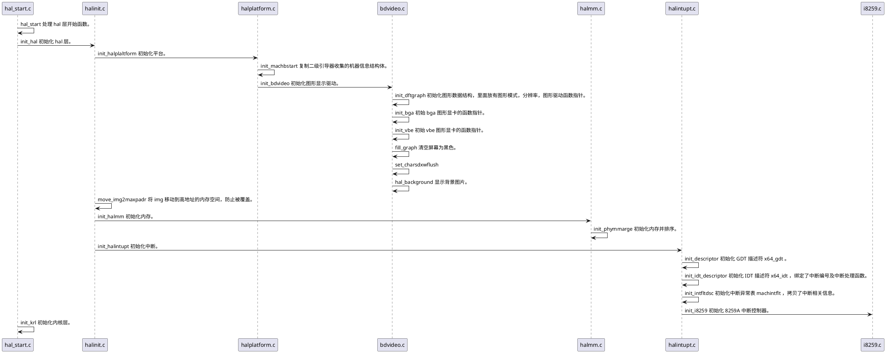

# 第一个 C 函数总体概述
第一个 C 函数 hal_start 首先初始化 hal 层，其中执行了平台初始化，hal层的内存初始化、中断初始化，最后进入到内核初始化。下面展示了整个执行时序图，先有一个宏观的感官。

下面在从微观角度看一下每一个功能的实现。

# hal 层初始化
hal 层初始化相关代码在 `Cosmos/hal/x86/halinit.c` 中实现，比较简单，调用初始化平台、初始化内存、初始化中断的功能，如下所示。
```cpp
void init_hal()
{
    // 平台初始化函数
    init_halplaltform();
    // 将 img 移动到高地址的内存空间，防止被覆盖
    move_img2maxpadr(&kmachbsp);
    // 初始化内存
    init_halmm(); 
    // 初始化中断
    init_halintupt();
    return;
}
```
接下来看一下初始化平台。

## 初始化平台
初始化平台主要完成两个任务，一个是把二级引导器建立的机器信息结构复制到 hal 层的一个全局变量中，方便内核中的其他代码使用里面的信息，之后二级引导器建立的数据所占用的内存都会被释放；二是初始化图形显示驱动，内核运行过程要在屏幕上输出信息。

初始化平台相关代码在 `Cosmos/hal/x86/halplatform.c` 文件中，以下代码实现了机器信息结构的复制。
```cpp
void init_machbstart()
{
    machbstart_t *kmbsp = &kmachbsp;
    machbstart_t *smbsp = MBSPADR; // 物理地址 1MB 处存放着此前初始化的 machbstart_t 结构体。
    machbstart_t_init(kmbsp);
    // 要把地址转换成虚拟地址并复制
    memcopy((void *)phyadr_to_viradr((adr_t)smbsp), (void *)kmbsp, sizeof(machbstart_t));
    return;
}
// 平台初始化函数
void init_halplaltform()
{
    // 复制机器信息结构
    init_machbstart();
    // 初始化图形显示驱动
    init_bdvideo();
    return;
}
```
其中值得关注的一个变量为 `kmachbsp` ，该变量是一个 hal 层的全局变量，定义在 `Cosmos/hal/x86/halglobal.c` 文件中，如下所示。
```cpp
//全局变量定义变量放在data段
#define HAL_DEFGLOB_VARIABLE(vartype,varname) \
EXTERN  __attribute__((section(".data"))) vartype varname

HAL_DEFGLOB_VARIABLE(machbstart_t,kmachbsp);
```

下面再看一下初始化图形显示驱动，相关代码在 `Cosmos/hal/x86/bdvideo.c` 文件中，如下所示。
```cpp
// 初始化图形显示驱动
PUBLIC LKINIT void init_bdvideo()
{
    dftgraph_t *kghp = &kdftgh;
    // 初始化图形数据结构，里面放有图形模式，分辨率，图形驱动函数指针
    init_dftgraph();
    // 初始bga图形显卡的函数指针
    init_bga();
    // 初始vbe图形显卡的函数指针
    init_vbe();
    // 清空屏幕 为黑色
    fill_graph(kghp, BGRA(0, 0, 0));
    // 显示背景图片 
    set_charsdxwflush(0, 0);
    hal_background();
    
    return;
}
```
`init_defgraph()` 函数初始了 `dftgraph_t` 结构体类型的变量 `kdftgh`，`dftgraph_t` 相关结构体定义在 `Cosmos/hal/x86/halglobal.c` 文件中，如下所示。
```cpp
typedef struct s_DFTGRAPH
{
    u64_t gh_mode;         //图形模式
    u64_t gh_x;            //水平像素点
    u64_t gh_y;            //垂直像素点
    u64_t gh_framphyadr;   //显存物理地址 
    u64_t gh_fvrmphyadr;   //显存虚拟地址
    u64_t gh_fvrmsz;       //显存大小
    u64_t gh_onepixbits;   //一个像素字占用的数据位数
    u64_t gh_onepixbyte;
    u64_t gh_vbemodenr;    //vbe模式号
    u64_t gh_bank;         //显存的bank数
    u64_t gh_curdipbnk;    //当前bank
    u64_t gh_nextbnk;      //下一个bank
    u64_t gh_banksz;       //bank大小
    u64_t gh_fontadr;      //字库地址
    u64_t gh_fontsz;       //字库大小
    u64_t gh_fnthight;     //字体高度
    u64_t gh_nxtcharsx;    //下一字符显示的x坐标
    u64_t gh_nxtcharsy;    //下一字符显示的y坐标
    u64_t gh_linesz;       //字符行高
    pixl_t gh_deffontpx;   //默认字体大小
    u64_t gh_chardxw;
    u64_t gh_flush;
    u64_t gh_framnr;
    u64_t gh_fshdata;      //刷新相关的
    dftghops_t gh_opfun;   //图形驱动操作函数指针结构体
}dftgraph_t;
typedef struct s_DFTGHOPS
{
    //读写显存数据
    size_t (*dgo_read)(void* ghpdev,void* outp,size_t rdsz);
    size_t (*dgo_write)(void* ghpdev,void* inp,size_t wesz);
    sint_t (*dgo_ioctrl)(void* ghpdev,void* outp,uint_t iocode);
    //刷新
    void   (*dgo_flush)(void* ghpdev);
    sint_t (*dgo_set_bank)(void* ghpdev, sint_t bnr);
    //读写像素
    pixl_t (*dgo_readpix)(void* ghpdev,uint_t x,uint_t y);
    void   (*dgo_writepix)(void* ghpdev,pixl_t pix,uint_t x,uint_t y);
    //直接读写像素 
    pixl_t (*dgo_dxreadpix)(void* ghpdev,uint_t x,uint_t y);
    void   (*dgo_dxwritepix)(void* ghpdev,pixl_t pix,uint_t x,uint_t y);
    //设置x，y坐标和偏移
    sint_t (*dgo_set_xy)(void* ghpdev,uint_t x,uint_t y);
    sint_t (*dgo_set_vwh)(void* ghpdev,uint_t vwt,uint_t vhi);
    sint_t (*dgo_set_xyoffset)(void* ghpdev,uint_t xoff,uint_t yoff);
    //获取x，y坐标和偏移
    sint_t (*dgo_get_xy)(void* ghpdev,uint_t* rx,uint_t* ry);
    sint_t (*dgo_get_vwh)(void* ghpdev,uint_t* rvwt,uint_t* rvhi);
    sint_t (*dgo_get_xyoffset)(void* ghpdev,uint_t* rxoff,uint_t* ryoff);
}dftghops_t;
//刷新显存
void flush_videoram(dftgraph_t *kghp)
{
    kghp->gh_opfun.dgo_flush(kghp);
    return;
}
```
初始化图形显示驱动，这里实现了设置背景图片，显示 Cosmos 的版本、编译时间、CPU工作模式、内存大小等数据。

## 初始化内存
hal 层的内存初始化比较容易，只要向内存管理器提供内存空间布局信息就可以。

在二级引导器中我们已经获取了内存布局信息，但是 Cosmos 的内存管理器需要保存更多的信息，这里就需要以 BIOS 提供的结构为基础，设计一套新的数据结构，如下所示。
```cpp
#define PMR_T_OSAPUSERRAM 1
#define PMR_T_RESERVRAM 2
#define PMR_T_HWUSERRAM 8
#define PMR_T_ARACONRAM 0xf
#define PMR_T_BUGRAM 0xff
#define PMR_F_X86_32 (1<<0)
#define PMR_F_X86_64 (1<<1)
#define PMR_F_ARM_32 (1<<2)
#define PMR_F_ARM_64 (1<<3)
#define PMR_F_HAL_MASK 0xff
typedef struct s_PHYMMARGE
{
    spinlock_t pmr_lock;//保护这个结构是自旋锁
    u32_t pmr_type;     //内存地址空间类型
    u32_t pmr_stype;
    u32_t pmr_dtype;    //内存地址空间的子类型，见上面的宏
    u32_t pmr_flgs;     //结构的标志与状态
    u32_t pmr_stus;
    u64_t pmr_saddr;    //内存空间的开始地址
    u64_t pmr_lsize;    //内存空间的大小
    u64_t pmr_end;      //内存空间的结束地址
    u64_t pmr_rrvmsaddr;//内存保留空间的开始地址
    u64_t pmr_rrvmend;  //内存保留空间的结束地址
    void* pmr_prip;     //结构的私有数据指针，以后扩展所用
    void* pmr_extp;     //结构的扩展数据指针，以后扩展所用
}phymmarge_t;
```

下面开始将  e820map_t 内存结构中的数据复制到 phymmarge_t 结构中来，如下所示。
```cpp
u64_t initpmrge_core(e820map_t *e8sp, u64_t e8nr, phymmarge_t *pmargesp)
{
    u64_t retnr = 0;
    for (u64_t i = 0; i < e8nr; i++)
    {
        //根据一个e820map_t结构建立一个phymmarge_t结构
        if (init_one_pmrge(&e8sp[i], &pmargesp[i]) == FALSE)
        {
            return retnr;
        }
        retnr++;
    }
    return retnr;
}
void init_phymmarge()
{
    machbstart_t *mbsp = &kmachbsp;
    phymmarge_t *pmarge_adr = NULL;
    u64_t pmrgesz = 0;
    //根据machbstart_t机器信息结构计算获得phymmarge_t结构的开始地址和大小
    ret_phymmarge_adrandsz(mbsp, &pmarge_adr, &pmrgesz);
    u64_t tmppmrphyadr = mbsp->mb_nextwtpadr;
    e820map_t *e8p = (e820map_t *)((adr_t)(mbsp->mb_e820padr));
    //建立phymmarge_t结构
    u64_t ipmgnr = initpmrge_core(e8p, mbsp->mb_e820nr, pmarge_adr);
    //把phymmarge_t结构的地址大小个数保存machbstart_t机器信息结构中
    mbsp->mb_e820expadr = tmppmrphyadr;
    mbsp->mb_e820exnr = ipmgnr;
    mbsp->mb_e820exsz = ipmgnr * sizeof(phymmarge_t);
    mbsp->mb_nextwtpadr = PAGE_ALIGN(mbsp->mb_e820expadr + mbsp->mb_e820exsz);
    //phymmarge_t结构中地址空间从低到高进行排序，我已经帮你写好了
    phymmarge_sort(pmarge_adr, ipmgnr);
    return;
}
```

## 初始化中断

在 x86 CPU 上，最多支持 256 个中断，这意味着我们要准备 256 个中断门描述符和 256 个中断处理程序的入口。

下面我们来定义中断门描述符，如下所示。
```cpp
// 中断门描述符
typedef struct s_GATE
{
        u16_t   offset_low;     /* 偏移 */
        u16_t   selector;       /* 段选择子 */
        u8_t    dcount;         /* 该字段只在调用门描述符中有效。如果在利用调用门调用子程序时引起特权级的转换和堆栈的改变，需要将外层堆栈中的参数复制到内层堆栈。该双字计数字段就是用于说明这种情况发生时，要复制的双字参数的数量。*/
        u8_t    attr;           /* P(1) DPL(2) DT(1) TYPE(4) */
        u16_t   offset_high;    /* 偏移的高位段 */
        u32_t   offset_high_h;
        u32_t   offset_resv;
}__attribute__((packed)) gate_t;
//定义中断表
HAL_DEFGLOB_VARIABLE(gate_t,x64_idt)[IDTMAX];
```

定义好中断表后，需要进行设置中断门描述符数据，相关代码如下所示。
```cpp
//vector 向量也是中断号
//desc_type 中断门类型，中断门，陷阱门
//handler 中断处理程序的入口地址
//privilege 中断门的权限级别
void set_idt_desc(u8_t vector, u8_t desc_type, inthandler_t handler, u8_t privilege)
{
    gate_t *p_gate = &x64_idt[vector];
    u64_t base = (u64_t)handler;
    p_gate->offset_low = base & 0xFFFF;
    p_gate->selector = SELECTOR_KERNEL_CS;
    p_gate->dcount = 0;
    p_gate->attr = (u8_t)(desc_type | (privilege << 5));
    p_gate->offset_high = (u16_t)((base >> 16) & 0xFFFF);
    p_gate->offset_high_h = (u32_t)((base >> 32) & 0xffffffff);
    p_gate->offset_resv = 0;
    return;
}
```

接下来，我们需要设置中断处理程序，中断处理程序只负责这三件事。
1. 保护 CPU 寄存器，即中断发生时的程序运行的上下文。
2. 调用中断处理程序，这个程序可以是修复异常的，可以是设备驱动程序中对设备响应的程序。
3. 恢复 CPU 寄存器，即恢复中断时程序运行的上下文，使程序继续运行。

下面为部分中断处理程序相关代码。
```cpp
//除法错误异常 比如除0
exc_divide_error:
  SRFTFAULT 0
//单步执行异常
exc_single_step_exception:
  SRFTFAULT 1
exc_nmi:
  SRFTFAULT 2
//调试断点异常
exc_breakpoint_exception:
  SRFTFAULT 3
//溢出异常
exc_overflow:
  SRFTFAULT 4
//段不存在异常
exc_segment_not_present:
  SRFTFAULT_ECODE 11
//栈异常
exc_stack_exception:
  SRFTFAULT_ECODE 12
//通用异常
exc_general_protection:
  SRFTFAULT_ECODE 13
//缺页异常
exc_page_fault:
  SRFTFAULT_ECODE 14
hxi_exc_general_intpfault:
  SRFTFAULT 256
//硬件1～7号中断
hxi_hwint00:
  HARWINT  (INT_VECTOR_IRQ0+0)
hxi_hwint01:
  HARWINT  (INT_VECTOR_IRQ0+1)
hxi_hwint02:
  HARWINT  (INT_VECTOR_IRQ0+2)
hxi_hwint03:
  HARWINT  (INT_VECTOR_IRQ0+3)
hxi_hwint04:
  HARWINT  (INT_VECTOR_IRQ0+4)
hxi_hwint05:
  HARWINT  (INT_VECTOR_IRQ0+5)
hxi_hwint06:
  HARWINT  (INT_VECTOR_IRQ0+6)
hxi_hwint07:
  HARWINT  (INT_VECTOR_IRQ0+7)
```

有了中断处理程序的入口地址，就可以设置中断描述符了，如下所示。
```cpp
void init_idt_descriptor()
{
    // 一开始把所有中断的处理程序设置为保留的通用处理程序
    for (u16_t intindx = 0; intindx <= 255; intindx++)
    {
        set_idt_desc((u8_t)intindx, DA_386IGate, hxi_exc_general_intpfault, PRIVILEGE_KRNL);
    }
    // 对已知的中断和异常进一步设置，这会覆盖之前的通用处理程序
    set_idt_desc(INT_VECTOR_DIVIDE, DA_386IGate, exc_divide_error, PRIVILEGE_KRNL);
    set_idt_desc(INT_VECTOR_DEBUG, DA_386IGate, exc_single_step_exception, PRIVILEGE_KRNL);
    set_idt_desc(INT_VECTOR_NMI, DA_386IGate, exc_nmi, PRIVILEGE_KRNL);
    set_idt_desc(INT_VECTOR_BREAKPOINT, DA_386IGate, exc_breakpoint_exception, PRIVILEGE_USER);
    set_idt_desc(INT_VECTOR_OVERFLOW, DA_386IGate, exc_overflow, PRIVILEGE_USER);
    ....
    set_idt_desc(INT_VECTOR_PAGE_FAULT, DA_386IGate, exc_page_fault, PRIVILEGE_KRNL);
    set_idt_desc(INT_VECTOR_IRQ0 + 0, DA_386IGate, hxi_hwint00, PRIVILEGE_KRNL);
    set_idt_desc(INT_VECTOR_IRQ0 + 1, DA_386IGate, hxi_hwint01, PRIVILEGE_KRNL);
    set_idt_desc(INT_VECTOR_IRQ0 + 2, DA_386IGate, hxi_hwint02, PRIVILEGE_KRNL);
    set_idt_desc(INT_VECTOR_IRQ0 + 3, DA_386IGate, hxi_hwint03, PRIVILEGE_KRNL);
    ....
     return;
}
```
最后再实现中断处理函数。
```cpp
//中断处理函数
void hal_do_hwint(uint_t intnumb, void *krnlsframp)
{
    intfltdsc_t *ifdscp = NULL;
    cpuflg_t cpuflg;
    if (intnumb > IDTMAX || krnlsframp == NULL)
    {
        hal_sysdie("hal_do_hwint fail\n");
        return;
    }
    // 根据中断号获取中断异常描述符地址    
    ifdscp = hal_retn_intfltdsc(intnumb);
    if (ifdscp == NULL)
    {
        hal_sysdie("hal_do_hwint ifdscp NULL\n");
        return;
    }
    // 对断异常描述符加锁并中断
    hal_spinlock_saveflg_cli(&ifdscp->i_lock, &cpuflg);
    ifdscp->i_indx++;
    ifdscp->i_deep++;
    // 运行中断处理的回调函数
    hal_run_intflthandle(intnumb, krnlsframp);
    ifdscp->i_deep--;
    // 解锁并恢复中断状态
    hal_spinunlock_restflg_sti(&ifdscp->i_lock, &cpuflg);
    return;
}
```
## 初始化中断控制器
前面实现了 CPU 端的中断，接下来需要初始化中断控制器，处理 CPU 与设备之间的中断，这里选择 8259A 中断控制器。

相关代码在 `Cosmos/hal/x86/i8259.c` 中，具体实现如下所示。
```cpp
void init_i8259()
{
	// 初始化主从8259a
	out_u8_p(ZIOPT, ICW1);
	out_u8_p(SIOPT, ICW1);
	out_u8_p(ZIOPT1, ZICW2);
	out_u8_p(SIOPT1, SICW2);
	out_u8_p(ZIOPT1, ZICW3);
	out_u8_p(SIOPT1, SICW3);
	out_u8_p(ZIOPT1, ICW4);
	out_u8_p(SIOPT1, ICW4);
	// 屏蔽全部中断源
	out_u8_p(ZIOPT1, 0xff);
	out_u8_p(SIOPT1, 0xff);
	
	return;
}
```
如果你要了解 8259A 的细节，就是上述代码中为什么要写入这些数据，你可以自己在 Intel 官方网站上搜索 8259A 的数据手册，自行查看。

