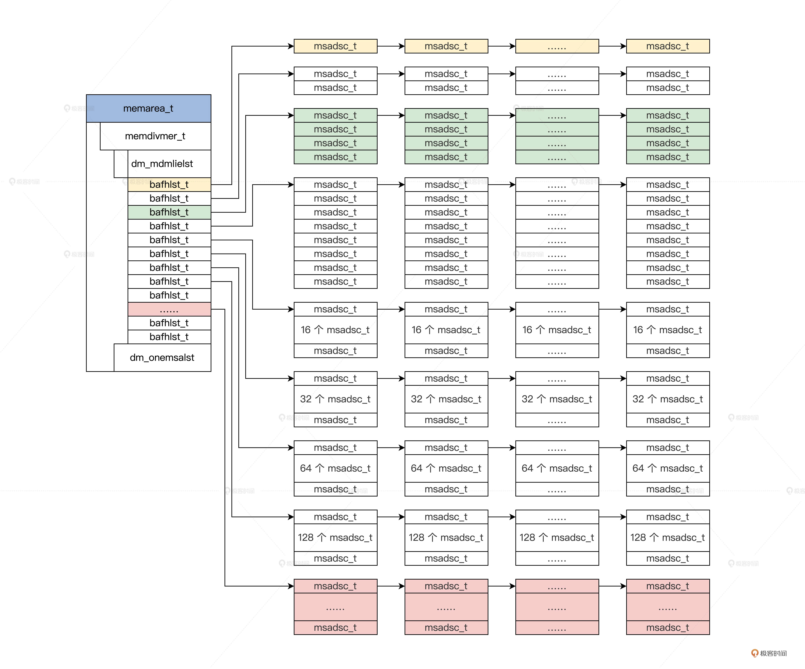
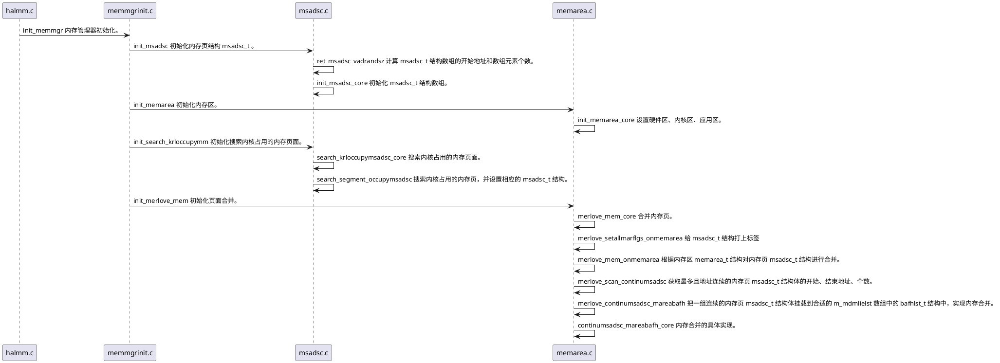
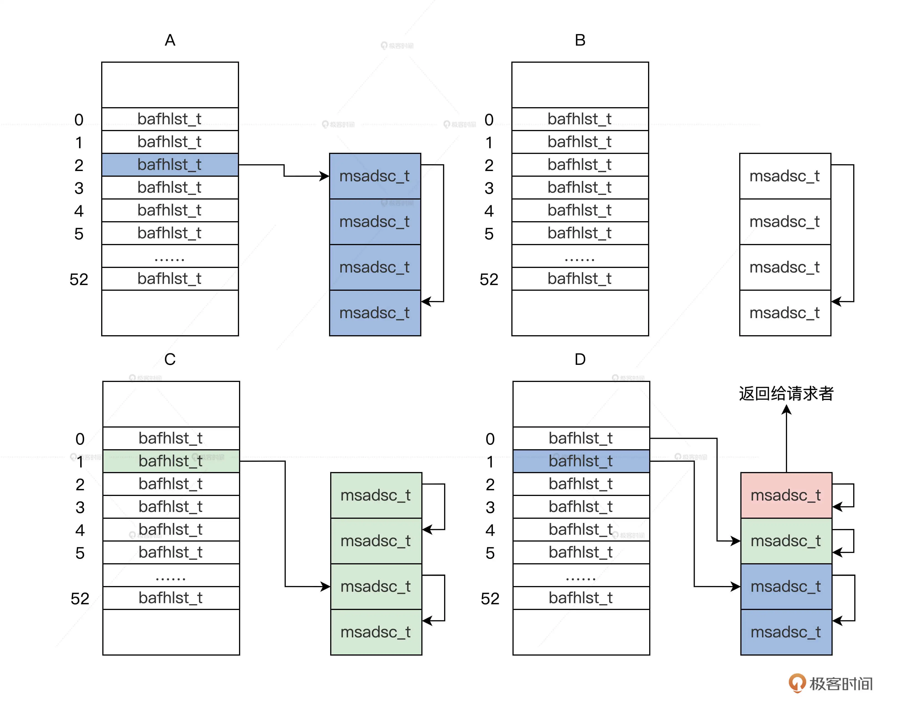
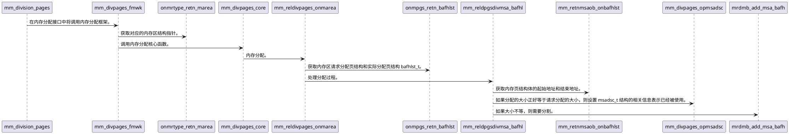
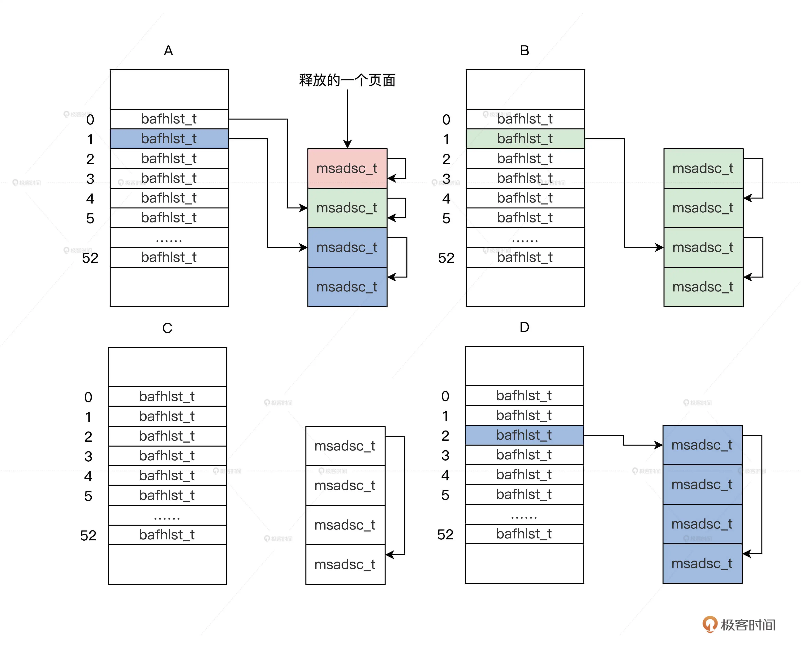
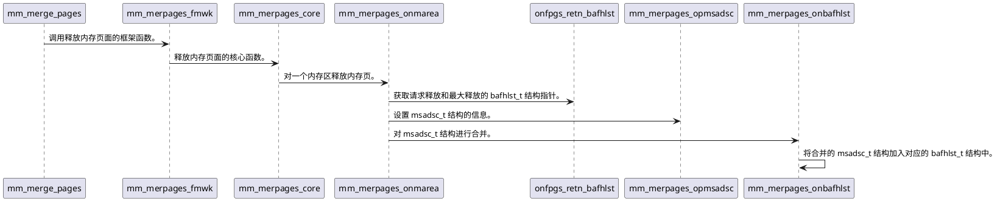

# 内存管理


## 内存页
我们使用分页模式来管理内存，把物理内存空间分成 4KB 大小页，称为内存页。

由于使用 4KB 进行分页，因此每一个页的起始地址都应该是 0x1000 的倍数，即地址的低 12 位可以可以另作它用。

为了使内存管理高效，我们需要一个结构存放页的状态、页的地址、页的分配记数、页的类型、页的链表，如下所示。
```cpp
// 内存空间地址描述符标志
typedef struct s_MSADFLGS
{
    u32_t mf_olkty:2;    // 挂入链表的类型
    u32_t mf_lstty:1;    // 是否挂入链表
    u32_t mf_mocty:2;    // 分配类型，被谁占用了，内核还是应用或者空闲
    u32_t mf_marty:3;    // 属于哪个区
    u32_t mf_uindx:24;   // 分配计数
}__attribute__((packed)) msadflgs_t; 
// 物理地址和标志  
typedef struct s_PHYADRFLGS
{
    u64_t paf_alloc:1;     // 分配位
    u64_t paf_shared:1;    // 共享位
    u64_t paf_swap:1;      // 交换位
    u64_t paf_cache:1;     // 缓存位
    u64_t paf_kmap:1;      // 映射位
    u64_t paf_lock:1;      // 锁定位
    u64_t paf_dirty:1;     // 脏位
    u64_t paf_busy:1;      // 忙位
    u64_t paf_rv2:4;       // 保留位
    u64_t paf_padrs:52;    // 页物理地址位
}__attribute__((packed)) phyadrflgs_t;
// 内存空间地址描述符
typedef struct s_MSADSC
{
    list_h_t md_list;           // 链表，可以方便它挂入到其他数据结构中。
    spinlock_t md_lock;         // 保护自身的自旋锁
    msadflgs_t md_indxflgs;     // 内存空间地址描述符标志
    phyadrflgs_t md_phyadrs;    // 物理地址和标志
    void* md_odlink;            // 相邻且相同大小 msadsc 的指针
}__attribute__((packed)) msadsc_t;
```
msadsc_t 结构看似很大，实则很小，因为它表示一个页面，物理内存页有多少就需要有多少个 msadsc_t 结构。

实际上一个 msadsc_t 结构占 40 字节，4KB * 100KB = 1G，所以按需要 10M 的内存空间才可以存下表示 1G 内存空间的 msadsc_t 结构。

正是因为页面地址总是按 4KB 对齐， 所以 phyadrflgs_t 结构的低 12 位才可以另作它用。

除了分配计数，msadflgs_t 结构中的其他部分都是用来描述 msadsc_t 结构本身信息的。

## 内存区
我们把物理内存分成三个区，分别为硬件区，内核区，应用区。

硬件区，它占用物理内存低端区域，地址区间为 `0~32MB`。因为很多外部硬件只能访问低于 24MB 的物理内存，所以需要硬件区。

内核区，内核也要使用内存，但是内核同样也是运行在虚拟地址空间，就需要有一段物理内存空间和内核的虚拟地址空间是线性映射关系。

应用区，这个区域主是给应用用户态程序使用。应用程序使用虚拟地址空间，一开始并不会为应用一次性分配完所需的所有物理内存，而是按需分配，即应用用到一页就分配一个页。
如果访问到一个没有与物理内存页建立映射关系的虚拟内存页，这时候 CPU 就会产生缺页异常。最终这个缺页异常由操作系统处理，操作系统会分配一个物理内存页，并建好映射关系。

下面为内存区的数据结构。
```cpp
#define MA_TYPE_HWAD 1
#define MA_TYPE_KRNL 2
#define MA_TYPE_PROC 3
#define MA_HWAD_LSTART 0
#define MA_HWAD_LSZ 0x2000000
#define MA_HWAD_LEND (MA_HWAD_LSTART+MA_HWAD_LSZ-1)
#define MA_KRNL_LSTART 0x2000000
#define MA_KRNL_LSZ (0x40000000-0x2000000)
#define MA_KRNL_LEND (MA_KRNL_LSTART+MA_KRNL_LSZ-1)
#define MA_PROC_LSTART 0x40000000
#define MA_PROC_LSZ (0xffffffff-0x40000000)
#define MA_PROC_LEND (MA_PROC_LSTART+MA_PROC_LSZ)
typedef struct s_MEMAREA
{
    list_h_t ma_list;             //内存区自身的链表
    spinlock_t ma_lock;           //保护内存区的自旋锁
    uint_t ma_stus;               //内存区的状态
    uint_t ma_flgs;               //内存区的标志 
    uint_t ma_type;               //内存区的类型
    sem_t ma_sem;                 //内存区的信号量
    wait_l_head_t ma_waitlst;     //内存区的等待队列
    uint_t ma_maxpages;           //内存区总的页面数
    uint_t ma_allocpages;         //内存区分配的页面数
    uint_t ma_freepages;          //内存区空闲的页面数
    uint_t ma_resvpages;          //内存区保留的页面数
    uint_t ma_horizline;          //内存区分配时的水位线
    adr_t ma_logicstart;          //内存区开始地址
    adr_t ma_logicend;            //内存区结束地址
    uint_t ma_logicsz;            //内存区大小
    //还有一些结构我们这里不关心。后面才会用到
}memarea_t；
```

挂载 msadsc_t 结构的数据结构，它其中需要锁、状态、msadsc_t 结构数量，挂载 msadsc_t 结构的链表、和一些统计数据。
```cpp
typedef struct s_BAFHLST
{
    spinlock_t af_lock;    //保护自身结构的自旋锁
    u32_t af_stus;         //状态 
    uint_t af_oder;        //页面数的位移量
    uint_t af_oderpnr;     //oder对应的页面数比如 oder为2那就是1<<2=4
    uint_t af_fobjnr;      //多少个空闲msadsc_t结构，即空闲页面
    uint_t af_mobjnr;      //此结构的msadsc_t结构总数，即此结构总页面
    uint_t af_alcindx;     //此结构的分配计数
    uint_t af_freindx;     //此结构的释放计数
    list_h_t af_frelst;    //挂载此结构的空闲msadsc_t结构
    list_h_t af_alclst;    //挂载此结构已经分配的msadsc_t结构
}bafhlst_t;
```
为了更高效，这里会将不同的大小的内存进行分割，相关结构如下
```cpp
#define MDIVMER_ARR_LMAX 52
typedef struct s_MEMDIVMER
{
    spinlock_t dm_lock;      //保护自身结构的自旋锁
    u32_t dm_stus;           //状态
    uint_t dm_divnr;         //内存分配次数
    uint_t dm_mernr;         //内存合并次数
    bafhlst_t dm_mdmlielst[MDIVMER_ARR_LMAX];//bafhlst_t结构数组
    bafhlst_t dm_onemsalst;  //单个的bafhlst_t结构
}memdivmer_t;
```
下图为页面组织结构示意图。


# 实现内存管理

内存管理的关键函数 init_memmgr 在 `cosmos/hal/x86/memmgrinit.c` 文件中, 该函数为物理内存管理器初始化的大总管,代码如下所示。
```cpp
//cosmos/hal/x86/halmm.c中
//hal层的内存初始化函数
void init_halmm()
{
    init_phymmarge();
    init_memmgr();
    return;
}
//Cosmos物理内存管理器初始化
void init_memmgr()
{
    //初始化内存页结构msadsc_t
    //初始化内存区结构memarea_t
    return;
}
```
在 init_memmgr 函数中应该要完成内存页结构 msadsc_t 和内存区结构 memarea_t 的初始化。

下图为内存管理的时序图。


## 内存页结构初始化
内存页的初始化实现代码在 `cosmos/hal/x86/msadsc.c` 文件中，如下所示。
```cpp
void write_one_msadsc(msadsc_t *msap, u64_t phyadr)
{
    //对msadsc_t结构做基本的初始化，比如链表、锁、标志位
    msadsc_t_init(msap);
    //这是把一个64位的变量地址转换成phyadrflgs_t*类型方便取得其中的地址位段
    phyadrflgs_t *tmp = (phyadrflgs_t *)(&phyadr);
    //把页的物理地址写入到msadsc_t结构中
    msap->md_phyadrs.paf_padrs = tmp->paf_padrs;
    return;
}
u64_t init_msadsc_core(machbstart_t *mbsp, msadsc_t *msavstart, u64_t msanr)
{
    //获取phymmarge_t结构数组开始地址
    phymmarge_t *pmagep = (phymmarge_t *)phyadr_to_viradr((adr_t)mbsp->mb_e820expadr);
    u64_t mdindx = 0;
    //扫描phymmarge_t结构数组
    for (u64_t i = 0; i < mbsp->mb_e820exnr; i++)
    {
        //判断phymmarge_t结构的类型是不是可用内存
        if (PMR_T_OSAPUSERRAM == pmagep[i].pmr_type)
        {
            //遍历phymmarge_t结构的地址区间
            for (u64_t start = pmagep[i].pmr_saddr; start < pmagep[i].pmr_end; start += 4096)
            {
                //每次加上4KB-1比较是否小于等于phymmarge_t结构的结束地址
                if ((start + 4096 - 1) <= pmagep[i].pmr_end)
                {
                    //与当前地址为参数写入第mdindx个msadsc结构
                    write_one_msadsc(&msavstart[mdindx], start);
                    mdindx++;
                }
            }
        }
    }
    return mdindx;
}
void init_msadsc()
{
    u64_t coremdnr = 0, msadscnr = 0;
    msadsc_t *msadscvp = NULL;
    machbstart_t *mbsp = &kmachbsp;
    //计算msadsc_t结构数组的开始地址和数组元素个数
    if (ret_msadsc_vadrandsz(mbsp, &msadscvp, &msadscnr) == FALSE)
    {
        system_error("init_msadsc ret_msadsc_vadrandsz err\n");
    }
    //开始真正初始化msadsc_t结构数组
    coremdnr = init_msadsc_core(mbsp, msadscvp, msadscnr);
    if (coremdnr != msadscnr)
    {
        system_error("init_msadsc init_msadsc_core err\n");
    }
    //将msadsc_t结构数组的开始的物理地址写入kmachbsp结构中 
    mbsp->mb_memmappadr = viradr_to_phyadr((adr_t)msadscvp);
    //将msadsc_t结构数组的元素个数写入kmachbsp结构中 
    mbsp->mb_memmapnr = coremdnr;
    //将msadsc_t结构数组的大小写入kmachbsp结构中 
    mbsp->mb_memmapsz = coremdnr * sizeof(msadsc_t);
    //计算下一个空闲内存的开始地址 
    mbsp->mb_nextwtpadr = PAGE_ALIGN(mbsp->mb_memmappadr + mbsp->mb_memmapsz);
    return;
}
```


## 内存区结构初始化

内存区结构初始化实现代码在 `cosmos/hal/x86/memarea.c` 文件，如下所示。
```cpp
void bafhlst_t_init(bafhlst_t *initp, u32_t stus, uint_t oder, uint_t oderpnr)
{
    //初始化bafhlst_t结构体的基本数据
    knl_spinlock_init(&initp->af_lock);
    initp->af_stus = stus;
    initp->af_oder = oder;
    initp->af_oderpnr = oderpnr;
    initp->af_fobjnr = 0;
    initp->af_mobjnr = 0;
    initp->af_alcindx = 0;
    initp->af_freindx = 0;
    list_init(&initp->af_frelst);
    list_init(&initp->af_alclst);
    list_init(&initp->af_ovelst);
    return;
}
void memdivmer_t_init(memdivmer_t *initp)
{
    //初始化medivmer_t结构体的基本数据
    knl_spinlock_init(&initp->dm_lock);
    initp->dm_stus = 0;
    initp->dm_divnr = 0;
    initp->dm_mernr = 0;
    //循环初始化memdivmer_t结构体中dm_mdmlielst数组中的每个bafhlst_t结构的基本数据
    for (uint_t li = 0; li < MDIVMER_ARR_LMAX; li++)
    {
        bafhlst_t_init(&initp->dm_mdmlielst[li], BAFH_STUS_DIVM, li, (1UL << li));
    }
    bafhlst_t_init(&initp->dm_onemsalst, BAFH_STUS_ONEM, 0, 1UL);
    return;
}
void memarea_t_init(memarea_t *initp)
{
    //初始化memarea_t结构体的基本数据
    list_init(&initp->ma_list);
    knl_spinlock_init(&initp->ma_lock);
    initp->ma_stus = 0;
    initp->ma_flgs = 0;
    initp->ma_type = MA_TYPE_INIT;
    initp->ma_maxpages = 0;
    initp->ma_allocpages = 0;
    initp->ma_freepages = 0;
    initp->ma_resvpages = 0;
    initp->ma_horizline = 0;
    initp->ma_logicstart = 0;
    initp->ma_logicend = 0;
    initp->ma_logicsz = 0;
    //初始化memarea_t结构体中的memdivmer_t结构体
    memdivmer_t_init(&initp->ma_mdmdata);
    initp->ma_privp = NULL;
    return;
}
bool_t init_memarea_core(machbstart_t *mbsp)
{
    //获取memarea_t结构开始地址
    u64_t phymarea = mbsp->mb_nextwtpadr;
    //检查内存空间够不够放下MEMAREA_MAX个memarea_t结构实例变量
    if (initchkadr_is_ok(mbsp, phymarea, (sizeof(memarea_t) * MEMAREA_MAX)) != 0)
    {
        return FALSE;
    }
    memarea_t *virmarea = (memarea_t *)phyadr_to_viradr((adr_t)phymarea);
    for (uint_t mai = 0; mai < MEMAREA_MAX; mai++)
    {   //循环初始化每个memarea_t结构实例变量
        memarea_t_init(&virmarea[mai]);
    }
    //设置硬件区的类型和空间大小
    virmarea[0].ma_type = MA_TYPE_HWAD;
    virmarea[0].ma_logicstart = MA_HWAD_LSTART;
    virmarea[0].ma_logicend = MA_HWAD_LEND;
    virmarea[0].ma_logicsz = MA_HWAD_LSZ;
    //设置内核区的类型和空间大小
    virmarea[1].ma_type = MA_TYPE_KRNL;
    virmarea[1].ma_logicstart = MA_KRNL_LSTART;
    virmarea[1].ma_logicend = MA_KRNL_LEND;
    virmarea[1].ma_logicsz = MA_KRNL_LSZ;
    //设置应用区的类型和空间大小
    virmarea[2].ma_type = MA_TYPE_PROC;
    virmarea[2].ma_logicstart = MA_PROC_LSTART;
    virmarea[2].ma_logicend = MA_PROC_LEND;
    virmarea[2].ma_logicsz = MA_PROC_LSZ;
    //将memarea_t结构的开始的物理地址写入kmachbsp结构中 
    mbsp->mb_memznpadr = phymarea;
    //将memarea_t结构的个数写入kmachbsp结构中 
    mbsp->mb_memznnr = MEMAREA_MAX;
    //将所有memarea_t结构的大小写入kmachbsp结构中 
    mbsp->mb_memznsz = sizeof(memarea_t) * MEMAREA_MAX;
    //计算下一个空闲内存的开始地址 
    mbsp->mb_nextwtpadr = PAGE_ALIGN(phymarea + sizeof(memarea_t) * MEMAREA_MAX);
    return TRUE;
}
//初始化内存区
void init_memarea()
{
    //真正初始化内存区
    if (init_memarea_core(&kmachbsp) == FALSE)
    {
        system_error("init_memarea_core fail");
    }
    return;
}
```

## 内存页的分配
分配一个页面，这个算法将执行如下步骤：
1. 根据一个页面的请求，会返回 m_mdmlielst 数组中的第 0 个 bafhlst_t 结构。
2. 如果第 0 个 bafhlst_t 结构中有 msadsc_t 结构就直接返回，若没有 msadsc_t 结构，就会继续查找 m_mdmlielst 数组中的第 1 个 bafhlst_t 结构。
3. 如果第 1 个 bafhlst_t 结构中也没有 msadsc_t 结构，就会继续查找 m_mdmlielst 数组中的第 2 个 bafhlst_t 结构。
4. 如果第 2 个 bafhlst_t 结构中有 msadsc_t 结构，记住第 2 个 bafhlst_t 结构中对应是 4 个连续的 msadsc_t 结构。这时让这 4 个连续的 msadsc_t 结构从第 2 个 bafhlst_t 结构中脱离。
5. 把这 4 个连续的 msadsc_t 结构，对半分割成 2 个双 msadsc_t 结构，把其中一个双 msadsc_t 结构挂载到第 1 个 bafhlst_t 结构中。
6. 把剩下一个双 msadsc_t 结构，继续对半分割成两个单 msadsc_t 结构，把其中一个单 msadsc_t 结构挂载到第 0 个 bafhlst_t 结构中，剩下一个单 msadsc_t 结构返回给请求者，完成内存分配。

内存分配算法示意图。


时序图


## 内存页的释放
释放一个页面，这个算法将执行如下步骤：
1. 释放一个页面，会返回 m_mdmlielst 数组中的第 0 个 bafhlst_t 结构。
2. 设置这个页面对应的 msadsc_t 结构的相关信息，表示已经执行了释放操作。
3. 开始查看第 0 个 bafhlst_t 结构中有没有空闲的 msadsc_t，并且它和要释放的 msadsc_t 对应的物理地址是连续的。没有则把这个释放的 msadsc_t 挂载第 0 个 bafhlst_t 结构中，算法结束，否则进入下一步。
4. 把第 0 个 bafhlst_t 结构中的 msadsc_t 结构拿出来与释放的 msadsc_t 结构，合并成 2 个连续且更大的 msadsc_t。
5. 继续查看第 1 个 bafhlst_t 结构中有没有空闲的 msadsc_t，而且这个空闲 msadsc_t 要和上一步合并的 2 个 msadsc_t 对应的物理地址是连续的。没有则把这个合并的 2 个 msadsc_t 挂载第 1 个 bafhlst_t 结构中，算法结束，否则进入下一步。
6. 把第 1 个 bafhlst_t 结构中的 2 个连续的 msadsc_t 结构，还有合并的 2 个地址连续的 msadsc_t 结构拿出来，合并成 4 个连续且更大的 msadsc_t 结构。
7. 继续查看第 2 个 bafhlst_t 结构，有没有空闲的 msadsc_t 结构，并且它要和上一步合并的 4 个 msadsc_t 结构对应的物理地址是连续的。没有则把这个合并的 4 个 msadsc_t 挂载第 2 个 bafhlst_t 结构中，算法结束。

内存释放算法示意图。


时序图


整个流程基本结束，后面有时间再看细节。