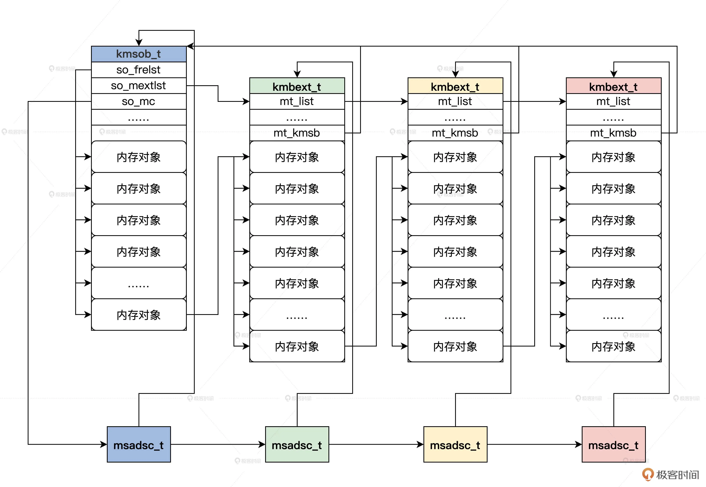
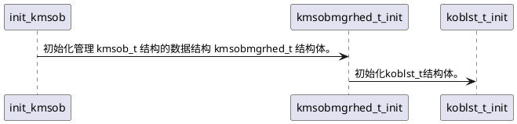
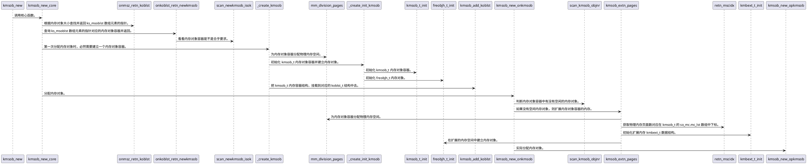
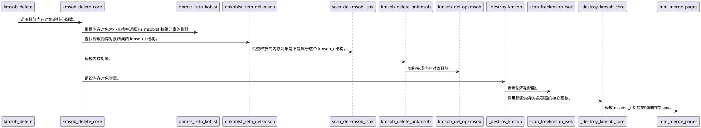

# 内存对象管理数据结构

用 freobjh_t 结构表示一个对象了，如下所示。
```cpp
typedef struct s_FREOBJH
{
    list_h_t oh_list;     // 内存对象链表
    uint_t oh_stus;       // 内存对象状态
    void* oh_stat;        // 内存对象的开始地址
}freobjh_t;
```

kmsob_t 用于表示内存对象容器，kmbext_t 用于表示内存对象容器的扩展内存，msomdc_t 和 msclst_t 用于管理内存对象容器占用的物理内存页面。

```cpp
//管理内存对象容器占用的内存页面所对应的msadsc_t结构
typedef struct s_MSCLST
{
    uint_t ml_msanr;  //多少个msadsc_t
    uint_t ml_ompnr;  //一个msadsc_t对应的连续的物理内存页面数
    list_h_t ml_list; //挂载msadsc_t的链表
}msclst_t;

//管理内存对象容器占用的内存
typedef struct s_MSOMDC
{
    //msclst_t结构数组mc_lst[0]=1个连续页面的msadsc_t
    //               mc_lst[1]=2个连续页面的msadsc_t
    //               mc_lst[2]=4个连续页面的msadsc_t
    //               mc_lst[3]=8个连续页面的msadsc_t
    //               mc_lst[4]=16个连续页面的msadsc_t
    msclst_t mc_lst[MSCLST_MAX];
    uint_t mc_msanr;   //总共多个msadsc_t结构
    list_h_t mc_list;
    //内存对象容器第一个占用msadsc_t
    list_h_t mc_kmobinlst;
    //内存对象容器第一个占用msadsc_t对应的连续的物理内存页面数
    uint_t mc_kmobinpnr;
}msomdc_t;

//管理内存对象容器扩展容量
typedef struct s_KMBEXT
{
    list_h_t mt_list;        //链表
    adr_t mt_vstat;          //内存对象容器扩展容量开始地址
    adr_t mt_vend;           //内存对象容器扩展容量结束地址
    kmsob_t* mt_kmsb;        //指向内存对象容器结构
    uint_t mt_mobjnr;        //内存对象容器扩展容量的内存中有多少对象
}kmbext_t;

// 内存对象容器
typedef struct s_KMSOB
{
    list_h_t so_list;        //链表
    spinlock_t so_lock;      //保护结构自身的自旋锁
    uint_t so_stus;          //状态与标志
    uint_t so_flgs;
    adr_t so_vstat;          //内存对象容器的开始地址
    adr_t so_vend;           //内存对象容器的结束地址
    size_t so_objsz;         //内存对象大小
    size_t so_objrelsz;      //内存对象实际大小
    uint_t so_mobjnr;        //内存对象容器中总共的对象个数
    uint_t so_fobjnr;        //内存对象容器中空闲的对象个数
    list_h_t so_frelst;      //内存对象容器中空闲的对象链表头
    list_h_t so_alclst;      //内存对象容器中分配的对象链表头
    list_h_t so_mextlst;     //内存对象容器扩展kmbext_t结构链表头
    uint_t so_mextnr;        //内存对象容器扩展kmbext_t结构个数
    msomdc_t so_mc;          //内存对象容器占用内存页面管理结构
    void* so_privp;          //本结构私有数据指针
    void* so_extdp;          //本结构扩展数据指针
}kmsob_t;
```

内存对象容器关系



管理内存对象容器 kmsob_t 结构的数据结构如下所示。
```cpp
#define KOBLST_MAX (64)
//挂载kmsob_t结构
typedef struct s_KOBLST
{
    list_h_t ol_emplst; // 挂载 kmsob_t 结构的链表
    kmsob_t* ol_cahe;   // 最近一次查找的 kmsob_t 结构
    uint_t ol_emnr;     // 挂载 kmsob_t 结构的数量
    size_t ol_sz;       // kmsob_t 结构中内存对象的大小
}koblst_t;
//管理 kmsob_t 结构的数据结构
typedef struct s_KMSOBMGRHED
{
    spinlock_t ks_lock;  // 保护自身的自旋锁
    list_h_t ks_tclst;   // 链表
    uint_t ks_tcnr;
    uint_t ks_msobnr;    // 总共多少个 kmsob_t 结构
    kmsob_t* ks_msobche; // 最近分配内存对象的 kmsob_t 结构
    koblst_t ks_msoblst[KOBLST_MAX]; //koblst_t结构数组
}kmsobmgrhed_t;
```
## 初始化

时序图

这里需要注意的是 ks_msoblst 数组中 kmsob_t 结构中内存对象的大小 ol_sz 初始值为 32 字节，并且每次递增 32，即 kmsob_t 内存容器中存放的单个内存对象最大内存大小为 32*64 = 2048 字节。
# 分配内存对象

时序图


## 释放内存对象


时序图



