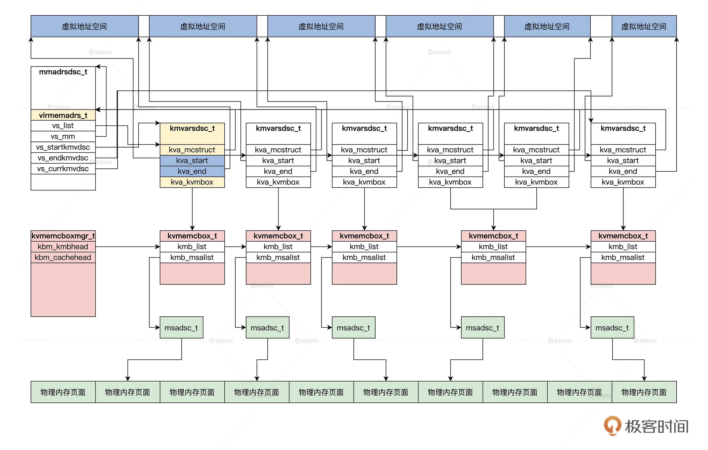
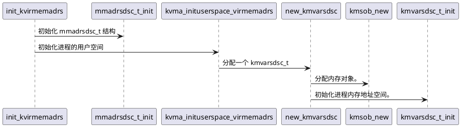
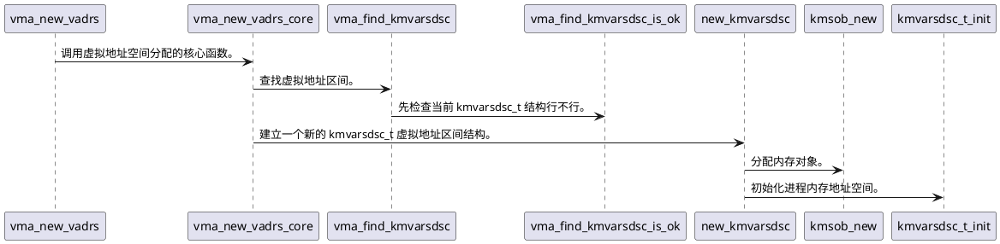
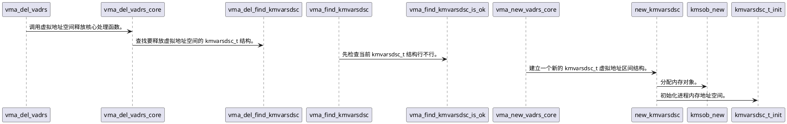
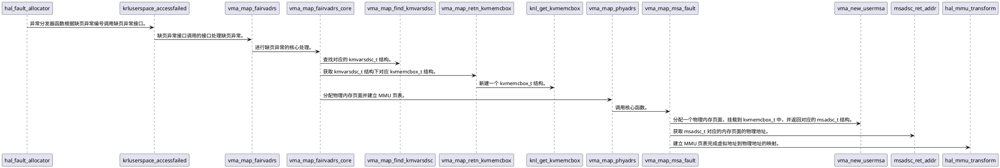

# 数据结构

虚拟地址区间
```cpp
// 虚拟地址空间
typedef struct KMVARSDSC
{
	spinlock_t kva_lock;	// 保护自身自旋锁
	u32_t  kva_maptype;		// 映射类型
	list_h_t kva_list;		// 链表
	u64_t  kva_flgs;		// 相关标志
	u64_t  kva_limits;
	vaslknode_t kva_lknode;
	void*  kva_mcstruct;	// 指向它的上层结构
	adr_t  kva_start;		// 虚拟地址的开始
	adr_t  kva_end;			// 虚拟地址的结束
	kvmemcbox_t* kva_kvmbox;// 管理这个结构映射的物理页面
	void*  kva_kvmcobj;
}kmvarsdsc_t;
```

虚拟地址空间描述结构
```cpp
// 虚拟地址空间描述结构
typedef struct s_VIRMEMADRS
{
	spinlock_t vs_lock;			// 保护自身的自旋锁
	u32_t  vs_resalin;
	list_h_t vs_list;			// 链表，链接虚拟地址区间
	uint_t vs_flgs;				// 标志
	uint_t vs_kmvdscnr;			// 多少个虚拟地址区间
	mmadrsdsc_t* vs_mm;			// 指向它的上层的数据结构
	kmvarsdsc_t* vs_startkmvdsc;// 开始的虚拟地址区间
	kmvarsdsc_t* vs_endkmvdsc;	// 结束的虚拟地址区间
	kmvarsdsc_t* vs_currkmvdsc;	// 当前的虚拟地址区间
	kmvarsdsc_t* vs_krlmapdsc;	// 能分配的开始虚拟地址
	kmvarsdsc_t* vs_krlhwmdsc;	// 能分配的结束虚拟地址
	kmvarsdsc_t* vs_krlolddsc;	
	kmvarsdsc_t* vs_heapkmvdsc;
	kmvarsdsc_t* vs_stackkmvdsc;
	adr_t vs_isalcstart;
	adr_t vs_isalcend;
	void* vs_privte;			// 私有数据指针
	void* vs_ext;				// 扩展数据指针
}virmemadrs_t;
```

进程的内存地址空间
```cpp
// 进程的内存地址空间
typedef struct s_MMADRSDSC
{
	spinlock_t msd_lock;		// 保护自身的自旋锁
	list_h_t msd_list;			// 链表
	uint_t msd_flag;			// 状态和标志
	uint_t msd_stus;
	uint_t msd_scount;			// 计数，该结构可能被共享
	thread_t* msd_thread;	
	sem_t  msd_sem;				// 信号量
	mmudsc_t msd_mmu;			// MMU相关的信息
	virmemadrs_t msd_virmemadrs;// 虚拟地址空间
	adr_t msd_stext;			// 应用的指令区的开始、结束地址
	adr_t msd_etext;
	adr_t msd_sdata;			// 应用的数据区的开始、结束地址
	adr_t msd_edata;
	adr_t msd_sbss;
	adr_t msd_ebss;
	adr_t msd_sbrk;				// 应用的堆区的开始、结束地址
	adr_t msd_ebrk;
}mmadrsdsc_t;
```

页面盒子
```cpp
// 页面盒子
typedef struct KVMEMCBOX 
{
	list_h_t kmb_list;			// 链表
	spinlock_t kmb_lock;		// 保护自身的自旋锁
	refcount_t kmb_cont;		// 共享的计数器
	u64_t kmb_flgs;				// 状态和标志
	u64_t kmb_stus;
	u64_t kmb_type;				// 类型
	uint_t kmb_msanr;			// 多少个msadsc_t
	list_h_t kmb_msalist;		// 挂载msadsc_t结构的链表
	kvmemcboxmgr_t* kmb_mgr;	// 指向上层结构
	void* kmb_filenode;			// 指向文件节点描述符
	void* kmb_pager;			// 指向分页器 暂时不使用
	void* kmb_ext;				// 自身扩展数据指针
}kvmemcbox_t;
```
页面盒子的头
```cpp
// 页面盒子的头
typedef struct KVMEMCBOXMGR 
{
	list_h_t kbm_list;		// 链表
	spinlock_t kbm_lock;	// 保护自身的自旋锁
	u64_t kbm_flgs;			// 标志与状态
	u64_t kbm_stus;	
	uint_t kbm_kmbnr;		// kvmemcbox_t结构个数
	list_h_t kbm_kmbhead;	// 挂载kvmemcbox_t结构的链表
	uint_t kbm_cachenr;		// 缓存空闲kvmemcbox_t结构的个数
	uint_t kbm_cachemax;	// 最大缓存个数，超过了就要释放
	uint_t kbm_cachemin;	// 最小缓存个数
	list_h_t kbm_cachehead;	// 缓存kvmemcbox_t结构的链表
	void* kbm_ext;			// 扩展数据指针
}kvmemcboxmgr_t;
```



初始化时序图

mmadrsdsc_t_init 函数功能：初始化全局变量 initmmadrsdsc 。
```cpp
// 初始化全局变量 initmmadrsdsc  
void mmadrsdsc_t_init(mmadrsdsc_t* initp)
{
	if(NULL == initp)
	{
		return;
	}
	krlspinlock_init(&initp->msd_lock);
	list_init(&initp->msd_list);
	initp->msd_flag = 0;
	initp->msd_stus = 0;
	initp->msd_scount = 0;
	initp->msd_thread = NULL;
	krlsem_t_init(&initp->msd_sem);
	krlsem_set_sem(&initp->msd_sem, SEM_FLG_MUTEX, SEM_MUTEX_ONE_LOCK);
	mmudsc_t_init(&initp->msd_mmu);
	virmemadrs_t_init(&initp->msd_virmemadrs);
	initp->msd_stext = 0;
	initp->msd_etext = 0;
	initp->msd_sdata = 0;
	initp->msd_edata = 0;
	initp->msd_sbss = 0;
	initp->msd_ebss = 0;
	initp->msd_sbrk = 0;
	initp->msd_ebrk = 0;
	return; 
}
```

kvma_inituserspace_virmemadrs 函数功能：初始化进程的用户空间。
```cpp
// 初始化进程虚拟地址空间
bool_t kvma_inituserspace_virmemadrs(virmemadrs_t *vma)
{
	kmvarsdsc_t *kmvdc = NULL, *stackkmvdc = NULL, *heapkmvdc = NULL;
	if (NULL == vma)
	{
		return FALSE;
	}
	//分配一个进程的内存地址空间 kmvarsdsc_t 
	kmvdc = new_kmvarsdsc();
	if (NULL == kmvdc)
	{
		return FALSE;
	}
	heapkmvdc = new_kmvarsdsc();
	if(NULL == heapkmvdc)
	{
		del_kmvarsdsc(kmvdc);
		return FALSE;
	}
	// 分配一个栈区的 kmvarsdsc_t 
	stackkmvdc = new_kmvarsdsc();
	if (NULL == stackkmvdc)
	{
		del_kmvarsdsc(kmvdc);
		del_kmvarsdsc(heapkmvdc);
		return FALSE;
	}
	// 虚拟区间开始地址 0x1000 4K
	kmvdc->kva_start = USER_VIRTUAL_ADDRESS_START + 0x1000;
	// 虚拟区间结束地址 0x5000
	kmvdc->kva_end = kmvdc->kva_start + 0x4000;
	kmvdc->kva_mcstruct = vma; 

	heapkmvdc->kva_start = THREAD_HEAPADR_START;
	heapkmvdc->kva_end = heapkmvdc->kva_start + 0x1000;
	heapkmvdc->kva_mcstruct = vma;
	heapkmvdc->kva_maptype = KMV_HEAP_TYPE;
	//栈虚拟区间开始地址 USER_VIRTUAL_ADDRESS_END - 0x40000000
	stackkmvdc->kva_start = PAGE_ALIGN(USER_VIRTUAL_ADDRESS_END - 0x40000000);
	//栈虚拟区间结束地址 USER_VIRTUAL_ADDRESS_END
	stackkmvdc->kva_end = USER_VIRTUAL_ADDRESS_END;
	stackkmvdc->kva_mcstruct = vma;
	stackkmvdc->kva_maptype = KMV_STACK_TYPE;

	krlspinlock_lock(&vma->vs_lock);
	vma->vs_isalcstart = USER_VIRTUAL_ADDRESS_START;
	vma->vs_isalcend = USER_VIRTUAL_ADDRESS_END;
	//设置虚拟地址空间的开始区间为kmvdc
	vma->vs_startkmvdsc = kmvdc;
	vma->vs_endkmvdsc = stackkmvdc;
	vma->vs_heapkmvdsc = heapkmvdc;
	//设置虚拟地址空间的开始区间为栈区
	vma->vs_stackkmvdsc = stackkmvdc;
	//加入链表
	list_add_tail(&kmvdc->kva_list, &vma->vs_list);
	list_add_tail(&heapkmvdc->kva_list, &vma->vs_list);
	list_add_tail(&stackkmvdc->kva_list, &vma->vs_list);
	// 计数加3
	vma->vs_kmvdscnr += 3;
	krlspinlock_unlock(&vma->vs_lock);
	return TRUE;
}
```

new_kmvarsdsc 函数主要功能：为 kmvarsdsc_t 结构申请一块内存空间，并初始化。
```cpp
// 申请内存空间
kmvarsdsc_t *new_kmvarsdsc()
{
	kmvarsdsc_t *kmvdc = NULL;
	// 分配内存对象
	kmvdc = (kmvarsdsc_t *)kmsob_new(sizeof(kmvarsdsc_t));
	if (NULL == kmvdc)
	{
		return NULL;
	}
	// 初始化
	kmvarsdsc_t_init(kmvdc);
	return kmvdc;
}
```

## 分配虚拟地址


vma_new_vadrs 函数功能：判断用户申请的地址是否合法，然后调用虚拟地址空间分配的核心函数。
```cpp
// 分配虚拟地址空间的接口，这里允许用户指定地址
adr_t vma_new_vadrs(mmadrsdsc_t *mm, adr_t start, size_t vassize, u64_t vaslimits, u32_t vastype)
{
	if (NULL == mm || 1 > vassize)
	{
		return NULL;
	}
	if (NULL != start)
	{	// 进行参数检查，开始地址要和页面（4KB）对齐，并且要大于 4K，原因见 kvma_inituserspace_virmemadrs 函数，
		// 结束地址不能超过整个虚拟地址空间
		if (((start & 0xfff) != 0) || (0x1000 > start) || (USER_VIRTUAL_ADDRESS_END < (start + vassize)))
		{
			return NULL;
		}
	}
	// 调用虚拟地址空间分配的核心函数
	return vma_new_vadrs_core(mm, start, VADSZ_ALIGN(vassize), vaslimits, vastype);
}
```

vma_new_vadrs_core 函数功能：找到 virmemadrs_t -> vs_list 链表中合适的 kmvarsdsc_t 内存区间，并分配空间。
```cpp
// 虚拟地址空间分配的核心函数
adr_t vma_new_vadrs_core(mmadrsdsc_t *mm, adr_t start, size_t vassize, u64_t vaslimits, u32_t vastype)
{
	adr_t retadrs = NULL;
	kmvarsdsc_t *newkmvd = NULL, *currkmvd = NULL;
	virmemadrs_t *vma = &mm->msd_virmemadrs;
	cpuflg_t cpuflg;
	krlspinlock_cli(&vma->vs_lock, &cpuflg);
	// 查找 virmemadrs_t 结构中的所有 kmvarsdsc_t 结构，找出合适的虚拟地址区间。
	currkmvd = vma_find_kmvarsdsc(vma, start, vassize, vaslimits, vastype);
	if (NULL == currkmvd)
	{
		retadrs = NULL;
		goto out;
	}
	//进行虚拟地址区间进行检查看能否复用这个数据结构
	if (((NULL == start) || (start == currkmvd->kva_end)) && (vaslimits == currkmvd->kva_limits) && (vastype == currkmvd->kva_maptype))
	{	//能复用的话，当前虚拟地址区间的结束地址返回
		retadrs = currkmvd->kva_end;
		//扩展当前虚拟地址区间的结束地址为分配虚拟地址区间的大小
		currkmvd->kva_end += vassize;
		vma->vs_currkmvdsc = currkmvd;
		goto out;
	}
	//建立一个新的kmvarsdsc_t虚拟地址区间结构
	newkmvd = new_kmvarsdsc();
	if (NULL == newkmvd)
	{
		retadrs = NULL;
		goto out;
	}
	//如果分配的开始地址为NULL就由系统动态决定
	if (NULL == start)
	{	//当然是接着当前虚拟地址区间之后开始
		newkmvd->kva_start = currkmvd->kva_end;
	}
	else
	{	//否则这个新的虚拟地址区间的开始就是请求分配的开始地址
		newkmvd->kva_start = start;
	}
	//设置新的虚拟地址区间的结束地址
	newkmvd->kva_end = newkmvd->kva_start + vassize;
	newkmvd->kva_limits = vaslimits;
	newkmvd->kva_maptype = vastype;
	newkmvd->kva_mcstruct = vma;
	vma->vs_currkmvdsc = newkmvd;
	//将新的虚拟地址区间加入到virmemadrs_t结构中
	list_add(&newkmvd->kva_list, &currkmvd->kva_list);
	//看看新的虚拟地址区间是否是最后一个
	if (list_is_last(&newkmvd->kva_list, &vma->vs_list) == TRUE)
	{
		vma->vs_endkmvdsc = newkmvd;
	}
 	//返回新的虚拟地址区间的开始地址
	retadrs = newkmvd->kva_start;
out:
	krlspinunlock_sti(&vma->vs_lock, &cpuflg);
	return retadrs;
}
```

vma_find_kmvarsdsc 函数的功能：查找 virmemadrs_t 结构中的所有 kmvarsdsc_t 结构，找出合适的虚拟地址区间。
```cpp
// 检查 kmvarsdsc_t 结构
kmvarsdsc_t *vma_find_kmvarsdsc_is_ok(virmemadrs_t *vmalocked, kmvarsdsc_t *curr, adr_t start, size_t vassize)
{
	kmvarsdsc_t *nextkmvd = NULL;
	adr_t newend = start + (adr_t)vassize;
	  // 先检查当前 kmvarsdsc_t 结构是不是最后一个
	if (list_is_last(&curr->kva_list, &vmalocked->vs_list) == FALSE)
	{	// 如果不是，就获取 curr 的下一个 kmvarsdsc_t 结构,这样就可以获取到当前虚拟内存的结束地址。
		nextkmvd = list_next_entry(curr, kmvarsdsc_t, kva_list);
		// 由系统动态决定分配虚拟空间的开始地址
		if (NULL == start)
		{
			// 如果 curr 的结束地址加上分配的大小小于等于下一个 kmvarsdsc_t 结构的开始地址就返回 curr
			if ((curr->kva_end + (adr_t)vassize) <= nextkmvd->kva_start)
			{
				return curr;
			}
		}
		else
		{ 	// 否则比较应用指定分配的开始、结束地址是不是在 curr 和下一个 kmvarsdsc_t 结构之间
			if ((curr->kva_end <= start) && (newend <= nextkmvd->kva_start))
			{
				return curr;
			}
		}
	}
	else
	{	// 否则 curr 为最后一个 kmvarsdsc_t 结构
		if (NULL == start)
		{	// curr 的结束地址加上分配空间的大小是不是小于整个虚拟地址空间
			if ((curr->kva_end + (adr_t)vassize) < vmalocked->vs_isalcend)
			{
				return curr;
			}
		}
		else
		{	// 否则比较应用指定分配的开始、结束地址是不是在 curr 的结束地址和整个虚拟地址空间的结束地址之间
			if ((curr->kva_end <= start) && (newend < vmalocked->vs_isalcend))
			{
				return curr;
			}
		}
	}
	return NULL;
}

//查找合适的 kmvarsdsc_t 结构
kmvarsdsc_t *vma_find_kmvarsdsc(virmemadrs_t *vmalocked, adr_t start, size_t vassize, u64_t vaslimits, u32_t vastype)
{
	kmvarsdsc_t *kmvdcurrent = NULL, *curr = vmalocked->vs_currkmvdsc;
	adr_t newend = start + vassize;
	list_h_t *listpos = NULL;
	// 分配的虚拟空间大小 小于 4KB 不行
	if (0x1000 > vassize)
	{
		return NULL;
	}
	// 将要分配虚拟地址空间的结束地址大于整个虚拟地址空间 不行
	if (newend > vmalocked->vs_isalcend)
	{
		return NULL;
	}
	

	if (NULL != curr)
	{	// 先检查当前 kmvarsdsc_t 结构行不行
		kmvdcurrent = vma_find_kmvarsdsc_is_ok(vmalocked, curr, start, vassize);
		if (NULL != kmvdcurrent)
		{
			if(vaslimits == kmvdcurrent->kva_limits && vastype == kmvdcurrent->kva_maptype)
			{
				return kmvdcurrent;
			}
		}
	}
	//遍历 virmemadrs_t 中的所有的 kmvarsdsc_t 结构
	list_for_each(listpos, &vmalocked->vs_list)
	{
		curr = list_entry(listpos, kmvarsdsc_t, kva_list);
		if(vaslimits == curr->kva_limits && vastype == curr->kva_maptype)
		{	//检查每个 kmvarsdsc_t 结构
			kmvdcurrent = vma_find_kmvarsdsc_is_ok(vmalocked, curr, start, vassize);
			if (NULL != kmvdcurrent)
			{	// 如果符合要求就返回
				return kmvdcurrent;
			}
		}
	}
	
	return NULL;
}
```


## 释放虚拟地址



vma_del_vadrs 函数功能：释放虚拟地址空间的接口，主要调用虚拟地址空间释放核心处理函数。
```cpp
// 释放虚拟地址空间的接口
bool_t vma_del_vadrs(mmadrsdsc_t *mm, adr_t start, size_t vassize)
{	//对参数进行检查
	if (NULL == mm || 1 > vassize || NULL == start)
	{
		return FALSE;
	}
	// 调用核心处理函数
	return vma_del_vadrs_core(mm, start, VADSZ_ALIGN(vassize));
}
```

vma_del_vadrs_core 函数功能：释放虚拟地址空间的核心函数。
```cpp
//释放虚拟地址空间的核心函数
bool_t vma_del_vadrs_core(mmadrsdsc_t *mm, adr_t start, size_t vassize)
{
    bool_t rets = FALSE;
    kmvarsdsc_t *newkmvd = NULL, *delkmvd = NULL;
    virmemadrs_t *vma = &mm->msd_virmemadrs;
    knl_spinlock(&vma->vs_lock);
    //查找要释放虚拟地址空间的kmvarsdsc_t结构
    delkmvd = vma_del_find_kmvarsdsc(vma, start, vassize);
    if (NULL == delkmvd)
    {
        rets = FALSE;
        goto out;
    }
    //第一种情况要释放的虚拟地址空间正好等于查找的kmvarsdsc_t结构
    if ((delkmvd->kva_start == start) && (delkmvd->kva_end == (start + (adr_t)vassize)))
    {
        //脱链
        list_del(&delkmvd->kva_list);
        //删除kmvarsdsc_t结构
        del_kmvarsdsc(delkmvd);
        vma->vs_kmvdscnr--;
        rets = TRUE;
        goto out;
    }
    //第二种情况要释放的虚拟地址空间是在查找的kmvarsdsc_t结构的上半部分
    if ((delkmvd->kva_start == start) && (delkmvd->kva_end > (start + (adr_t)vassize)))
    {    //所以直接把查找的kmvarsdsc_t结构的开始地址设置为释放虚拟地址空间的结束地址
        delkmvd->kva_start = start + (adr_t)vassize;
        rets = TRUE;
        goto out;
    }
    //第三种情况要释放的虚拟地址空间是在查找的kmvarsdsc_t结构的下半部分
    if ((delkmvd->kva_start < start) && (delkmvd->kva_end == (start + (adr_t)vassize)))
    {//所以直接把查找的kmvarsdsc_t结构的结束地址设置为释放虚拟地址空间的开始地址
        delkmvd->kva_end = start;
        rets = TRUE;
        goto out;
    }
    //第四种情况要释放的虚拟地址空间是在查找的kmvarsdsc_t结构的中间
    if ((delkmvd->kva_start < start) && (delkmvd->kva_end > (start + (adr_t)vassize)))
    {//所以要再新建一个kmvarsdsc_t结构来处理释放虚拟地址空间之后的下半虚拟部分地址空间
        newkmvd = new_kmvarsdsc();
        if (NULL == newkmvd)
        {
            rets = FALSE;
            goto out;
        }
        //让新的kmvarsdsc_t结构指向查找的kmvarsdsc_t结构的后半部分虚拟地址空间
        newkmvd->kva_end = delkmvd->kva_end;
        newkmvd->kva_start = start + (adr_t)vassize;
        //和查找到的kmvarsdsc_t结构保持一致
        newkmvd->kva_limits = delkmvd->kva_limits;
        newkmvd->kva_maptype = delkmvd->kva_maptype;
        newkmvd->kva_mcstruct = vma;
        delkmvd->kva_end = start;
        //加入链表
        list_add(&newkmvd->kva_list, &delkmvd->kva_list);
        vma->vs_kmvdscnr++;
        //是否为最后一个kmvarsdsc_t结构
        if (list_is_last(&newkmvd->kva_list, &vma->vs_list) == TRUE)
        {
            vma->vs_endkmvdsc = newkmvd;
            vma->vs_currkmvdsc = newkmvd;
        }
        else
        {
            vma->vs_currkmvdsc = newkmvd;
        }
        rets = TRUE;
        goto out;
    }
    rets = FALSE;
out:
    knl_spinunlock(&vma->vs_lock);
    return rets;
}
```


## 处理缺页异常

