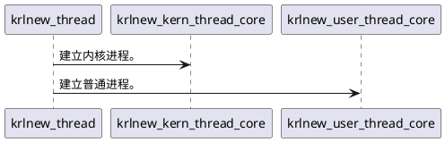
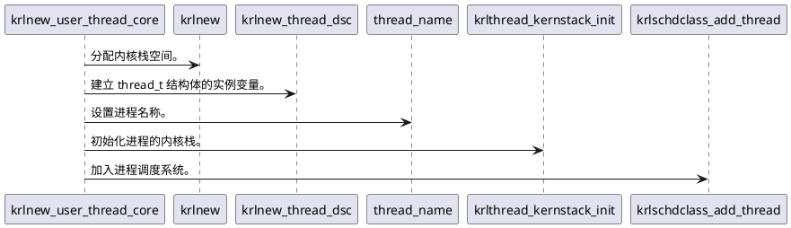
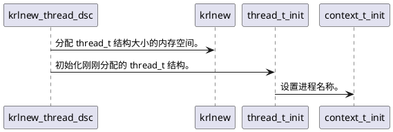
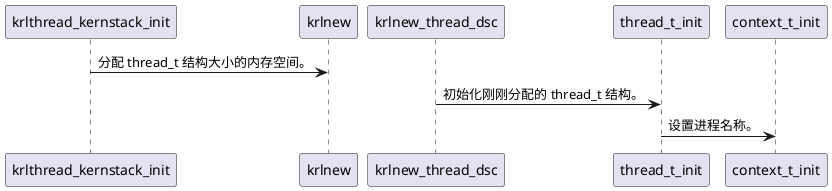
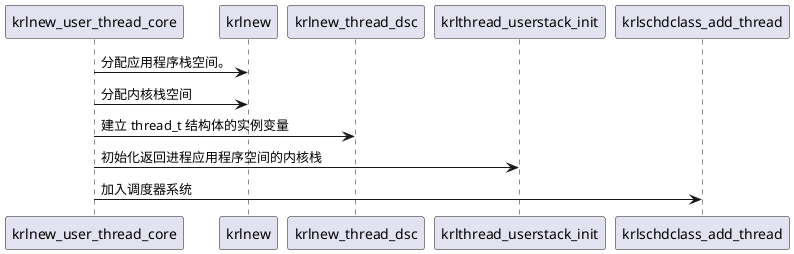
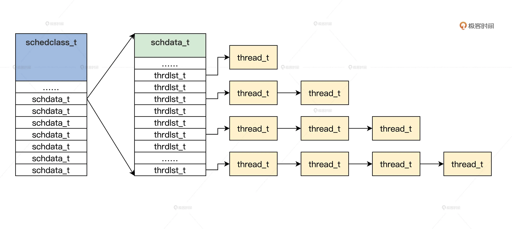

# 数据结构

```cpp
// 进程结构
typedef struct s_THREAD
{
    spinlock_t  td_lock;                    // 进程的自旋锁         
    list_h_t    td_list;                    // 进程链表 
    uint_t      td_flgs;                    // 进程的标志
    uint_t      td_stus;                    // 进程的状态
    uint_t      td_cpuid;                   // 进程所在的 CPU 的 id
    uint_t      td_id;                      // 进程的 id
    uint_t      td_tick;                    // 进程运行了多少 tick
    uint_t      td_sumtick;                 
    uint_t      td_privilege;               // 进程的权限
    uint_t      td_priority;                // 进程的优先级
    uint_t      td_runmode;                 // 进程的运行模式
    adr_t       td_krlstktop;               // 应用程序内核栈顶地址
    adr_t       td_krlstkstart;             // 应用程序内核栈开始地址
    adr_t       td_usrstktop;               // 应用程序栈顶地址
    adr_t       td_usrstkstart;             // 应用程序栈开始地址
    mmadrsdsc_t* td_mmdsc;                  // 地址空间结构
    void*       td_resdsc;
    void*       td_privtep;
    void*       td_extdatap;
    char_t*     td_appfilenm;
    uint_t      td_appfilenmlen;            //
    context_t   td_context;                 // 机器上下文件结构
    objnode_t*  td_handtbl[TD_HAND_MAX];    // 打开的对象数组，可以理解为进程打开资源的描述符数组
    char_t      td_name[THREAD_NAME_MAX];   //
}thread_t;
```

进程的地址空间
```cpp
// 进程的内存地址空间，它包含 virmemadrs_t 结构和 mmudsc_t 结构
typedef struct s_MMADRSDSC
{
	spinlock_t msd_lock;		// 保护自身的自旋锁
	list_h_t msd_list;			// 链表
	uint_t msd_flag;			// 状态和标志
	uint_t msd_stus;
	uint_t msd_scount;			// 计数，该结构可能被共享
	thread_t* msd_thread;	
	sem_t  msd_sem;				// 信号量
	mmudsc_t msd_mmu;			// MMU相关的信息
	virmemadrs_t msd_virmemadrs;// 虚拟地址空间
	adr_t msd_stext;			// 应用的指令区的开始、结束地址
	adr_t msd_etext;
	adr_t msd_sdata;			// 应用的数据区的开始、结束地址
	adr_t msd_edata;
	adr_t msd_sbss;				// 应用初始化为 0 的区域开始、结束地址
	adr_t msd_ebss;
	adr_t msd_sbrk;				// 应用的堆区的开始、结束地址
	adr_t msd_ebrk;
}mmadrsdsc_t;
```

进程的机器上下文
```cpp
// 进程的机器上下文
typedef struct s_CONTEXT
{  
    uint_t       ctx_nextrip;   // 保存下一次运行的地址
    uint_t       ctx_nextrsp;   // 保存下一次运行时内核栈的地址
    x64tss_t*    ctx_nexttss;   // 指向 tss 结构
}context_t;
```

x64tss_t 结构
```cpp
typedef struct s_X64TSS
{
	u32_t reserv0;	// 保留
	u64_t rsp0;		// R0特权级的栈地址
	u64_t rsp1;		// R1特权级的栈地址，我们未使用
	u64_t rsp2;		// R2特权级的栈地址，我们未使用
	u64_t reserv28;	// 保留
	u64_t ist[7];	// 我们未使用
	u64_t reserv92;	// 保留
	u16_t reserv100;// 保留
	u16_t iobase;	// 我们未使用
	
}__attribute__((packed)) x64tss_t;
```

# 建立进程

时序图

内核进程就是用进程的方式去运行一段内核代码，那么这段代码就可以随时暂停或者继续运行，又或者和其它代码段并发运行，只是这种进程永远不会回到进程应用程序地址空间中去，只会在内核地址空间中运行。



创建 thread_t 结构


初始化内核栈



建立普通进程



# 多进程调度

进程调度数据结构
```cpp
typedef struct s_THRDLST
{
    list_h_t    tdl_lsth;       // 挂载进程的链表头
    thread_t*   tdl_curruntd;   // 该链表上正在运行的进程
    uint_t      tdl_nr;         // 该链表上进程个数
}thrdlst_t;

typedef struct s_SCHDATA
{
    spinlock_t  sda_lock;               // 自旋锁
    uint_t      sda_cpuid;              // 当前CPU id
    uint_t      sda_schdflgs;           // 标志
    uint_t      sda_premptidx;          // 进程抢占计数
    uint_t      sda_threadnr;           // 进程数
    uint_t      sda_prityidx;           // 当前优先级
    thread_t*   sda_cpuidle;            // 当前CPU的空转进程
    thread_t*   sda_currtd;             // 当前正在运行的进程
    thrdlst_t   sda_thdlst[PRITY_MAX];  // 进程链表数组
    list_h_t    sda_exitlist;  
}schdata_t;

typedef struct s_SCHEDCALSS
{
    spinlock_t  scls_lock;              // 自旋锁
    uint_t      scls_cpunr;             // CPU 个数
    uint_t      scls_threadnr;          // 系统中所有的进程数
    uint_t      scls_threadid_inc;      // 分配进程id所用
    schdata_t   scls_schda[CPUCORE_MAX];// 每个 CPU 调度数据结构
}schedclass_t;
```




管理进程的初始化


设计实现进程调度器


# 实现进程的等待与唤醒机制