> 原文地址 [linux.do](https://linux.do/t/topic/2161543) 原文地址 [linux.do](https://linux.do/t/topic/2502409)

加入 linux.do 也有一段时间了，希望给大家带来一些有用的信息，谢谢大家！

# 揭露流氓 APP 是怎么围剿猎杀用户的

_**为吸引更多技术人员加入分析，揭开流氓软件行为，本人主动放弃本文全部版权。任何人可随意转载、修改、搬运本文，无需授权，不需要署我名**_

原本，我只想写一写，揭示某个 App 流氓且绕过商店审核的行为，但后来发现这并非个例。因此我停止了分析，转而自己写 App 去验证自己的想法，以便大家更好地了解这些现象。现在我作为一名业内人士，手机软件开发者，通过左右脑互博，梳理出了这些关键点及其解决方法。

#### _从下面开始，以第一视角的口吻来揭露行业内真相：_

## 一、流氓商家是怎么提高 APP 广告的转化率的？

这里列举三个常见但无人提及的方法：

一是接入系统厂商自带的广告 SDK。这些下崽器拥有特殊权限，能够调用应用商店进行静默下载和安装。（应用商店的静默下载安装权限无法被用户禁用）

在前几年我还发现就算是开了守护模式（禁止安装应用），此种广告依然能静默安装 APP

点击关闭按钮就自动下载、安装推广 app，此能力来自厂家自身广告 SDK

二是广告以全屏形式展开，当用户呼出虚拟导航键（小白条）时，会 100% 跳转至广告页面。

这样一来，用户只会以为是自己不小心手滑点到了。

实际上是广告页监听了导航栏，出现导航了说明用户进行了滑动，立马跳屏。

起初我猜测滑动这个松开动作被 app 广告页捕捉当成了点击。实际呼出小白条操作只会被系统拦截，app 无法感知到用户在哪个区域松手。

注意看滑动轨迹，没有额外点击

第三种是 "切屏广告"。用户从前台切出 App 一段时间后，再次返回时，会弹出类似开屏广告的页面。

用户往往误以为是手机内存不足，导致 App 被后台自动清理了。

这类情况过于普遍，我就不截图了。

其他非技术性的广告套路，例如叠加多层广告、使用深色背景遮挡半透明关闭按钮等，这里暂不展开讨论。

## 二、那能进一步提升广告触达率吗？

一种简单的办法就是让用户使用一段时间我们的 app，绘制热力图，得到用户常点的位置，然后把广告跳过和进入按钮进行对调。

如果不想让用户很快识别出这种手段，我们可以更换广告类型、样式、按钮大小，让用户感知不到但存在肌肉记忆

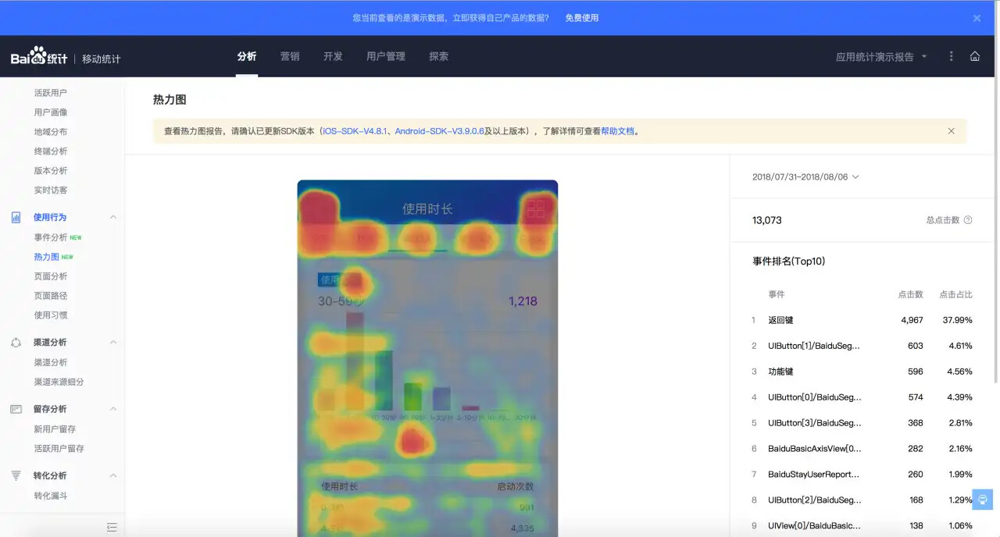

此图来自百度移动统计 SDK

## 三、怎么区分老人、小孩哥进行精准推广？

老人和小孩是两个沉默群体，并且其行为特征明显

老人特征

每一步操作的思考时间都明显长于年轻人

比如滑动操作（按下、滑动、松开）时间 > 500ms

底部有三大金刚

比如通过获取手机尺寸和 app 内界面显示最大尺寸比较，可以判断用户是否开启导航栏

安装应用列表短剧、短视频、极速版、听书居多

系统字体缩放比例在 "大" 以上

小孩哥特征

因为手指小，可以通过计算按压面积来判定（不是单一指标就断定为小孩哥）

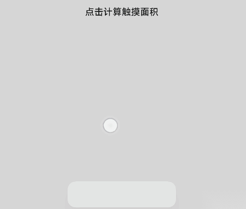

前两次：大拇指（大人）；后两次：尾指（模拟小孩）

安装软件里游戏居多，并且很多是商店里的小型游戏

这些是用户画像的重要一部分，只要我们精准识别为老人小孩群体，广告就可以不限制的推送给他们。

## 四、那用户拒绝了读取安装的软件列表权限，我们还能获取吗？

## **这里说一点，往往用户以为拒绝了就不会被读到，实际可以绕过！！！！！！！！！（所以你们手机上有什么外面的软件，反诈是可以打电话给你们的，当然是劝你们别干坏事）**

如图：

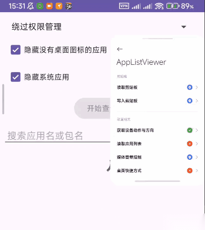

禁止了应用权限，依然可以绕过获得应用列表

## 五、要是有人抓包怎么办？

检测代理，只要发现开着代理就改变自身行为（禁止发送敏感数据、停止展示流氓广告）

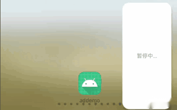

根据用户网络环境改变 app 行为

如果有人要逆向 app 怎么办

对抗是无止尽的，混淆、加固、反抓包能防住一般技术人员分析即可。我们这种体量的 APP 大佬们不会看上的

如果 APP 被盯上了要怎么办

如果被多方盯上了我直接滑跪，下架避避风口，然后改名再来

再不行就换皮上架，提前申请备用的版号

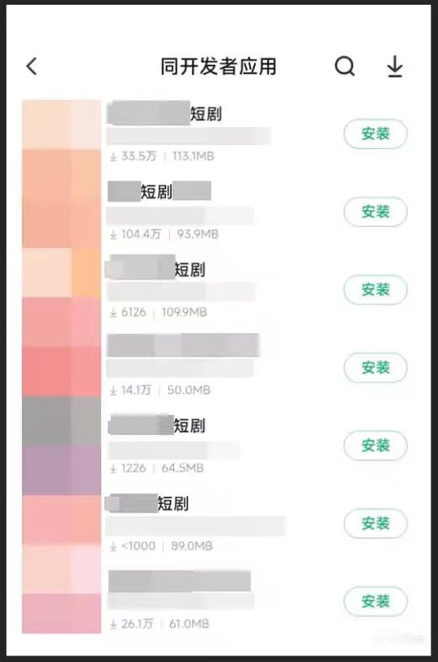

此为示例图，和本文无关

那要是用户要卸载怎么挽留

用户习惯性使用长按图标卸载，我们就可以加个假卸载入口来迷惑用户

然后进入后就发一些福利来挽留用户

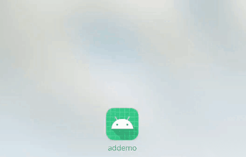

快捷菜单虚假卸载引流

六、那要是有用户要投诉我们呢？

比如我们接入的广告，我们就放一个

**假投诉 **按钮，投诉到**我们自己平台**

再在 app 个人中心里放一个**投诉反馈**。

截流是一种高效的手段。我们单独给这部分用户开绿色远控

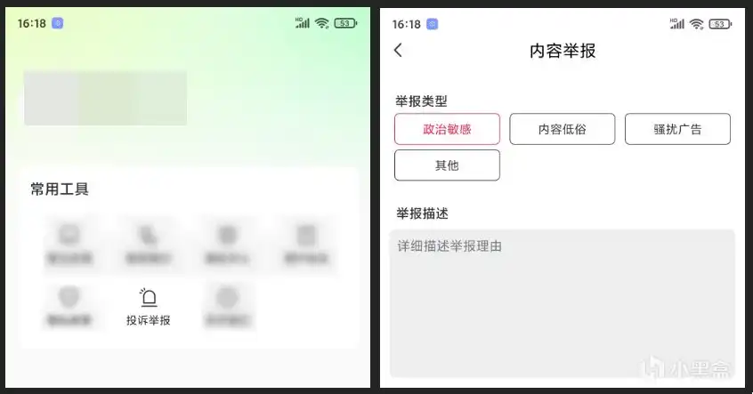

投诉截流

## 七、如果用户要录屏发到网上曝光，我们能阻止吗？

没有接口用于检测悬浮窗，但是可以通过 app 内操作后的视图更新速度（帧率）来推测是否可能开启了录屏

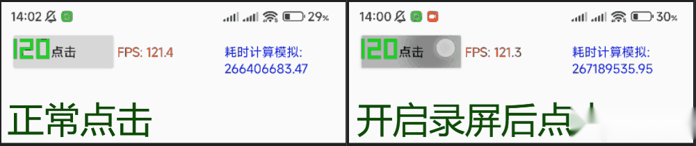

开启录屏后，操作帧会明显波动

测试过播放 4K 视频悬浮窗等，对 app 内的操作帧率不会有影响

只有录屏会出现如图的明显掉帧。我对此种检测方法保留意见，仅作示例

关于防止录屏和截图，其实可以直接调用系统接口禁止即可，简单粗暴。我们可以找个理由比如 "出于版权考虑，本 app 禁止截图和录屏"，你看很多的 app 甚至小程序都开始滥用这个功能。

禁止截图、录屏，强制录屏结果就是黑屏

## 八、要上架商店，人工审核怎么绕过呢？

审核人员的安卓虚拟机、手机都有特定的 app，我们只需要单独检测这部分 app，如果存在则开绿色通道。

另外，不要惹到律师，他们很难搞。比如，在开发时候，我们可以检测手机上是否有律师常用的 "真相取证"APP（com.truthso.ip360.activity）来让 APP 保持沉默，其他类似的就是敏感人士了，做网络安全的，在公安部门的，懂得都懂

远控下发配置白名单

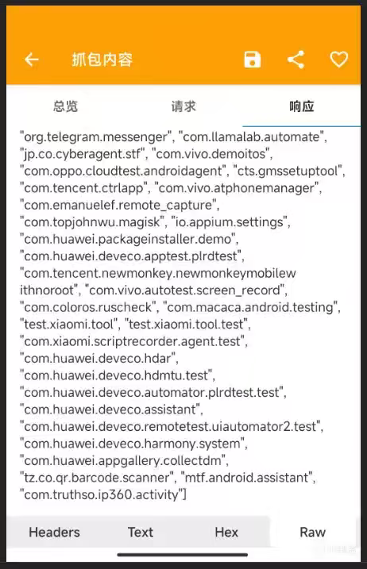

## 九、那怎么绕过最上面的人的审核？

可以结合多种手段，检测 IP 为北京、上海和广州等重点城市，针对性下发远控。

检测到商务、高端机型，特殊定制类机型就随机下发包（上面的人总不会在用红米和荣耀吧），让复现难度加大（但我不想一刀切，高端机型也有我们的目标用户）

我花了很多时间收集、逆向、分析、写代码验证，不是为了学习如何成为这样的恶龙，而是为了让这些潜藏在代码深处的恶意，暴露在公众中

当商业利益成为唯一驱动力，技术便不再是服务于人的工具，而异化为操控人的枷锁。

无止尽的试探底线，在透支整个移动互联网生态的信任。

_**技术本应向善，而不应成为围猎用户的利器**_

_**回归友好广告，守住做人底线**_

再提供相关开发资料（#替换为.）感兴趣的可以去看下

安卓 API 文档：

developer#android.google#cn/reference/packages

绕过应用列表权限获取应用列表的方法：

github#com/LuoYunXi0407/AppListViewer

#### 现在，知道了那么多流氓软件的套路之后，佬友应该多多少少心里有数了吧？更何况是应用商店没有上架的，某些来路不明的小软件，只会比上面说到的那些更恶心，这就是国内 APP 的生态啊，**所以，大家尽可能不要下载来路不明的软件。**

**如果家里有爸妈不太懂这些手机的，或者家中有老人 / 小孩，咱们还是给他们打开手机自带的软件管家拦截吧！（如无其他需要，最好锁死手机第三方安装权限和支付权限，或者干脆不绑支付卡）**

另外插一句嘴，如果遇到 APP 的关键词是：

破解版，解锁 VIP 会员，直播，大秀，瑟瑟软件，看篇软件，成人，同城，果聊，来路不明的 VPN 软件，约会，投资理财，下注，博彩…

那这些背后就不是窃取隐私那么简单了，很有可能是某东南亚灰产或者某某帮，站内也有人揭露过类似这样的骗局：[https://linux.do/t/topic/205802?u=aichitangcupaigu](https://linux.do/t/topic/205802)

希望本文能帮到大家，保护自己 / 家中老人小孩！

———————————————————————————————————————————————————————————

# 你的手机，是怎么样被他们区分对待的？

**跟大家说说，你的手机，广告从哪里来？又是怎么样被他们区分对待的？**

**首先，以快应用为例：**

我想你一定遇到过下面这种情况：打开 app 时，唤起了很多快应用

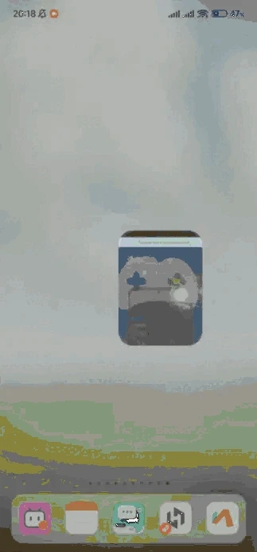

网上对于以上 “病毒式跳转” 的议论猜测有：

1、通过轻微的 “摇一摇” 从而使得合规跳转

2、app 自己偷偷点击广告

但都止步于猜测，始终缺少实例证据。于是我在通过抓包数据分析和阅读开发者文档后，发现事情没想的那么复杂。

---

**快应用 和 普通广告跳转 APP 不同**

普通广告跳转 app 会被系统拦截并弹窗询问

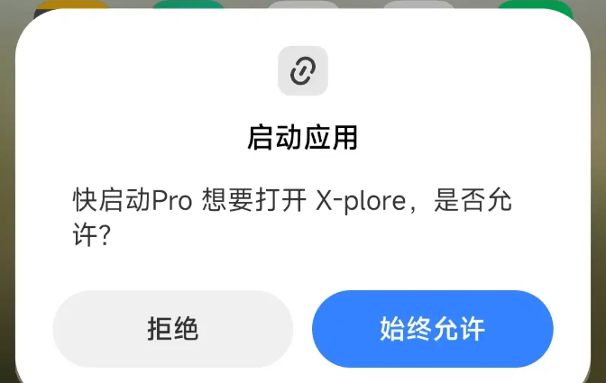

而快应用的跳转是独立设置的，即你没设置就默认跳转。等等，app 是怎么接到这些快应用广告的呢？（点名某雷下载 APP）

现在的 app 都不需要自己拉广告，而是接入广告 SDK，广告由 SDK 推送

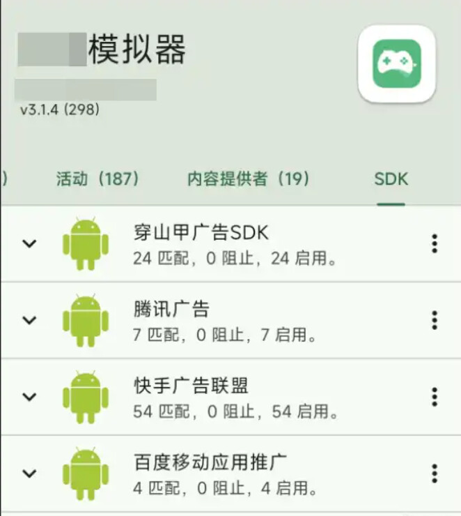

## **具体实现**

知道了这些，那我们就可以实现和头图相同的行为。

唤起方式和普通 app 无异，都是通过 intent，传递快应用协议和包名，比如 hap://app/com.zywl.tdwallpaper

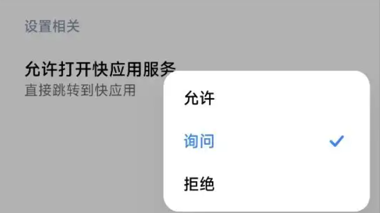

## **PS：常见问题解答**

### **为什么不同品牌手机的快应用设置、功能会有差异？**

快应用联盟只统一技术规范，具体实现由各大系统厂商安排，也就是说，厂商可以遵循，可以不遵循，可以禁用特定功能，可以开放特殊接口。

### **为什么国家网络安全通报中心报告中没有一个是快应用？**

快应用目前还没有特别流氓的应用（或者我没发现），流氓的是外部（网页、app）跳转快应用这个行为。

### **为什么 app 频繁拉起快应用这种严重影响体验的行为不会被厂商遏制？**

快应用的发展是严重滞后的，2021 年说解决跳转问题，几年过去了都没见进展。

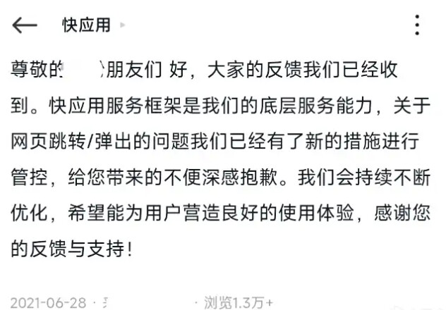

**  
其次，我们又是怎么样被他们区分对待的？**

# 一、检测到这些包名， App 可能会主动收敛广告与隐私越权

很多中小工具类、打包改版类国产 App 内置统一风控规则，一旦扫描到手机安装了维权取证、官方监管、隐私检测、逆向调试类 App，会立刻缩减广告频次、关闭静默权限读取、停止捆绑诱导下载，规避用户投诉与监管处罚，**因为这些人不好惹，也不是目标对象**

1. 维权投诉类

---

**真相取证**

包名：`com.ip360.truthso`

作用：检测到后大幅降低开屏 / 弹窗广告、关闭静默权限读取、禁止诱导下载捆绑软件

**黑猫投诉**

包名：`com.sina.blackcat`

作用：减少高频信息流广告、限制隐私数据上报、规避违规推广行为

### 同类型维权取证类（但厂商同样做风控降广告）

**移动公证（证据管家）**

包名：`com.fengyu.notary`

律师常用存证公证 APP，多数流氓软件检测到会收敛违规行为

**取证宝**

包名：`com.zhengqu.app`

网页 / 录屏侵权取证工具，风控白名单高频包名

**保全网**

包名：`com.baoquan.org`

区块链电子存证，属于厂商高危风控名单

2. 官方政企类

---

**公安一网通办**

包名：`com.ga.egov`

作用：公职、政企稳定就业高价值用户标签，部分中小流氓 APP 检测后会主动关闭静默权限读取、停止捆绑第三方软件推广行为

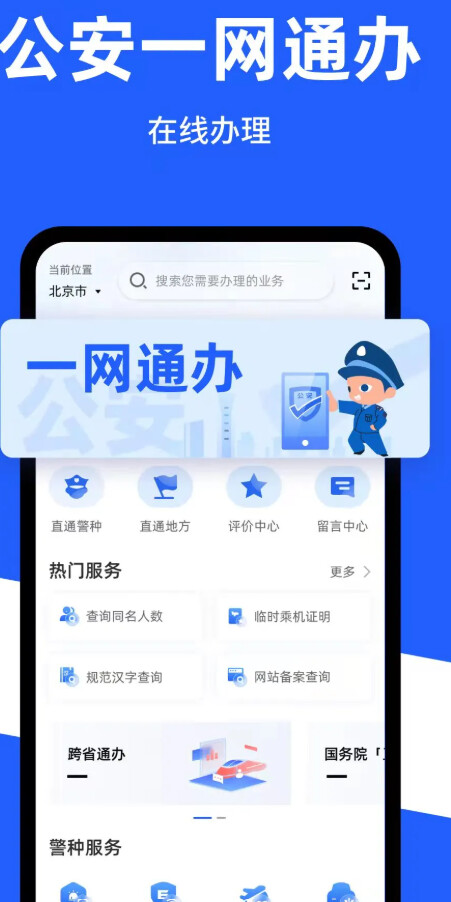

**工信部 APP 个人信息保护检测（官方小程序端无独立安装包，配套官方 APP）**

**12321 举报中心**

包名：`cn.12321.android.jbzs`

只要检测到该包，部分广告 SDK 会直接限制弹窗、跳过强制开屏广告，避免被官方投诉处罚

**全国 12315 平台**

包名： `com.samr.cdr（因为国家市场监督管理总局 就是SAMR 缩写`）

市场监管官方维权 APP，风控最高级白名单

3. 安全杀毒，隐私行为检测类

---

**LibChecker（APP 组件 / 广告 SDK 检测神器）**

包名：`com.absinthe.libchecker`

专门扫描广告埋点、追踪 SDK，几乎所有穿山甲 / 优量汇 / 快手广告 SDK 都内置该包名风控，检测到直接减少广告曝光

**Exodus Privacy（开源隐私追踪检测）**

包名：`org.eu.exodus_privacy.exodusprivacy`

国外知名追踪 SDK 扫描工具，国内很多 APP 会做兼容风控

**TrackerControl**

包名：`org.faircode.trackercontrol`

实时监控 APP 隐私联网上报，检测后限制用户画像广告推送

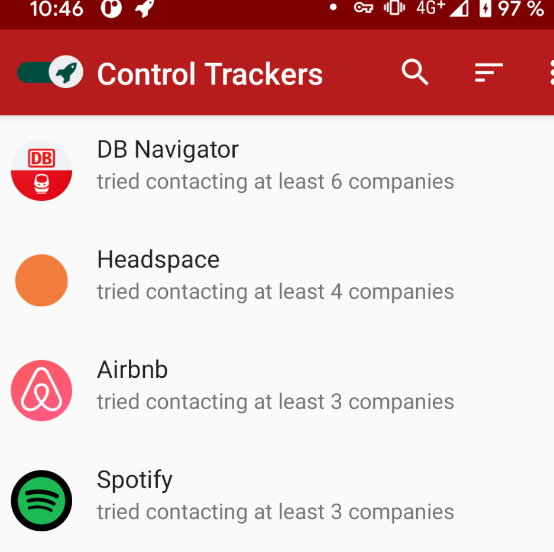

**HttpCanary（小黄鸟抓包）**

包名：`com.guoshi.httpcanary`

抓包取证神器，一旦检测安装，会关闭敏感网络上报、减少广告请求

**360 手机卫士**

包名：`com.qihoo360.mobilesafe`

**腾讯手机管家**

包名：`com.tencent.qqpimsecure`

两大安全厂商包名，部分流氓软件会主动收敛捆绑安装、恶意弹窗

4. 部分系统行为日志 / 权限监控类

---

**权限狗（PermissionHub）**

包名：`com.gaurav.ansu.permissionhub`

监控 APP 越权读取隐私，检测后会减少后台隐私采集、定向广告

**AppOps 权限管理**

包名：`com.suddenapp.ops`

精细化权限审计工具，风控高频白名单

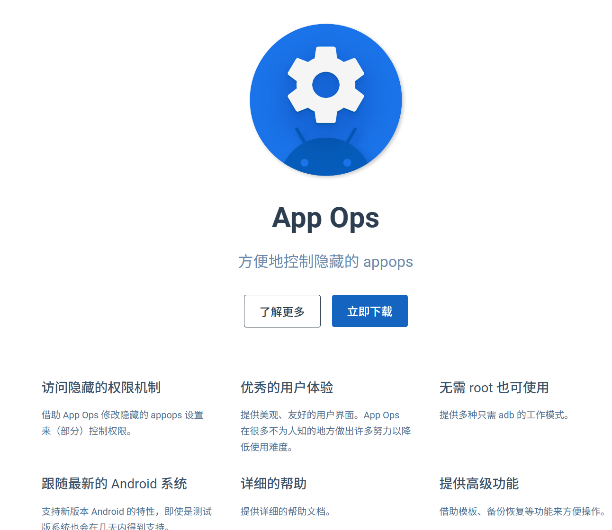

5. 逆向 / 调试类

---

**MT 管理器**

包名：`shturl.cc/x`

APK 反编译、安装包修改工具，绝大多数打包类流氓软件检测到直接屏蔽全部广告弹窗

**VMOS、光速虚拟机**

包名：`com.vmos.pro`、`com.gx.virtual`

虚拟机类 APP，厂商判定为取证、逆向环境，直接关闭所有商业化广告逻辑

# 二、广告 SDK 内置通用风控规则是什么？

#### （不止检测单个 APP，还会检测各种系统指纹）

#### 只要手机存在**抓包工具、虚拟机、权限审计、存证维权类 APP**

1.  部分广告 SDK 会自动：
2.  强制可跳过开屏广告、取消摇一摇 / 全屏弹窗广告
3.  降低广告展示频次（从高频改为低频）
4.  关闭静默安装、捆绑第三方软件行为
5.  停止位置、设备 ID 等隐私信息采集上报

#### 但是呢，也有生效局限：

1.  仅**国内中小开发者、单机工具类、破解版 / 打包修改类 APP** 风控最明显；
2.  大厂微信、抖音、淘宝等主流 APP **仅轻微降低违规广告**，但不会完全关闭合规商业广告。
3.  纯流氓或者病毒 APP **不会管你**

**但是，广告 SDK 不都要遵循广告法吗？**

拿巨量引擎广告 sdk 来说，广告由广告主在巨量引擎后台配置，其中可以配置落地页（即网页），巨量官方 AI 告知可以嵌入 “合规” 的 js，那这么长的一个链条，哪个环节出了问题呢？我并不知道。

不要问我为什么不实际验证，要测试必须是企业用户

[jishuzhan.net](https://jishuzhan.net/article/2056313256901971970)

### [巨量引擎营销 API 完整文档 - 技术栈](https://jishuzhan.net/article/2056313256901971970)

基于官方 OceanEngine Open Platform 和 Java SDK (oceanengine-mapi-java-client v1.1.85) 整理 文档更新时间: 2026-05-04

#### 巨量引擎文档截图：

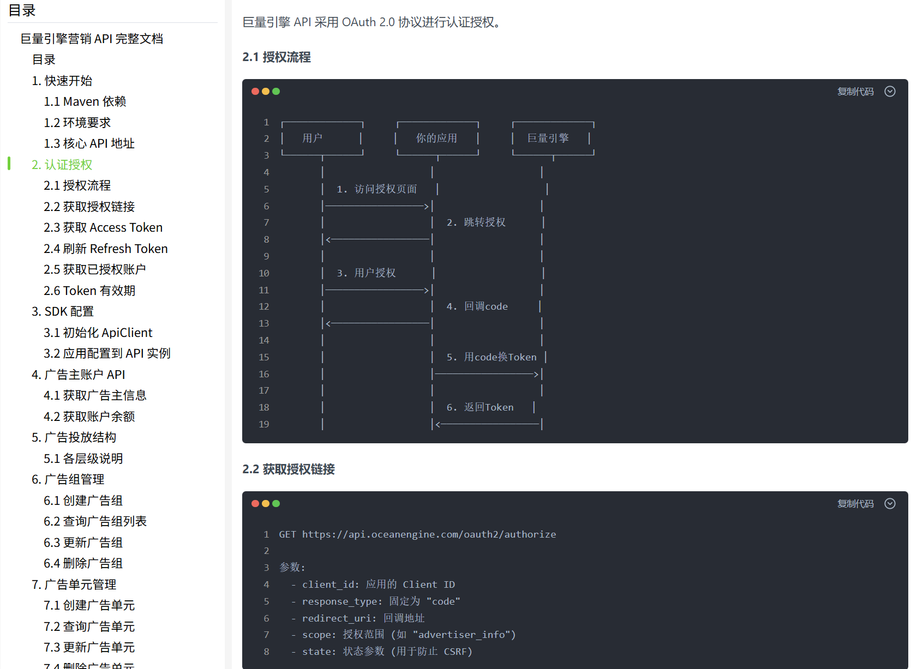

#### 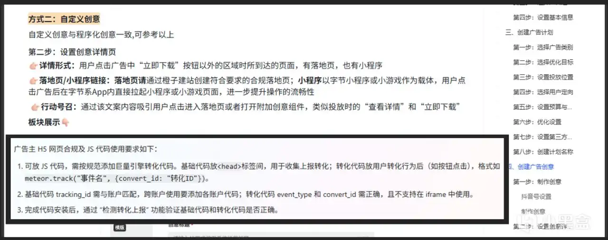

# 三、怎么通过获取机型，区分用户是高净值用户 / 低消费人群？

很简单，看手机型号价格就能区分 rich/poor / 消费主义者 / 低物欲水平者 / 老人 / 小孩，加上配合 APP 包名还能识别出大致区域，工作情况，婚姻情况，收入水平，用户画像一清二楚

广告 SDK 会抓取手机型号，对照新机官方定价完成基础用户标签划分：折叠屏、高端旗舰机型用户被归类为**高净值人群**，会避开小额网贷、低价拼团类下沉广告，定向推送高端房产、豪车养护、私募理财、轻奢商品营销；千元入门机、老旧机型则被判定为**价格敏感低消费群体**，大幅提高广告填充率，频繁推送薅羊毛、特价秒杀、现金借贷类内容；老旧功能机、大字体适配设备默认标记为**中老年用户**，游戏、线上教育类高频使用设备则会判定为**未成年人、学生群体**，针对性投放对应圈层广告。机型之外，结合 IP 地理位置、设备使用时长，还能进一步推断用户所在城市、从业类型，再结合婚恋约会、母婴类 App 安装记录，拼凑出婚姻状态、家庭结构，**构建完整用户画像来实现差异化定价与广告收割**。

# 四、怎么通过获取包名，区分用户是高净值用户 / 低消费人群？

高净值人群特点： **豪车，金融投资，高端商旅**

1. 豪华汽车品牌类

---

1.  **Mercedes me 奔驰官方 APP**

    包名：`com.daimler.ris.mercedesme.cn`

    作用：标记高收入高端客群，大幅砍掉金币裂变、砍价、小额借贷类低俗广告，减少强制弹窗广告，定向推送豪车养护、高端理财、奢侈品、高端房产类高客单价广告

2.  **BMW 宝马官方 APP**

    包名：`com.bmw.connected.cn`

    作用：判定中产以上消费用户，降低激励视频广告曝光频次，限制后台隐私画像高频采集，优先投放商旅、高端保险、轻奢消费类广告

3.  **特斯拉官方 APP**

    包名：`com.teslamotors.tesla`

    作用：标记高学历新中产人群，屏蔽下沉市场低价引流广告，收敛锁屏、摇一摇恶意弹窗广告，推送智能家居、高端出行、私募理财类广告

4.  **保时捷中国**

    包名：`com.porsche.porschecn`

    作用：顶级高净值用户标签，几乎关闭全部下沉类激励广告，仅保留品牌类、高端服务类商业广告

5.  **路虎 InControl**

    包名：`com.landrover.incontrol.cn`

    作用：判定高端自驾、高消费客群，减少低价团购、薅羊毛类信息流广告推送

6.  高端银行、券商金融类

---

6.  **招商银行掌上生活**

    包名：`com.cmbchina.cmbcredit`

    作用：高频中产及私行潜在用户标记，限制小额网贷类广告投放，收敛开屏强制广告，推送大额理财、高端信用卡、信托类广告

7.  **工商银行手机银行**

    包名：`com.icbc.mobile.android`

    作用：稳健高净值用户判定，降低低价引流广告填充率，减少 APP 后台静默收集用户行为数据

8.  **东方财富**

    包名：`com.eastmoney.android.berton`

    作用：投资理财类高价值用户标签，屏蔽下沉裂变拉新广告，适度减少弹窗广告频次

9.  高端会员电商、精品商超类

---

9.  **山姆会员商店**

    包名：`com.walmart.samsclubcn`

    作用：付费会员高消费人群判定，屏蔽特价团购、砍价类广告，但可能会推送高端生鲜、家居、母婴大牌类商业广告

10. **京东（标准版，非极速版）**

    包名：`com.jingdong.app.mall`

    作用：常规线上高消费用户，京东具有：品牌溢价 + 售后口碑 + 花钱省事人群专选 + 电子大额消费平台诸多特性

11. 高端出行、航司商旅类

---

11. **中国国航**

    包名：`com.airchina.iphone.android`

    作用：高频商旅高收入人群判定，收敛各类诱导下载捆绑广告，推送高端酒店、商旅服务广告

12. **香格里拉**

    包名：`com.shangri.la.mobile`

    作用：高端酒店常旅客，高净值度假、商务住宿用户标签，收敛各类恶意弹窗广告

13. **万豪旅享家**

    包名：`com.marriott.mobile`

    作用：全球高端商旅住宿用户，大幅降低广告曝光频次，定向推送高端度假、私人保险广告

14. **洲际酒店 IHG**

    包名：`com.ihg.mobile`

    作用：高频商务住宿人群判定，屏蔽特价优惠券、社群拼团类信息流广告

# 行业通用的 "低消费 “或者是” 价格敏感用户判定包名"

低消费人群特点：薅羊毛，低价，团购

#### （广告 SDK 检测到这些包名，判定下沉薅羊毛人群，大幅提升广告曝光频次、高频推送激励金币类、低价类、小额信贷类广告）

1. 各大平台极速版、金币任务版

---

1.  **抖音极速版**

    包名：`com.bytedance.douyinlite`

    作用：标记薅羊毛价格敏感用户，大幅提高开屏、插屏、激励视频广告曝光频次，频繁推送拉新裂变、金币任务、低价商品广告

2.  **快手极速版**

    包名：`com.kuaishou.nebula`

    作用：下沉市场核心标签，增加锁屏、悬浮弹窗广告，优先推送小额贷款、砍价拼团类高转化广告

3.  **京东极速版**

    包名：`com.jd.jdlite`

    作用：低价优惠敏感用户判定，大量推送特价秒杀、社群团购类信息流广告

4.  **淘宝特价版（淘特）**

    包名：`com.taobao.lite`

    作用：下沉电商用户标签，提高广告填充率，频繁触发激励视频、弹窗优惠券广告

5.  **头条极速版**

    包名：`com.ss.android.article.lite`

    作用：看资讯赚金币类用户判定，后台高频采集用户行为画像，持续推送各类赚钱任务类广告

6.  社区团购、低价生鲜类

---

6.  **多多买菜**

    包名：`com.xunmeng.pinduoduo.maicai`

    作用：线下低价消费人群标记，推送邻里团购、日用品特价类广告，增加弹窗优惠券广告频次

7.  **美团优选**

    包名：`com.meituan.youxuan`

    作用：社区下沉用户判定，拉高本地生活低价引流广告投放量级

8.  免费网文、薅羊毛工具类

---

8.  **番茄免费小说**

    包名：`com.bytedance.fanqienovel`

    作用：依赖免费激励变现用户标签，每章节高频植入激励广告、弹窗推广 APP 广告

9.  **WiFi 万能钥匙**

    包名：`com.snda.wifilocating`

    作用：下沉流量敏感用户判定，大量推送省钱、小额理财、低价话费类广告

# 三、所以，有什么焚绝可以教给佬友们吗？有的！

1.  **简体字改成繁体字（港台）或者英文**，少数民族同胞可以改成藏文，地区可以保留中国大陆，但不放心地区可以修改成港澳台，因为非简体广告 SDK 投放较少，因为境外广告投放体系和国内简体广告 SDK 相互独立，能够大幅减少下沉类定向营销广告推送，规避精细化用户画像采集
2.  **在谷歌商店搜索软件的境外版**，替换掉（洋大人可没投放过简体中文 SDK 广告），因为海外版本不会内置国内穿山甲、优量汇等本土广告 SDK，没有精细化用户分层投放机制，开屏弹窗、激励类广告数量会大幅减少
3.  **按需安装 12315、12321 官方维权 App 以及 LibChecker 隐私检测工具**，既能约束多数小众流氓 App 的违规广告行为，也可随时取证违规隐私收集行为，遇到恶意过度营销、越权窃取信息的应用，及时向监管平台投诉举报。（这里推荐跳一跳之类的 APP，不过最近整顿严打，很多 APP 开屏跳转广告都紧急热更新下架了）
4.  **终极焚绝：解锁 BL 锁**，然后 ROOT 装各种框架，隔离权限，创建虚假虚拟欺骗环境，让 APP 什么都看不见（最少也是变成默认软件推广广告），也就是说对 App 禁用通讯录、应用列表、位置、设备标识码等敏感权限；借助虚拟机工具搭建虚拟运行环境，虚假上报设备参数，让广告 SDK 无法读取真实机型、安装包信息，只能推送通用类常规广告，无法精准分层收割 （ [[全解] 刷机, BL 锁, Bootloader, Recovery, Magisk, Root, ADB, 线刷, 卡刷, 9008, 绕过 FRP](https://slimenull.com/posts/20221022104302/)）

## **详细的七 种广告处理方法：**

### **1. 逆向修改：代码层面的彻底清除**

对 apk 文件**反编译**，定位并**移除广告代码、启动页**，或**修改布局文件**移除广告横幅，一次性去除应用内所有广告。

这种修改过的安装包，被称为 **“绿色版”“纯净版”**，也曾风靡一时。

可以试着搜索 “app 名字 + 无广告 / 纯净版”，或许会有惊喜，但今时不同往日，要小心木马病毒钓鱼软件。学有余力者，可前往某些论坛的技术板块，或者“极客堂” 学习如何自己绿化 app。

优点：一次性根除 app 广告

缺点：不能更新；官方可能会停用旧版本

### **2. 自动化点击工具：模拟用户点击行为跳过开屏广告**

利用**无障碍辅助功能监测界面元素**变化，当识识别到 “X”“跳过” 或“关闭”按钮的文本特征或资源 ID 时，**自动模拟用户点击行为**。效果立竿见影。

首推 “搞快点”，规则可从 GitHub 等平台获取。

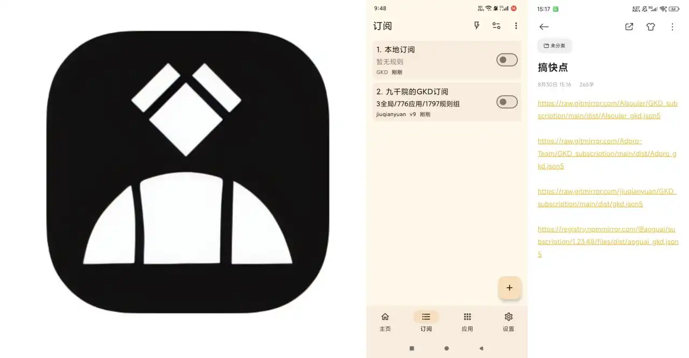

#### 搞快点

优点：效果立竿见影

缺点：驻留后台会增加耗电、杀死进程即无效

### **3. 权限控制：阻止摇一摇广告的触发**

摇一摇作孽太多，被央视点名以后稍显收敛，后续手机厂商做了权限控制。

摇一摇广告依赖 “获取设备动作与方向” 权限，通过系统设置直接关闭该权限，可以从阻止摇一摇的触发。

**图文版教程**

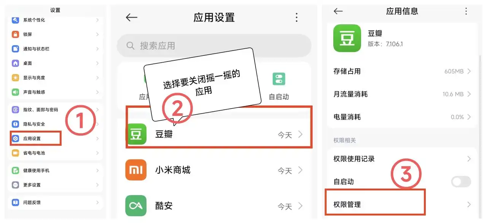

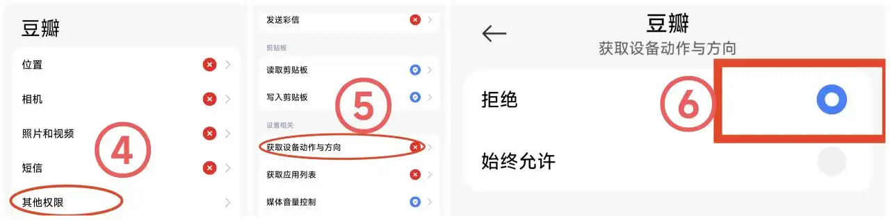

**文字版教程**

**操作方法**：进入系统设置→应用管理→找到需要关闭摇一摇的应用→权限管理→找到并关闭 “获取设备动作与方向” 或“传感器”权限

优点：无需额外工具

缺点：广告仍然存在，只是不会意外触发；需要手动为每个应用设置，较为繁琐

### **4.AdGuard：拦截广告请求**

通过**本地代理**拦截所有**网络请求**，当匹配到广告规则后阻止请求或返回空数据，**在广告内容加载前将其拦截**。

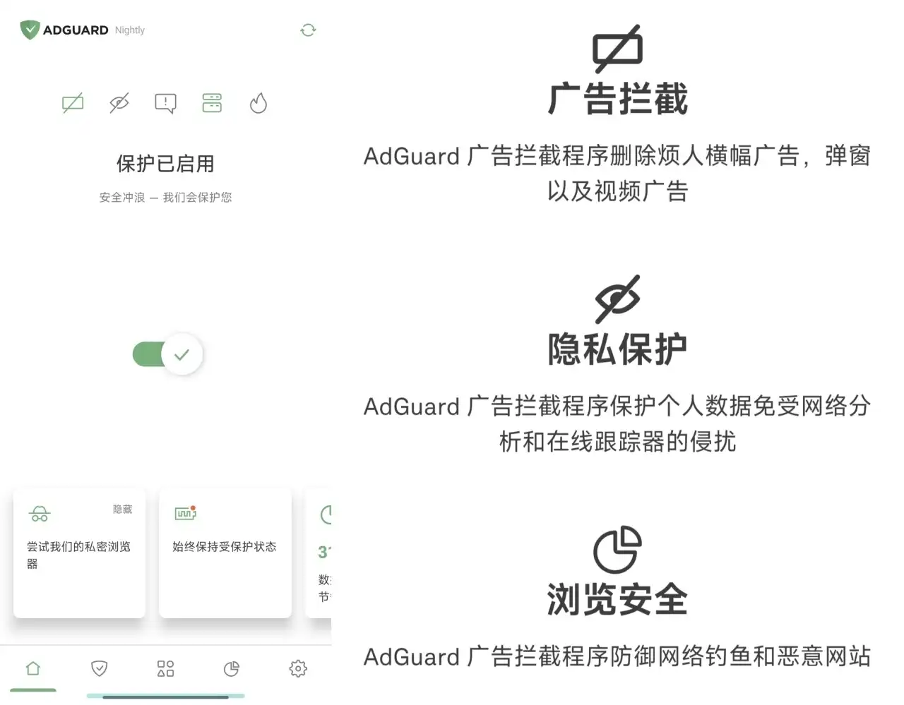

这有什么好处呢？可以**拦截**伪装成朋友圈的信息流广告、伪装成评论的**信息流广告**等等。

**理论上**可以**通杀**任何广告。同类工具还有 AdAway。

优点：覆盖范围广，支持多种广告形式

缺点：常驻后台，增加耗电；降低网络速度

### **5.Root 与插件：系统级广告拦截方案**

root 手机后获取**系统最高控制权**，使用 **Hosts 重定向**、**防火墙**规则**拦截广告域名解析和请求**。

推荐使用 AdAway 的 root 模式，修改 Hosts 文件，屏蔽广告域名。软件是开源的，GitHub 有大佬分享规则源。

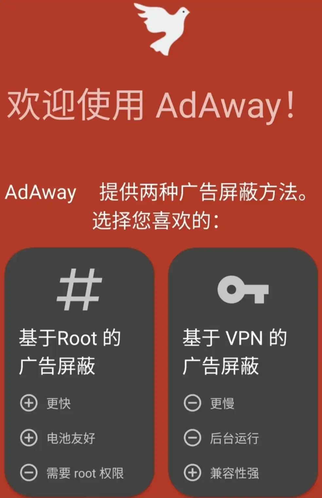

**插件**推荐小绿书 Top 大佬的 **AdGuardHome 模块**。

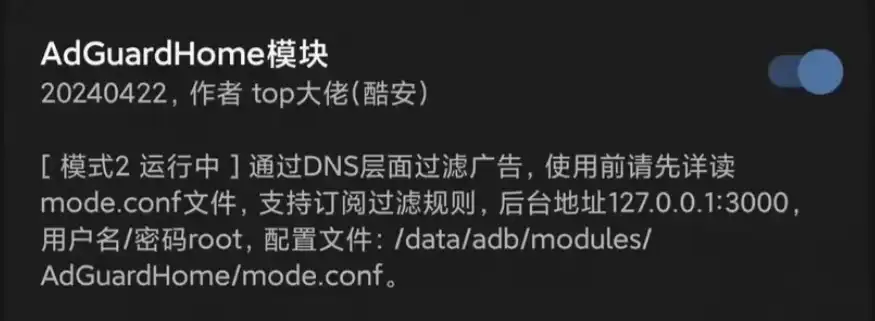

优点：一次配置，全局生效；效果最彻底

缺点：root 过程复杂，有变砖风险；银行类应用检测 root 会拒绝运行

### **6.LSPatch 修补：无需 root 的模块化方案**

利用无线调试启动 **Shizuku**，再授权给 **LSPatch** 工具，之后将 **Xposed 模块**直接**打包进 APK** 文件，实现无需 root 的**模块功能注入**。

需要模块支持修补模式

**操作步骤：**

获取原版 APK 和去广告模块→无线调试启动 Shizuku→授权并使用 LSPatch 进行修补→安装修补后的 APK

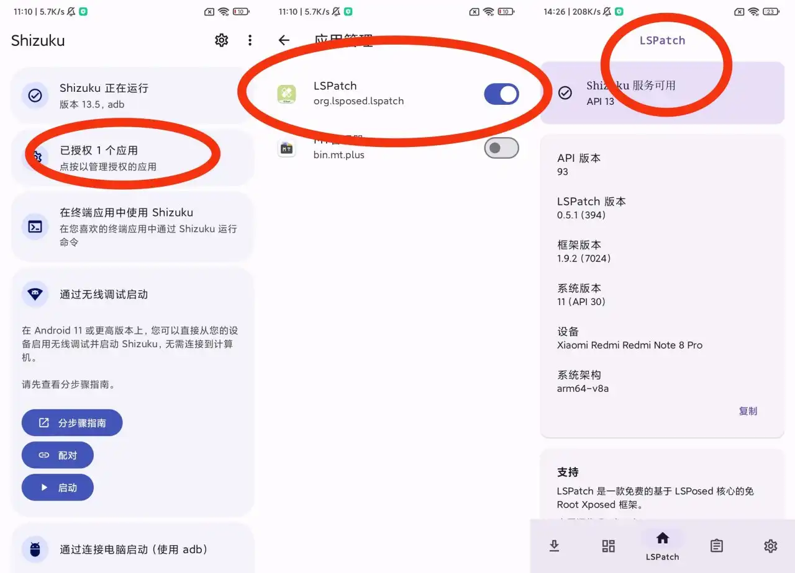

#### Shizuku 授权 LSPatch

优点：无需 root，相对安全

缺点：需要为每个应用单独处理；应用更新后需要重新修补；可能触发签名验证导致闪退

### **7.DNS 过滤：唯一平衡了效果和易用性的终极方案**

这是所有去广告方法中，我最推荐的一个。

**只需要在手机上输入一串网址，就能去除 95% 的 app 牛皮藓广告！**

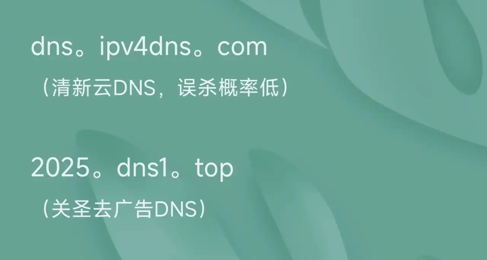

DNS 提供商在服务器搭建好广告域名黑名单，用户在智能设备（手机、平板、pc）配置好 DNS 后，当设备查询这些广告域名时，就会返回错误 IP(如 0。0。0。0) 或本地 IP，使广告无法加载，这样就达到了去除广告的效果。

这和 AdGuard、AdAway 本地代理模式有异曲同工之处，因为这两个 app 的去广告功能都使用了 DNS 过滤。

而 Android 9 + 自带 ** 私人 DNS 功能，** 与其使用需要常驻后台的应用，不如直接采用手机原生的 DNS 功能来过滤。

**配置方法：**

进入系统设置→网络和互联网→私人 DNS→选择 “私人 DNS 提供商主机名”→输入 DNS 服务地址

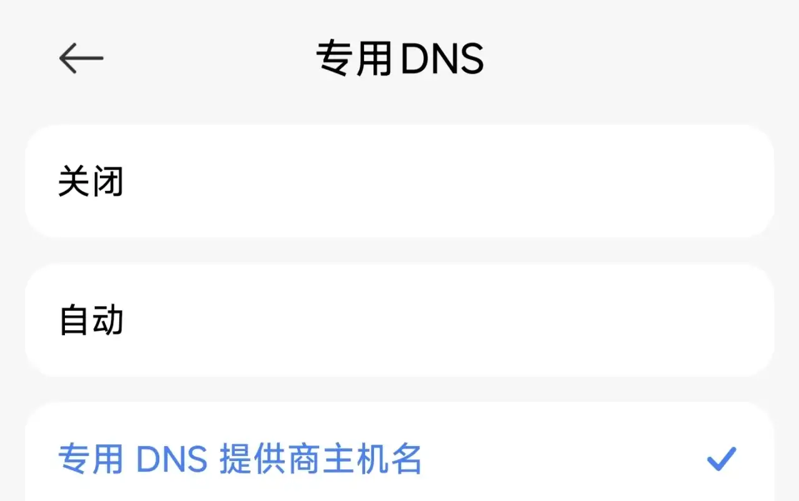

**Android 9 以下可以走 wifi 的 dns 解析。**

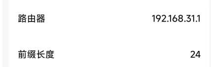

---

（此处二更 2026/07/01）： 感谢评论区佬友补充

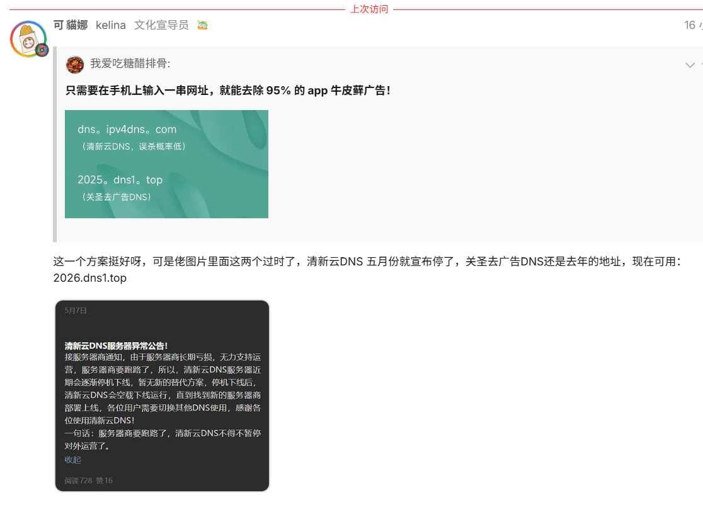

## 现在可用 DNS： 2026.dns1.top

三更：评论区现身说法

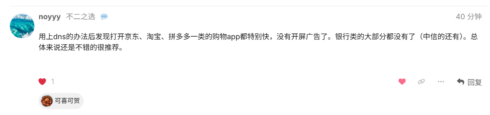

---

DNS 过滤**无需安装应用**，操作简单，一次配置，网页、应用**全局生效**，消耗更低的手机资源，获得和 AdGuard、AdAway 等应用几乎一样的效果。

优点：无需安装应用、网页和应用全局生效

缺点：少数顽固广告可能漏网、存在误杀、有时候会拖慢网速

# 为吸引更多技术人员加入分析，揭开流氓广告 / APP / 大数据杀熟，优化国内 APP 生态圈

# 本人主动放弃本文全部版权。

# 即日起，任何人可**随意转载、修改、搬运本文，无需署名，无需授权**
