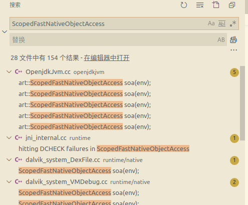
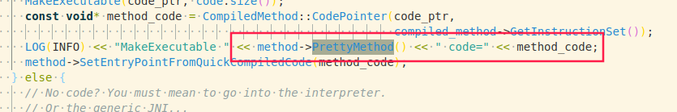
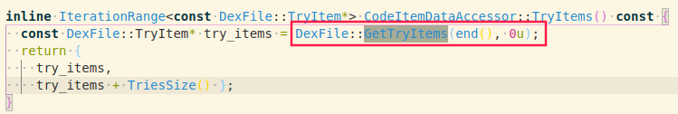
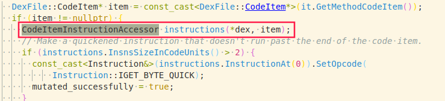

最近有点时间就尝试着移植 FART 到 Android 9.0 ，本文记录一下的整个过程。

# 获取 cloassloader 执行主动调用
首先修改 `frameworks/base/core/java/android/app/ActivityThread.java` 文件，添加以下内容。其中主要思想就是获取 apk 的 classloader 然后通过反射获取 dumpMethodCode 方法，执行主动调用，下面添加 dumpMethodCode 方法。

```
// add start
import android.os.Build;
import android.util.ArrayMap;
import android.util.Log;
import java.io.BufferedReader;
import java.io.File;
import java.io.FileInputStream;
import java.io.FileWriter;
import java.io.IOException;
import java.io.InputStreamReader;
import java.lang.ref.WeakReference;
import java.lang.reflect.Field;
import java.lang.reflect.InvocationTargetException;
import java.lang.reflect.Method;
import java.lang.reflect.Modifier;
import java.util.ArrayList;
import java.util.HashMap;
import java.util.List;
import java.lang.reflect.Constructor;
import dalvik.system.BaseDexClassLoader;
import dalvik.system.DexClassLoader;
// add end


// add start
    public static String CKCatTAG = "CKCatUnPack";
    public static Field getClassField(ClassLoader classloader, String className,
        String fieldName){
        try{
            Class clazz = classloader.loadClass(className);
            Field field = clazz.getDeclaredField(fieldName);
            field.setAccessible(true);
            return field;

        }catch(SecurityException e){
            e.printStackTrace();
        } catch (NoSuchFieldException e) {
            e.printStackTrace();
        } catch (IllegalArgumentException e) {
            e.printStackTrace();
        } catch (ClassNotFoundException e) {
            e.printStackTrace();
        }
        return null;
    }

    public static Object getClassFieldObject(ClassLoader classloader, String className, 
        Object obj, String fieldName){
        try {
            Class clazz = classloader.loadClass(className);
            Field field = clazz.getDeclaredField(fieldName);
            field.setAccessible(true);
            Object result = null;
            result = field.get(obj);
            return result;
        } catch (Exception e) {
            e.printStackTrace();
        }
        return null;
    }

    public static Object invokeStaticMethod(String className, String methodName,
        Class[] pareType, Object[] pareValues){
        try {
            Class clazz = Class.forName(className);
            Method method = clazz.getMethod(methodName, pareType);
            return method.invoke(null, pareValues);
        } catch(Exception e){
            e.printStackTrace();
        } 
        return null;
    }

    public static Object getFieldObject(String className, Object obj,
        String fieldName){
        try {
            Class clazz = Class.forName(className);
            Field field = clazz.getDeclaredField(fieldName);
            field.setAccessible(true);
            return field.get(obj);
        } catch (Exception e) {
            e.printStackTrace();
        }
        return null;

    }

    public static ClassLoader getClassLoader(){
        ClassLoader classloader = null;
        Object currentActivityThread = invokeStaticMethod("android.app.ActivityThread",
            "currentActivityThread", new Class[]{}, new Object[]{});
        Object mBoundApplication = getFieldObject("android.app.ActivityThread", 
            currentActivityThread, "mBoundApplication");
        Object loadedApkInfo = getFieldObject("android.app.ActivityThread$AppBindData",
            mBoundApplication, "info");
        Application mApplication = (Application)getFieldObject("android.app.loadedApk",
            loadedApkInfo, "mApplication");
        classloader = mApplication.getClassLoader();
        return classloader;
    }

    public static void loadClassAndInvoke(ClassLoader appClassloader, String eachClassName, 
        Method dumpMethodCode_method){
        Log.i(CKCatTAG, "go into loadClassAndInvoke->" + "classname:" + eachClassName);

        Class retClass = null;
        try {
            retClass = appClassloader.loadClass(eachClassName);
        } catch (Exception e) {
            e.printStackTrace();
            return;
        } catch (Error e) {
            e.printStackTrace();
            return;
        } 

        if (retClass != null) {
            try {
                Constructor<?> cons[] = retClass.getDeclaredConstructors();
                for (Constructor<?> constructor : cons){
                    if (dumpMethodCode_method != null) {
                        try {
                            dumpMethodCode_method.invoke(null, constructor);
                        } catch (Exception e) {
                            e.printStackTrace();
                            continue;
                        } catch (Error e) {
                            e.printStackTrace();
                            continue;
                        } 
                    } else {
                        Log.e(CKCatTAG, "dumpMethodCode_method is null ");
                    }
                }
            }  catch (Exception e) {
                e.printStackTrace();
            } catch (Error e) {
                e.printStackTrace();
            } 

            try {
                Method[] methods = retClass.getDeclaredMethods();
                if (methods != null) {
                    for (Method m : methods) {
                        if (dumpMethodCode_method != null) {
                            try {
                               dumpMethodCode_method.invoke(null, m);
                             } catch (Exception e) {
                                e.printStackTrace();
                                continue;
                            } catch (Error e) {
                                e.printStackTrace();
                                continue;
                            } 
                        } else {
                            Log.e(CKCatTAG, "dumpMethodCode_method is null ");
                        }
                    }
                }
            } catch (Exception e) {
                e.printStackTrace();
            } catch (Error e) {
                e.printStackTrace();
            } 
        }
    }

    public static void fart(){
        //获取当前 classloader
        ClassLoader appClassloader = getClassLoader();
        List<Object> dexFieldsArray = new ArrayList<Object>();

        // 获取 pathList 字段
        Field pathList_Field = (Field)getClassField(appClassloader, 
            "dalvik.system.BaseDexClassLoader", "pathList");
        Object pathList_object = getFieldObject("dalvik.system.BaseDexClassLoader", 
            appClassloader, "pathList");

        // 获取 dexElements
        Object[] dexElements = (Object[]) getFieldObject("dalvik.system.DexPathList", 
            pathList_object, "dexElements");

        Field dexFile_Field = null;
        try {
            dexFile_Field = (Field)getClassField(appClassloader, 
                "dalvik.system.DexPathList$Element", "dexFile");
        } catch (Exception e) {
            e.printStackTrace();
        }

        Class dexFileClazz = null;
        try {
            dexFileClazz = appClassloader.loadClass("dalvik.system.DexFile");
        } catch (Exception e) {
            e.printStackTrace();
        }

        Method getClassNameList_Method = null;
        Method defineClass_Method = null;
        Method dumpMethodCode_Method = null;
        // 通过反射获取获取 dumpMethodCode 
        for (Method method : dexFileClazz.getDeclaredMethods()){
            if (method.getName().equals("getClassNameList")) {
                getClassNameList_Method = method;
                getClassNameList_Method.setAccessible(true);
            }
            if (method.getName().equals("defineClassNative")) {
                defineClass_Method = method;
                defineClass_Method.setAccessible(true);
            }
            if (method.getName().equals("dumpMethodCode")) {
                dumpMethodCode_Method = method;
                dumpMethodCode_Method.setAccessible(true);
            }
        }

        // 获取 mCookie
        Field mCookieField = getClassField(appClassloader, "dalvik.system.DexFile", "mCookie");
        for (int i = 0; i < dexElements.length; i++) {
            Object element = dexElements[i];
            Object dexfile = null;
            try {
                dexfile = (Object)dexFile_Field.get(element);
            } catch (Exception e) {
                e.printStackTrace();
            }

            if (dexfile == null) {
                continue;
            }

            if(dexfile != null){
                dexFieldsArray.add(dexfile);
                Object mCookie = getClassFieldObject(appClassloader, 
                    "dalvik.system.DexFile", dexfile, "mCookie");
                if (mCookie == null) {
                    continue;
                }

                String[] classNames = null;
                try {
                    classNames = (String[])getClassNameList_Method.invoke(dexfile, mCookie);
                } catch (Exception e) {
                    e.printStackTrace();
                    continue;
                } catch (Error e) {
                    e.printStackTrace();
                    continue;
                }

                if (classNames != null) {
                    for(String eachClassName: classNames){
                        // 执行主动调用
                        loadClassAndInvoke(appClassloader, eachClassName, dumpMethodCode_Method);
                    }
                }
            }
        }

    }

    public static void fartthread(){
        new Thread(new Runnable(){

            @Override
            public void run(){
                try{
                    Log.e(CKCatTAG, "start sleep,wait for fartthread start......");
                    Thread.sleep(1*60*1000);
                }catch(InterruptedException e){
                    e.printStackTrace();
                }
                Log.e(CKCatTAG, "sleep over and start fartthread");
                fart();
                Log.e(CKCatTAG, "fart run over");
            }
        });
    }
    // add end

    /**  Core implementation of activity launch. */
    private Activity performLaunchActivity(ActivityClientRecord r, Intent customIntent) {

        ...
        // add start
        fartthread();
        // add end
        return activity;
    }
```

# 添加 dumpMethodCode 方法
在 `libcore/dalvik/src/main/java/dalvik/system/DexFile.java` 中声明 dumpMethodCode 方法。
```
//声明 dumpMethodCode 方法
private static native void dumpMethodCode(Object m);
```

在 `art/runtime/native/dalvik_system_DexFile.cc` 中实现 dumpMethodCode 方法。
```
// add start
#include "art_method-inl.h"
#include "class_linker.h"
#include "jni_internal.h"
#include "mirror/class-inl.h"
#include "mirror/object-inl.h"
#include "mirror/object_array-inl.h"
#include "reflection.h"
#include "scoped_fast_native_object_access-inl.h"
#include "well_known_classes.h"

extern "C" void myfartInvoke(ArtMethod* artmethod);

static void DexFile_dumpMethodCode(JNIEnv* env, jclass, jobject method){

  ScopedFastNativeObjectAccess soa(env);
  if (method != nullptr){
    ArtMethod* artmethod = ArtMethod::FromReflectedMethod(soa, method);
    myfartInvoke(artmethod);
  }
}
// add end
```

动态注册 dumpMethodCode 方法。
```
static JNINativeMethod gMethods[] = {
    ...
  NATIVE_METHOD(DexFile, setTrusted, "(Ljava/lang/Object;)V"),
  NATIVE_METHOD(DexFile, dumpMethodCode, "(Ljava/lang/Object;)V"),
};
```

在这里移植的时候遇到了一个问题，即 ScopedFastNativeObjectAccess 类的头文件名称改变了，后续通过如下方法找到。

在 vscode 搜索类 ScopedFastNativeObjectAccess ，如下图：



随便选择一个使用了该类的文件，查看头文件，最终发现 `native/scoped_fast_native_object_access-inl.h` 文件中定义了 ScopedFastNativeObjectAccess ，所以我们在自己的文件中添加该头文件即可。


# 添加 myfartInvoke 方法

在 `art/runtime/art_method.cc` 文件中添加 myfartInvoke 相关代码。
```
// add start
#include <pthread.h>
#include <sys/types.h>
#include <sys/stat.h>
#include <fcntl.h>
#include "runtime.h"
#include <android/log.h>
#include <assert.h>
#include <errno.h>
#include <fcntl.h>
#include <pthread.h>
#include <stdarg.h>
#include <stddef.h>
#include <stdlib.h>
#include <string.h>
#include <sys/mman.h>
#include <sys/socket.h>
#include <sys/types.h>
#include <sys/uio.h>
#include <sys/un.h>
#include <time.h>
#include <unistd.h>
#include <sys/syscall.h>
#include "dex/code_item_accessors-inl.h"
#define gettidv1() syscall(__NR_gettid)
#define LOG_TAG "CKCatUnPack"
#define ALOGI(...) __android_log_print(ANDROID_LOG_INFO, LOG_TAG, __VA_ARGS__)


uint8_t* codeitem_end(const uint8_t** pData){
  uint32_t num_of_list = DecodeUnsignedLeb128(pData);

  for (; num_of_list > 0; num_of_list--){
    int32_t num_of_handlers = DecodeUnsignedLeb128(pData);
    int num = num_of_handlers;
    if (num_of_handlers <= 0){
      num = -num_of_handlers;
    }

    for (; num > 0; num--){
      DecodeUnsignedLeb128(pData);
      DecodeUnsignedLeb128(pData);
    }

    if (num_of_handlers <= 0){
      DecodeUnsignedLeb128(pData);
    }
  }
  return (uint8_t*)(*pData);
}

extern "C" char* Base64EnCode(char* str, long strLen, long* outLen){
  long len;
  char* res;
  int i, j;
      const char *base64_table =
        "ABCDEFGHIJKLMNOPQRSTUVWXYZabcdefghijklmnopqrstuvwxyz0123456789+/";
    if (strLen % 3 == 0)
      len = strLen / 3 * 4;
    else
      len = (strLen / 3 + 1) * 4;

    res = (char *) malloc(sizeof(char) * (len + 1));
    res[len] = '\0';
    *outLen = len;
    for (i = 0, j = 0; i < len - 2; j += 3, i += 4) {
      res[i] = base64_table[str[j] >> 2];
      res[i + 1] =
          base64_table[(str[j] & 0x3) << 4 |
           (str[j + 1] >> 4)];
      res[i + 2] =
          base64_table[(str[j + 1] & 0xf) << 2 |
           (str[j + 2] >> 6)];
      res[i + 3] = base64_table[str[j + 2] & 0x3f];
    }

    switch (strLen % 3) {
    case 1:
      res[i - 2] = '=';
      res[i - 1] = '=';
      break;
    case 2:
      res[i - 1] = '=';
      break;
    }

    return res;
}

extern "C" void dumpDexFileByExecute(ArtMethod* artmethod)
SHARED_LOCKS_REQUIRED(Locks::mutator_lock_){
  char* dexfilepath = (char*)malloc(sizeof(char) * 2000);
  if (dexfilepath == nullptr){
      LOG(INFO) << "ArtMethod::dumpDexFileByExecute,methodname:"
        << artmethod->PrettyMethod(false).c_str() << "malloc 2000 byte failed";
        return;
  }

  int fcmdline = -1;
  char szCmdLine[64] = { 0 };
  char szProcName[256] = { 0 };
  int pid = getpid();
  sprintf(szCmdLine, "/proc/%d/cmdline", pid);
  fcmdline = open(szCmdLine, O_RDONLY);
  if(fcmdline > 0){
    int n = read(fcmdline, szProcName, 256);
    if(n > 0)
      close(fcmdline);
  }

  if (szProcName[0]){
      const DexFile* dexfile = artmethod->GetDexFile();
      const uint8_t* begin = dexfile->Begin();
      size_t size = dexfile->Size();

      memset(dexfilepath, 0, 2000);
      sprintf(dexfilepath, "%s", "/sdcard/fart");
      mkdir(dexfilepath, 0777);

      memset(dexfilepath, 0, 2000);
      sprintf(dexfilepath, "/sdcard/fart/%s", szProcName);
      mkdir(dexfilepath, 0777);

      memset(dexfilepath, 0, 2000);
      sprintf(dexfilepath, "/sdcard/fart/%s/%zu_dexfile_execute.dex", szProcName, size);
      
      int dexfilefp = open(dexfilepath, O_RDONLY);
      if (dexfilefp > 0){
        close(dexfilefp);
        dexfilefp = 0;
      } else {
        dexfilefp = open(dexfilepath, O_CREAT | O_RDWR, 0644);
        if (dexfilefp > 0){
          int n = write(dexfilefp, (void*)begin, size);
          if(n > 0)
            fsync(dexfilefp);
          close(dexfilefp);
        }
      }
  }

  if (dexfilepath != nullptr)
  {
    free(dexfilepath);
    dexfilepath = nullptr;
  }
}

extern "C" void dumpArtMethod(ArtMethod* artmethod)
SHARED_LOCKS_REQUIRED(Locks::mutator_lock_) {

  char* dexfilepath = (char*)malloc(sizeof(char) * 2000);
  if (dexfilepath == nullptr){
    LOG(INFO) <<"ArtMethod::dumpArtMethodinvoked,methodname:"
    << artmethod->PrettyMethod(false).c_str() << "malloc 2000 byte failed";
    return;
  }

  int fcmdline = -1;
  char szCmdline[64] = { 0 };
  char szProcName[256] = { 0 };
  int pid = getpid();
  sprintf(szCmdline, "/proc/%d/cmdline", pid);
  fcmdline = open(szCmdline, O_RDONLY);
  if (fcmdline > 0){
    int n = read(fcmdline, szProcName, 256);
    if(n > 0)
    close(fcmdline);
  }

  if (szProcName[0]){
    const DexFile* dexfile = artmethod->GetDexFile();
    const char* methodname = artmethod->PrettyMethod(false).c_str();
    const uint8_t* begin = dexfile->Begin();
    size_t size = dexfile->Size();

    memset(dexfilepath, 0, 2000);
    sprintf(dexfilepath, "%s", "/sdcard/fart");
    mkdir(dexfilepath, 0777);

    memset(dexfilepath, 0, 2000);
    sprintf(dexfilepath, "/sdcard/fart/%s", szProcName);
    mkdir(dexfilepath, 0777);

    memset(dexfilepath, 0, 2000);
    sprintf(dexfilepath, "/sdcard/fart/%s/%zu_dexfile_execute.dex", szProcName, size);
    
    int dexfilefp = open(dexfilepath, O_RDONLY);
    if (dexfilefp > 0) {
      close(dexfilefp);
      dexfilefp = 0;
    } else {
      dexfilefp = open(dexfilepath, O_CREAT | O_RDWR, 0644);
      if (dexfilefp > 0) {
        int n = write(dexfilefp, (void*)begin, size);
        if(n > 0)
          fsync(dexfilefp);
        close(dexfilefp);
      }
    }

    const StandardDexFile::CodeItem* code_item = (StandardDexFile::CodeItem*)artmethod->GetCodeItem();
    if (LIKELY(code_item != nullptr)) {
      int code_item_len = 0;
      uint8_t* item = (uint8_t*)code_item;
      if (code_item->tries_size_ > 0){
        CodeItemInstructionAccessor accessor(*dexfile, code_item);
        const uint8_t* handler_data = (const uint8_t*)DexFile::GetTryItems(accessor.end(), code_item->tries_size_);
        uint8_t *tail = codeitem_end(&handler_data);
        code_item_len = (int)(tail - item);
      } else {
        code_item_len = 16 + code_item->insns_size_in_code_units_ * 2;
      }

      memset(dexfilepath, 0, 2000);
      // data 的长度
      int size_int = (int)dexfile->Size();
      uint32_t method_idx = artmethod->GetDexMethodIndexUnchecked();
      sprintf(dexfilepath, "/sdcard/fart/%s/%d_%ld.bin", szProcName, size_int, gettidv1());

      int fp2 = open(dexfilepath, O_CREAT | O_APPEND | O_RDWR, 0644);
      if (fp2 > 0){
        lseek(fp2, 0, SEEK_END);
        memset(dexfilepath, 0, 2000);
        int offset = (int)(item - begin);
        sprintf(dexfilepath, "{name:%s,method_idx:%d,offset:%d,code_item_len:%d,ins:",
          methodname, method_idx, offset, code_item_len);

        int contentlength = 0;
        while(dexfilepath[contentlength] != 0)
          contentlength++;

        int n = write(fp2, (void*)dexfilepath, contentlength);
        if(n > 0)
          printf("");
        long outlen = 0;
        char* base64result = Base64EnCode((char*)item, (long)code_item_len, &outlen);
        n = write(fp2, base64result, outlen);
        if(n > 0)
        n = write(fp2, "};", 2);
        if(n > 0)
        fsync(fp2);
        close(fp2);
        if (base64result != nullptr){
          free(base64result);
          base64result = nullptr;
        }
      }
    }
  }

  if (dexfilepath != nullptr){
    free(dexfilepath);
    dexfilepath = nullptr;
  }
}

extern "C" void myfartInvoke(ArtMethod* artmethod)
 SHARED_LOCKS_REQUIRED(Locks::mutator_lock_) {
  JValue* result = nullptr;
  Thread* self = nullptr;
  uint32_t tmp = 6;
  uint32_t* args = &tmp;
  uint32_t args_size = 6;
  artmethod->Invoke(self, args, args_size, result, "Fart");
}

// add end
void ArtMethod::Invoke(Thread* self, uint32_t* args, uint32_t args_size, JValue* result,
                       const char* shorty) {
  // add start
  if (self == nullptr){
    dumpArtMethod(this);
    return;
  }
  // add end
  ...
}
```

在这里需要注意的是 PrettyMethod 方法和 GetTryItems 方法的参数有所改变，需要进行以下修改，可以参考上面关于 ScopedFastNativeObjectAccess 类查找头文件的方式进行修改，这里则关注那两个方法的使用和传参，然后再构造出相应的参数即可。由于这里主要关注的时移植，所以一些细节先这么处理了，后续可以在与阅读相关源码进行进一步处理。

```
 const StandardDexFile::CodeItem* code_item = (StandardDexFile::CodeItem*)artmethod->GetCodeItem();
    if (LIKELY(code_item != nullptr)) {
      int code_item_len = 0;
      uint8_t* item = (uint8_t*)code_item;
      if (code_item->tries_size_ > 0){
        CodeItemInstructionAccessor accessor(*dexfile, code_item);
        const uint8_t* handler_data = (const uint8_t*)DexFile::GetTryItems(accessor.end(), code_item->tries_size_);
        uint8_t *tail = codeitem_end(&handler_data);
        code_item_len = (int)(tail - item);
      } else {
        code_item_len = 16 + code_item->insns_size_in_code_units_ * 2;
      }
```







# 执行时 dumpDexFile
在 `/art/runtime/interpreter/interpreter.cc` 文件中的 Execute 方法中添加下列代码
```
extern "C" void dumpDexFileByExecute(ArtMethod* artmethod);

static inline JValue Execute(
    Thread* self,
    const CodeItemDataAccessor& accessor,
    ShadowFrame& shadow_frame,
    JValue result_register,
    bool stay_in_interpreter = false) REQUIRES_SHARED(Locks::mutator_lock_) {

  // add start
  if (strstr(shadow_frame.GetMethod()->PrettyMethod(false).c_str(),"<clinit>") != nullptr)
  {
    dumpDexFileByExecute(shadow_frame.GetMethod());
  }
  // add end
  ...
}
```
至此，整个 FART 的代码移植完成了，后续有时间再研究一下 libdexfile 相关代码。
