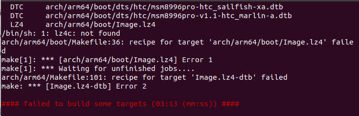

> 系统环境：Ubuntu 18.04.3
>
> 编译 Android 系统版本： 8.1

# 一、下载源码

由于国内网络环境问题，下列下载源码方式均未采用 google 官方提供的方式。

## 1. 下载 repo 工具

使用清华 mirror 下载 repo 工具

```
$ curl https://mirrors.tuna.tsinghua.edu.cn/git/git-repo -o repo
$ chmod +x repo
```

然后设置更新源：

```
export REPO_URL='https://mirrors.tuna.tsinghua.edu.cn/git/git-repo/'
```

## 2. 下载 Android 源码

因为 Android 的源码越来越大，repo sync 失败的概率也越来越高。
所以我们可以避开使用 repo sync 的方式，而采用下载预下载包的方式来实现：

```
$ wget -c https://mirrors.tuna.tsinghua.edu.cn/aosp-monthly/aosp-latest.tar # 下载初始化包
$ tar xf aosp-latest.tar
$ cd aosp   # 解压得到的 aosp 工程目录
$ repo init -u https://aosp.tuna.tsinghua.edu.cn/platform/manifest -b android-8.1.0_r1
$ repo sync # 正常同步一遍即可得到完整目录
```

> 参考：https://mirrors.tuna.tsinghua.edu.cn/

这里考虑到网络问题，sync 的过程中可能会意外断开，我们不可能一直守着看的，所以通过下面的脚本来完成代码的下载。将下面的内容保存为`start_repo.sh`，然后该脚本执行权限`chmod a+x start_repo.sh`，然后就是等待了，推荐晚上睡觉扔在那里下载，第二天就可以用了。

```
#!/bin/bash
echo "======start repo sync======"
./repo sync -j4
while [ $? = 1 ]; do
        echo "======sync failed, re-sync again======"
        sleep 3
        ./repo sync -j4
done
```

如果不想使用上述方式下载源码，可以使用国内用户提供的百度云盘连接下载：

```
http://pan.baidu.com/s/1ngsZs
```

以上连接来源自[此处](https://testerhome.com/topics/2229)。

## 3. android 源码查看所有分支切换分支

```
cd .repo/manifests
git branch -a   #查看所有分支

repo init -b android-4.1.2_r1   # 切换分支
repo sync
```

# 二、配置编译环境

## 1. 安装 JDK

官方 Android 版本与 JDK 版本说明：

```
Android 7.0 (Nougat) - Android 8.0 (O)：Ubuntu - OpenJDK 8；Mac OS - jdk 8u45 或更高版本
Android 5.x (Lollipop) - Android 6.0 (Marshmallow)：Ubuntu - OpenJDK 7；Mac OS - jdk-7u71-macosx-x64.dmg
Android 2.3.x (Gingerbread) - Android 4.4.x (KitKat)：Ubuntu - Java JDK 6；Mac OS - Java JDK 6
Android 1.5 (Cupcake) - Android 2.2.x (Froyo)：Ubuntu - Java JDK 5
```

安装 `openjdk-8-jdk` :

```
sudo apt-get update
sudo apt-get install openjdk-8-jdk
```

## 2. 安装编译所需要的包

```
apt-get -y install git-core gnupg flex bison build-essential zip curl zlib1g-dev gcc-multilib g++-multilib libc6-dev-i386 lib32ncurses5-dev x11proto-core-dev libx11-dev lib32z1-dev libgl1-mesa-dev libxml2-utils xsltproc unzip fontconfig
```

以上的依赖包在编译 `android-9.0.0_r36` 时测试没有问题，其中 `openjdk-8-jdk` 非必须。

## 3. 下载驱动

根据手机型号和 Android 版本下载对应的驱动

```
https://developers.google.com/android/drivers
```

下载完成后解压到`aosp`目录，并执行对应的脚本,最终会产生一个`vendor`目录。


## 4. 编译

首先运行`source build/envsetup.sh`:


执行 `lunch` ,选择需要编译的版本,执行 `make -j16` 进行编译。


编译成功


## 5. 刷机

为了保险期间，建议更新 bootloader 到相应的版本,可以去官方下载刷机包，刷入对应的 bootloader，我这里就是遇到了这个坑。

> https://developers.google.com/android/images/#sailfish

**刷机前，需要特别注意在 `setting->User & accounts` 中将 Google account remove 掉，否则刷完机后会要求登录刷机前的 Google 账户才允许进入 launcher 界面。这一点是需要特别注意的。**

首先`adb reboot bootloader`进入 bootloader 模式，然后进入下载好的刷机包，执行`./flash-base.sh`即可更行`bootloader`和`radio`了。

然后将路径切换到`out/target/product/sailfish`下，下面我们刷入其他镜像文件

> 首先是`boot.img`，执行`fastboot flash boot_a boot.img` 和 `fastboot flash boot_b boot.img` 。

> 接下来是`system.img`，执行`fastboot flash system system.img` 和 `fastboot flash system_b system_other.img` 。

> 最后是`vendor.img`，执行`fastboot flash vendor vendor.img` 。

当然如果你有自己定义，例如破解电信 4G 的 modem，可以执行 fastboot flash modem modem.img
最后通过 fastboot reboot，重启手机。

上列命令也可以使用下列命令进行替代

```
fastboot flashall -w
```

> 注意：此命令会在当前文件夹中查找全部 img 文件，将这些 img 文件烧写到全部相应的分区中，并又一次启动手机。


其他命令

```
//清空分区
# fastboot erase boot
# fastboot erase system
# fastboot erase data
# fastboot erase cache
上面的命令也可以简化成一条命令
fastboot erase system -w

//单刷
//最重要刷boot.img、system.img、userdata.img、vendor.img这四个固件.
# adb reboot bootloader
# fastboot flash boot boot.img
# fastboot flash system system.img
# fastboot flash userdata userdata.img
# fastboot flash vendor vendor.img
# fastboot flash recovery recovery.img //没有编出来，可选
# fastboot flash cache cache.img //没有编出来，可选
# fastboot flash persist persist.img //没有编出来，可选
# fastboot reboot

```

**遇到的坑**

我的手机版本是 7.1.2 的，然后直接刷机，开机后开机画面一闪而过，然后无限重启循环这个过程。

**解决**

先刷官方 8.1 的系统，在刷自己编译的 8.1 系统就可以了，具体原因就是 bootloader 没有更新到相应的版本。

下图为刷机成功的的手机系统信息。


# 三、编译内核并刷机

## 1. 获取内核源码

进入到源码根目录下的 kernel 文件夹中执行`git clone https://aosp.tuna.tsinghua.edu.cn/kernel/msm`,就可以下载到相应 msm 的内核源码了。
通过`https://source.android.com/source/building-kernels`页面找到设备对应的源码位置。


通过`git branch -r|grep marlin-kernel`命令查找对应的分支，然后通过`git checkout remotes/origin/android-msm-marlin-3.18-oreo-mr1`切换分支获取到源码。

## 2. 编译

修改内核目录下的 `Makefile` 文件，修改内容如下：

```
 # Note: Some architectures assign CROSS_COMPILE in their arch/*/Makefile
- ARCH           ?= $(SUBARCH)
- CROSS_COMPILE  ?= $(CONFIG_CROSS_COMPILE:"%"=%)
+ ARCH           ?= arm64
+ CROSS_COMPILE  ?= aarch64-linux-android-
+ SUBARCH           ?= arm64
+ CROSS_COMPILE_ARM32  ?= arm-linux-androideabi-

 # Architecture as present in compile.
```

回到`aosp`目录进行`source`，`lunch`操作，然后进入 msm 目录执行`make marlin_defconfig`，得到`.config`文件后，直接执行`make -j4`即可。

在编译过程中出现如下错误：

```
/bin/sh: 1: lz4c: not found
arch/arm64/boot/Makefile:36: recipe for target 'arch/arm64/boot/Image.lz4' failed
```



显然是`lz4c`没有找到，应该就是有依赖工具没有安装，通过`sudo apt-get install liblz4-tool` 安装即可，继续`make -j4`编译，最后得到`arch/arm64/boot/Image.lz4-dtb` 。


将上面编译得到的 Image.lz4-deb 文件复制到 aosp 源码目录下的 device/google/marlin-kernel 路径即可，然后到 aosp 源码根目录下执行 `make bootimage` 。


或者按下列命令生成 boot.img

```
export TARGET_PREBUILT_KERNEL=/media/ckcat/other/aosp/msm/arch/arm64/boot/Image.lz4-dtb
rm out/target/product/sailfish/boot.img &&  make bootimage
```

如果想要替换 `boot.img` 中的 `default.prop`,可以在 `build/core/Makefile` 中搜索关键字 `TARGET_RECOVERY_ROOT_OUT)/default.prop` 做如下修改，[参考](https://blog.csdn.net/XXOOYC/article/details/85679143):


最后按照前面所写的内容，使用`fastboot flash boot_a boot.img` 和 `fastboot flash boot_b boot.img` 刷入即可。如下截图可以看到 kernel 是使用`ckcat`的机器编译的。


> 参考: https://blog4jimmy.com/2018/02/418.html

# 四、错误处理

## 1. `flex-2.5.39: loadlocale.c:130: _nl_intern_locale_data: Assertioncnt < (sizeof (_nl_value_type_LC_TIME) / sizeof (_nl_value_type_LC_TIME[0]))' failed.` 错误。

bing 搜索之，在这个[链接中找到解法](https://stackoverflow.com/questions/49955137/error-when-build-lineageos-make-ninja-wrapper-error-1)。

```
export LC_ALL=C
```

把这行代码添加到 bashrc 文件中。
实测有效。

那么这句配置是什么意思呢？
搜索得到：
LC_ALL=C 是为了去除所有本地化的设置，让命令能正确执行。

**注意**

> 以上设置可能会导致 gnome-terminal 无法启动，通过 `grep "gnome-terminal" /var/log/syslog` 查看会发现是 `Non UTF-8 locale (ANSI_X3.4-1968) is not supported!`。此时删掉刚才设置的 `export LC_ALL=C` 即可。

参考： https://forums.linuxmint.com/viewtopic.php?t=280655

> 原文链接：https://blog.csdn.net/aaa111/article/details/80330848

## 2. adb 和 fastboot 都没有权限

> 可以参考 https://github.com/snowdream/51-android 或者 https://github.com/M0Rf30/android-udev-rules

## 3. adb devices 无法工作。

这是因为缺少 USB 驱动的原因，按照以下方法更新

1. 打开设备管理器
1. 查找未知的 Android 设备
1. 更新驱动程序
1. 浏览我的计算机以查找驱动程序软件
1. 让我从设备列表中选择，选择列出所有设备
1. 在 Android 设备 或 Google Inc 下，您会找到 Android Bootloader Interface
1. 选择 Android Bootloader 界面
1. 当它说驱动程序可能不兼容时单击 是

如果以上步骤 6 无法找到相应的设备，就需要安装对应的设备，参考网站 https://developer.android.com/studio/run/oem-usb#InstallingDriver 上的说明进行安装即可。

> 参考： https://stackoverflow.com/questions/8588595/android-fastboot-devices-not-returning-device

## SSL error when connecting to the Jack server. Try 'jack-diagnose'

原因就是编译时用的是 open-jdk 8u292，默认禁用了 TLSv1, TLSv1.1，
从`/etc/java-8-openjdk/security/java.security`中取消 TLSv1, TLSv1.1 禁用，
修改前

```bash
#   jdk.tls.disabledAlgorithms=MD5, SSLv3, DSA, RSA keySize < 2048
jdk.tls.disabledAlgorithms=SSLv3, TLSv1, TLSv1.1, RC4, DES, MD5withRSA, \
    DH keySize < 1024, EC keySize < 224, 3DES_EDE_CBC, anon, NULL, \
    include jdk.disabled.namedCurves
```

修改后:

```bash
#   jdk.tls.disabledAlgorithms=MD5, SSLv3, DSA, RSA keySize < 2048
jdk.tls.disabledAlgorithms=SSLv3, RC4, DES, MD5withRSA, \
    DH keySize < 1024, EC keySize < 224, 3DES_EDE_CBC, anon, NULL, \
    include jdk.disabled.namedCurves
```

`aosp/prebuilts/sdk/tools/` 目录下执行 `./jack-admin kill-server && ./jack-admin start-server` 成功。

# 其他

编译亲儿子内核时简单几步让版本信息和官方镜像一致，而不是显示 `-dirty` 。

```bash
adb shell cat /proc/version

export KBUILD_BUILD_VERSION=1
export KBUILD_BUILD_USER=android-build
export KBUILD_BUILD_HOST=xxx.google.com
export KBUILD_BUILD_TIMESTAMP="Web Feb 13 19:10:11 UTC 2019"
sed -i "s/#define LINUX_COMPILER/#define LINUX_COMPILER "'\\"gcc version xxx-google xxx \\(prerelease\\) \\(GCC\\) \\" # /' scripts/mkcompile_h
make xxx_defconfig
make -j7 KERNELRELEASE="xxx"
```

修改了 AOSP 源码之后，比如加了文件，哪怕在一个文件夹下，AS 开发时可以正常引用并使用里面的函数，但是编译时就是报找不到，此时要修改这个文件，将添加的文件包括进去。然后运行一次 `make update-api`。最后再 `m` 编译。
