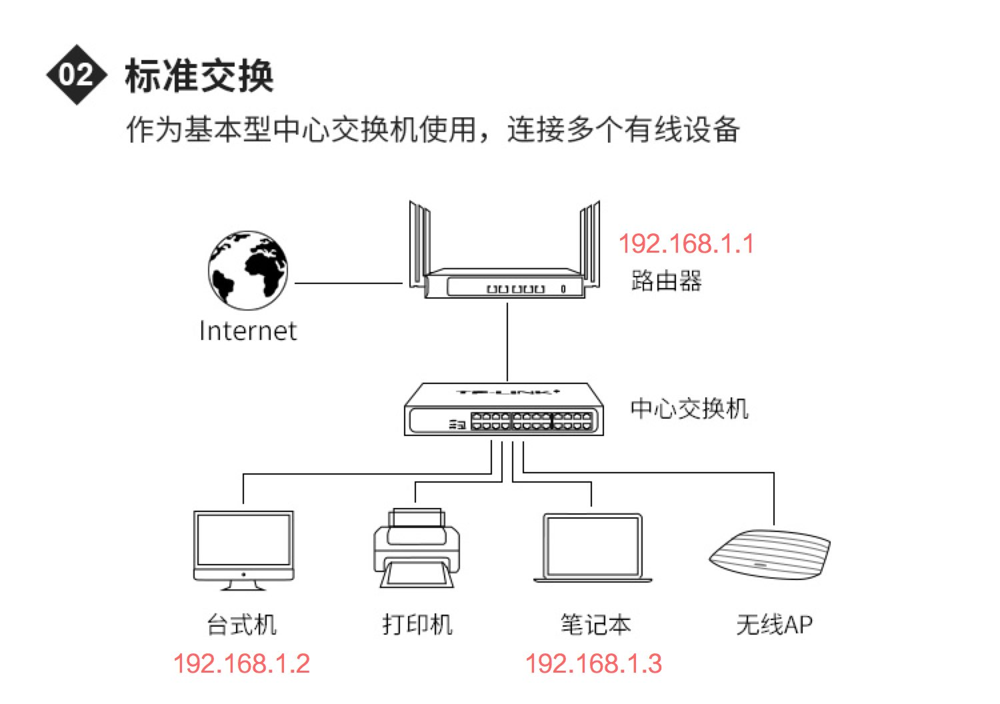

本文转自 https://lvwenhan.com/sort/tech-epic 中“软件工程师需要了解的网络知识：从铜线到 HTTP”的一系列文章。

# 前言

## 写作目标

本文面向中国互联网界众多的“应用软件工程师”，确切地说，面向 web 后端工程师（Java、PHP），web 前端工程师，移动开发工程师（iOS、Android）。本文将从铜线讲起，一路讲到 HTTP，为大家剖析出一个真实的“网络”。

## 写作由来

### 内容来源

前两天我给一个要跳槽的做 iOS 的哥们儿讲了几个小时的网络，给他的面试铺路，在讲之前，我就意识到了这次的内容如果能够整理一下将会是一套丰富的面向软件工程师的网络教程。

### 为什么是我

我装系统起家，从自己搭建网站开始了解 PHP 技术，大学期间通过做外包成了一名 web 全栈，毕业后创业因为招不到满意的 iOS 于是自己动手写 Swift——当时 Swift 刚刚发布半年，基础库匮乏而且还有缺陷，于是我自己造了一堆轮子，其中就有网络库，于是我对 HTTP 有了深入的理解（实际上超级简单没啥好深入的），又搞了 HTTPS pinning，加上我自己做后端和运维，自己申请、购买、部署证书，对 HTTPS 有了一些了解；后来再次创业自己搭建办公室网络，对路由器、交换机、网关、DHCP、DNS 等的概念有了亲身体会，加上我偶尔也会从我买了不看的书堆中找出《图解 HTTP/TCP,IP/网络硬件》啥的看一看，加上这次讲解的机会，终于融会贯通了。

### 说说融会贯通

大学时候我对计算机的理解融会贯通的点在“编译”，最近的融会贯通在于我看了神书《CS:APP》，对计算机系统又有了更深入的理解：硬件和操作系统是密切配合的；当前 x86_64 PC 的性能大部分来自于“缓存” + “乐观” 的概念。以后有机会的话我会写文章分享一下我的理解。

## 本文约定

本系列文章中，我们将进行如下几个重要约定：

本文目标是让软件工程师了解网络各层的本质，而不是事无巨细什么都讲
有些部分我将会用打比方的形式讲解，目的是让读者更容易理解，而不是每个细节都完全是真实情形
如果有我理解的不对的地方欢迎在评论里指出

# 以太网与交换机

## 网络七层、四层模型


四层模型是 TCP/IP 技术的实际模型，七层模型是标准化组织制订的理论规范，两者有如上图的对应关系。人们很少用到七层模型，一般常见的地方在负载均衡时：四层负载均衡和七层负载均衡，分别指的是在 TCP 和 HTTP 层面进行负载均衡。

## 以太网

### 历史沿革

Robert Metcalfe 在施乐帕洛阿尔托研究中心时发表了一篇名为《以太网：局域计算机网络的分布式包交换技术》的文章，随后获得了“具有冲突检测的多点数据通信系统”的专利，并于 1979 年创办了 3COM 公司，对，就是 H3C 的美国母亲。

### 以太网是什么

以太网是一系列标准，其显著特点是构造简单，可以多台计算机组成一个网络，虽然 IBM 的令牌环网理论上要比以太网优越，但是以太网胜在简单、便宜。实践证明，真正的计算机网络并不需要令牌环网的高吞吐量优势，而是更低价格更强扩展能力。以太网早期支持不同规格的同轴电缆和双绞线，最终双绞线技术胜出：可以实现更高速率。什么是同轴电缆呢？有线电视网络用的就是同轴电缆，起定义就是字面意思：两根线的轴是同一条线。

本文中我们只讨论最新的八芯双绞线实现的千兆网络，这也是当下最常见的局域网技术。

### 双绞线是什么

双绞线也是字面意思：八根铜线两两绞在一起，目的是尽量减少电磁干扰：电磁干扰是阻碍双绞线获得 10G、40G、100G 等更高带宽最大的阻力，当下更高速度的网络一般用光纤技术来实现。

八芯双绞线就是八根铜线绞在一起，双绞线里的铜线和 USB 线里的铜线没有任何区别，都是铜线，只有电导率、粗细、电阻 等基础电气属性的不同。

### 以太网传递的是什么

以太网传递的是电信号：一股又一股的电流而已。跟供电铜线不同的是，以太网协议确定了一系列的约定，让一股又一股的电流能够传递信息：0 或者 1。

### 个简化模型

六类双绞线实现千兆以太网时的工作频率是 250MHz，即每根铜线中的电流一秒钟都会改变 250 000 000 次，每一次都会携带一个电压：我们假设为 -5V 和 0V，代表 0 和 1，那么只需要四根铜线就能够实现 1Gbps 的单向带宽，另外四根用于实现反向 1Gbps 的带宽。

超五类双绞线实现千兆以太网时只有 125MHz 的频率，它采用一个电压表示两个位的方法来实现千兆网络：即一个电压代表 00 或 01 或 10 或 11。我们假设这四个电压分别是： -5V -3.5V -2V 0V。这样每两根铜线合在一起恰好可以实现 250Mbps 的双向传输（还需要两端设备支持串扰消除技术），八根铜线恰好实现 1Gbps 双向带宽。

### 一个关于计算机的常识

计算机内部许多电路的电压都不是标准的，例如主板标准电压为 12V，一般情况下实际电压都会稍高于这个数字。所以才有了各种纠错方法来保证信息传递的正确。

#### 小结论

超五类双绞线和六类双绞线虽然都能实现千兆网络，但是我们可以看出两者是截然不同的两种技术：六类双绞线由于本身电气性能有很大优势，所以需要的设备更简单，抗干扰能力更强，而超五类可以说是“勉强”实现了千兆网络，抗干扰能力差；如果电压因为电路问题或者受到外部干扰而产生了一些变化，很可能导致数据传输错误导致校验失败而引发重新传输，结果就是实测带宽无法达到千兆。我就遇到过超五类双绞线因为线材受损导致网络连接速度在 1G 和 100M 之间跳跃，最终导致网卡自动关闭的事情。

### 结论

全双工千兆以太网，实现的是每秒钟在网线的两个方向分别传递 1G 个的 0 或 1。

## 交换机

交换机是一种十分重要的设备，可以让多台计算机连入同一个局域网。以太网技术胜出的一大原因就是基于交换机技术可以实现低成本和高可靠性的网络扩展：对于早期计算机网络来说，没有什么比低成本地将新的计算机接入网络更激动人心的事情了。

以太网交换机典型的网络拓扑为树状：每一台交换机都可以下接 N 台计算机或交换机。

交换机工作在 OSI 模型的第二层（数据链路层），TCP/IP 模型的第一层。

### 局域网典型拓扑图



### 以太网帧


### 解读

物理层中的二进制数据会以上图中的格式进行组织，其基本单元被称为 MAC 帧。

每一台交换机的 MAC 帧 的长度都是一个固定的数值，多台交换机不一定一致
目的地址和源地址均为 MAC 地址，典型代表为 AA:BB:CC:DD:EE:FF，共有六段，每一段是一个两位的 16 进制数，十进制表示为 0-255，恰好可以用八位二进制数表示。所以 MAC 地址的长度为 8\*6 = 48 位。
类型字段采用 16 位二进制表示更上一层的网络层数据包的类型：IP、ARP、ICMP 等。
在理解网络的任何时候都要用位来表示数据，字节在这里毫无意义，只会干扰我们的大脑。

## 交换机工作原理

MAC 帧 中没有 ip 的概念，只有 MAC 地址的概念。

假设局域网中一台 ip 为 192.168.1.2 的电脑（插在交换机接口 1 上）希望打开 192.168.1.3 这台服务器（插在交换机接口 2 上）上的网页，就会发生如下事情：

1. 192.168.1.2 向局域网发出一个 ARP 包，询问拥有 192.168.1.3 这个 ip 的计算机的 MAC 地址，假设为 AA:BB:CC:DD:EE:FF
1. 将 TCP 数据包放在 IP 数据包的内部，再将 IP 数据包放在 MAC 帧 内部，通过 1 口将 MAC 帧 发给了交换机
1. 交换机拿到数据后，并不知道 AA:BB:CC:DD:EE:FF 这个 MAC 地址的设备插在自己的哪一个网口上，于是将这个 MAC 帧 发送到所有口上，包括 1 口
1. 2 口回应了，这时交换机就完成了第一次的自学习：AA:BB:CC:DD:EE:FF 这个 MAC 地址的设备插在自己的 2 口上，下次再转发就只发给 2 口就行了
1. 交换机会自己维护一个 MAC 地址 - 物理接口 对应关系的缓存表，并在一定时间内刷新这张表，重新缓存

### MAC 地址

世界上每一块网卡都有一个全世界唯一的 MAC 地址，由厂商向 IEEE 购买，再预先烧录进芯片里：每个有线网卡、每台路由器、每个无线网卡甚至每个蓝牙芯片都有自己的唯一 MAC 地址。

### 三层交换机

现在的网络组建特别是大型网络组建时，三层交换机会有很多应用，其本质是一种拥有部分路由器功能的高级交换机，感兴趣的同学可以自己了解。

## 结论

交换机第一次规范了双绞线中传递的 0、1 所代表的含义，这个就叫做“协议”。至此，交换机已经实现了局域网内数据的传递，可以由任意一台设备向任意一台设备传递二进制数据。

# TCP/IP

## 那些首部


一个 HTTP 请求发送到服务器上，需要在头部按顺序加上 TCP 首部、IP 首部、以太网首部，这样才能保证这个 HTTP 请求的二进制数据能够在复杂的网络环境中得到可靠的传输：这三个首部在经过各种网络设备时会被大量修改以实现正确传输：以太网首部在经过交换机时并不会被修改，但是 IP 首部 和 TCP 首部 在经过路由器时会被修改。

## TCP/IP 概述

当我们通过书本、博文等了解 TCP/IP 技术时，均将这两者作为两层来讲，似乎他们就是网络标准中的两个不同的虚拟化层级，但事实并没有这么简单。

### 我的虚拟化观

当初我学习《计算机组成原理》这本书的时候，我印象最深刻的就是里面对于计算机“虚拟化”的描述：只看计算机的硬件部分，其本质就是多层虚拟化：用逻辑电路、加法电路、积分电路、微分电路等模拟出算数逻辑单元、再和寄存器一起虚拟出运算器和控制器，配合由六个三极管组成一位的 SRAM 虚拟出的 L1、L2、L3 缓存，再配合由电容构成的 DRAM 虚拟出的“线性数组”内存，再由各种总线相互连接，实现了一个可以被操作系统软件控制的基础硬件平台。之后，这个基础硬件平台和操作系统一起虚拟出提供基本计算和逻辑判断服务的 CPU 以及可以被 C 指针读取的一个又一个内存存储单元。

计算机本身就是一层有一层虚拟化的产物，其复杂性远超我们日常生活中的复杂机械设备如汽车。计算机是一个纯粹的“人造”产物，是人类智能的集中体现。计算机从最底层的电路到最上层浏览器中显示出一个字，这背后正是虚拟化思想降低了复杂度，让人脑这个超低内存的计算机能够建造出如此纷繁复杂的计算机大厦。

### TCP/IP 的关系

IP 技术是从 TCP 技术中拆分得来的，如此多层的虚拟化显然不是一开始就这么设计的，人脑是趋利避害的，不会随意提高复杂度。

TCP/IP 技术源于美国军方自 1969 年起开始建设的控制点分散的网络系统 ARPAnet。1975 年，ARPAnet 的规模达到一百多台计算机，只靠传统的硬件协议（如以太网协议）已经很难再支撑更大规模的网络了，于是开始研发 TCP/IP 技术，并在 1980-1983 年间完成了内部转换。1983 年，支持异构网络的完全架空的 TCP/IP 协议正式发布。此处的异构网络指的是 ARPAnet、以太网、令牌环网、光纤网络（如 FDDI 和现在常说的 FTTH）、PPP 网络（如电话拨号 PPPoE）等 OSI 1-2 层的网络。

就在 1983 年，TCP/IP 被 Unix 4.2 BSD 系统采用。随着 Unix 的成功，TCP/IP 逐步成为 Internet 的标准网络协议，兼容多种物理实现。

### TCP/IP 和以太网

以太网诞生后，提供了一种简单的容易扩展的多台计算机相连接的电信号传输系统，能够一次性传输特定长度的 0、1 信息。以太网和 TCP/IP 是独立发展的，以太网是当前最成功的局域网技术，TCP/IP 则是整个 Internet 的标准协议：无论是局域网内常用的以太网，还是 FDDI 光纤网络，甚至是 LTE 4G 网络，都支持 TCP/IP 协议在其之上运行。从这个角度来看，TCP/IP 才是 Internet 的本体。

TCP/IP 协议簇是先有实现后有协议的，是从一个已经商用的成熟的网络架构中拆分出来的。

### IP 首部

像以太网帧拥有首部一样，IP 报文也是用首部来描述属性信息的。

### 详解图

以下为 ip 首部详解图（IPv4）：


### 简单解释

上图中每一行表示 32 位二进制数据。拥有 ip 首部特征的数据会被交换机、路由器、电脑网卡等以太网设备当做有效的 IP 报文（也称“IP 数据报”）。

### 重要数据描述

1. 总长度：界定了本次 ip 报文的长度，便于读取有效数据
1. 源地址：本次 ip 报文是由那个 ip 地址发出的
1. 目的地址：本次 ip 报文需要发给哪一台设备

源地址和目的地址均为 32 位（4 个字节）。我们常见的一个 IPv4 地址为：192.168.1.1，IPv4 地址范围为 0.0.0.0 - 255.255.255.255，255 为 2 的 8 次方减一，也就是说用八位二进制可以表示 0-255，四个八位即为 32 位。

#### 小 tip

1 字节等于八位，字节这个单位的出现是因为一个内存地址对应的数据长度为八位，是一个内存相关概念，在理解网络时我们最好抛弃这个概念，全部使用位。

### 结论

ip 层实际上就是规定了一个首部，里面最重要的数据是源 ip 地址和目的 ip 地址。

## TCP 首部


### 重要数据描述

1. TCP 首部中最重要的数据是源端口和目的端口
1. 他们各由 16 位二进制数组成，2^16 = 65536，即端口范围为 0-65535
1. 我们可以需要注意到，目的端口号这个重要数据是放在 TCP 首部的，和 IP 首部、以太网帧首部毫无关系

TCP 复杂的特性我们下一篇再解读。

# TCP 和路由器

## 基础梳理

1. 截至目前，我们已经得到了三个首部：以太网首部、IP 首部、TCP 首部。
1. 这三者看起来类似，实际却完全不同：
   a. 以太网首部是以太网技术提供的基础数据 package 功能：其数据包的长度是以太网独有的，和其他技术如光纤环网 FDDI 是完全不同的。实际上其他技术都不一定用的是 帧 这种基础逻辑单元，也不一定用的是这种简单的交换方式。
   b. IP 是网络层协议，其存在的意义是规定一种跨物理实现的“虚拟网络”，让这个网络在上层看来是一致的。从这个意义上来讲，IP 层是 Internet 的本体。IP 网络是真正的全球统一的网络。每一台接入网络的计算机都有一个 ip 地址。
   c. TCP 是传输层协议，其目的是在统一的 IP 层上实现“可靠”的信息传递。

## 可靠的 TCP

以太网数据帧和 IP 数据包都只是简单地规定了头部应该如何携带信息，而以太网帧并不保证能够送达，也不能保证按照顺序送达，出现了可靠性问题。

### 一个假设

假设我们需要从 192.168.1.2 向 192.168.1.3 发送一首歌，这首歌是真正的二进制数据，全部采用 0、1 组成，这样会便于我们理解，因为人脑处理文本信息的时候总是有一种障碍。

在没有 TCP 协议的情况下，我们知道了本机以及目标计算机的 ip 地址，我们将歌曲的二进制信息按照 1500 字节（12000 位）一块，分别包裹上 IP 首部和以太网首部，通过网口将这段 0、1 发送了出去。假设一共 2000 个 以太网帧。接着就会出现下面几种情况：

1. 前 1000 个 以太网帧被交换机完美地转发过去了，但是后 1000 个因为交换机受到干扰而没有发到 192.168.1.3 那里，歌曲放到一半就放不出来了。
1. 2000 个都发过去了，但是顺序错乱了：我们会得到一个放不出来的奇怪二进制文件。
1. 2000 个都发过去了，但是部分数据遭到了破坏，0 变成了 1，结果歌曲放一半播放器崩溃了。
   这时候我们就会发现只靠 IP 协议是无法满足所有通信要求的。

### 如何实现可靠传输？

TCP 通过校验、序列号机制、确认应答机制、重发控制、连接管理等特性实现了可靠传输。具体的特性不再展开叙述，因为 TCP 实在是太复杂，展开讲还能再写五个本文这么长的系列文章。下面我重点介绍 TCP 实现可靠传输的几个重点功能：

1. TCP 以 段 为基本单位发送数据，段的长度是在首次建立连接的时候双方约定好的。
1. 序列号和确认应答机制：每个段的发送都会携带一个整数序列号：当前段第一位在完整数据中的字节顺序，每次接收到一个段，远程计算机都要回复一个带序列号的“确认收到”。
1. 重发机制：首个段发送的时候使用一个比较大的 timeout 值，之后每次的 timeout 的值都是实时计算的，因为 TCP 希望在网络情况变化时也能够尽可能地提供高性能的传输。timeout 时间过了还没有收到携带本段序列号的“确认收到”，那就重发。
   TCP 还有基于窗口的发送速度优化、流量控制、拥塞控制等内容不再赘述。

### 三次握手和四次挥手

#### 三次握手


为了建立一个可靠的 TCP 连接，客户端和服务端之间需要进行三次数据发送：

- 客户端：我要建立连接。
- 服务端：收到。我也要建立连接。
- 客户端：收到。
  经历过这三个 IP 包的来往，这个可靠的 TCP 连接才算建立成功了。

#### 四次挥手


同上，经过这四次 IP 包的往来，双方都认为这个 TCP 连接已经断开了，相应的内存资源就可以释放了。

#### 为什么握手是三次而挥手是四次？

原因很简单：TCP 是全双工协议，即可以同时发送和接收数据，两条通道是完全独立的。

1. 尝试建立连接时，两者之间什么关系都没有，而“收到。我也要建立连接。”这两个动作是有顺序的，直接用一个 IP 包发送就可以了，节省时间。
1. 尝试断开连接时，“收到。我也要断开连接。”这两个动作之间还有其他事情要发生：客户端这边是不会再发送数据了，但是服务器发给客户端的 IP 包可能还在路上，所以两个方向的 TCP 流是并行的，要单独分别断开连接。

## 路由器

严格意义的路由器是工作在网络层的设备，即 IP 层。但是现代以太网路由器都是 路由器、网关、NAT 服务器、DNS 服务器、DHCP 服务器 的结合体，不少路由器还有防火墙功能。下面我将分开解释这几种功能。

### 路由器

Router 本质是一种“智能”设备，其会为经过它的每一个数据帧寻找一条最佳传输路径，以将该数据最有效地传送到目的站点。Internet 是网状的，而且是动态的，所以路由器是一种非常重要的设备，可以说是它保持了 Internet 的高性能。

### 网关

Gateway 是用于两个不同类型的网络之间通信的设备，例如实现两个以太网的相互通信，实现家庭以太网中的所有设备和光纤背后的服务器的通信。在实际场景中，网关将实现一个重要功能：沟通局域网中的设备和公网设备，例如让 192.168.1.2 这台计算机能够从 baidu.com 的服务器下载网页显示到浏览器上。

#### 子网掩码

一台计算机所拥有的 ip 地址和子网掩码配合，让这台计算机认识到了自己的局域网的范围在哪儿。我们采用家用网络中最常见的 192.168.1.2/255.255.255.0 的配合来解释它的作用：

1. 192.168.1.2 是本机的 ip，也是判定某个 ip 是不是局域网 ip 的基础
1. 255.255.255.0 的意思是前三段保持一致，最后一段 0-255 都是局域网 ip
1. 换句话说就是 192.168.1.0 - 192.168.1.255 都是和本机一个局域网的计算机
   那判断目标 ip 是不是同一个局域网有什么用呢？

1. 如果要连接的是局域网内的 192.168.1.3，那么连接方式将是：
   1. 发送 ARP 请求得到该 ip 地址对应的 MAC 地址
   1. 将数据包上 TCP 首部、IP 首部（目标 ip 地址 192.168.1.3）、以太网首部（目标地址是 192.168.1.3 的 MAC 地址），发送给交换机
   1. 交换机会直接将这个包发到目标计算机所在的网口上
1. 如果要连接的是 114.114.114.114 这个 ip，那么本机就会将这个包发给网关 192.168.1.1 ：

   1. 发送 ARP 请求得到网关的 MAC 地址
   1. 将数据包上 TCP 首部（目标端口 80，源端口 20000）、IP 首部（目标 ip 地址 114.114.114.114，源 ip 地址 192.168.1.2）、以太网首部（目标地址是 192.168.1.1 的 MAC 地址），发送给交换机
   1. 交换机会直接将这个包发到网关所在的网口上
   1. 网关收到了这个以太网帧，进行层层解包：
      1. 目标 MAC 地址是自己，说明这个包是合法的
      1. IP 首部中的目标 ip 地址不是自己，说明这是一个需要网关进行转发的数据包，接着进入转发流程：
         1. TCP 首部中，目标端口 80 不会变，但是源端口 20000 指的是 192.168.1.2 这台计算机的源端口，在网关 192.168.1.1 上这个端口已经被别的局域网机器用过了，该怎么办？修改端口
         1. 将 TCP 首部中的源端口改为 50000，将 IP 首部中的源 ip 地址改为本路由器的 WAN 口 ip，即公网 ip，发送出去。我们假设本路由器的公网 ip 为 106.0.0.1。
         1. 此时网关设备的内存里已经建立起了一个映射：50000 端口对应的是内网的 192.168.1.2 的 20000 端口，当来自 114.114.114.114 80 端口的 IP 包到达时，同样将目标 ip 地址从 106.0.0.1 改为 192.168.1.2，目标端口 从 50000 改为 20000，发送到局域网交换机上，再由交换机进行以太网帧转发。

### WAN 口、LAN 口

现代家用路由器一般有一个 WAN 口（广域网端口）和 4-8 个 LAN 口（局域网端口）。有多个 LAN 口本质上是集成了一个交换机。

### NAT 服务器

网络地址转换：将一个公网 ip 直接映射到一个内网 ip 上，当 IP 包经过路由器时，路由器会修改里面的 来源 IP 地址和目的 IP 地址，让双方都以为自己真的是和对方直接连接的。

### DNS 服务器

IP 网络中每一个网络终端都有一个 ip 地址，但是一串数字十分难记，于是域名便诞生了。路由器充当 DNS 服务器的目的是提升连接速度，节省局域网内设备的 DNS 查询时间。

### DHCP 服务器

提供自动分配 IP 服务，免去手动设置 ip 地址、子网掩码、网关、DNS 服务器的烦恼，让网络实现真正的即开即用。

# HTTP 和 HTTPS

## HTTP

在以前的文章中，我大力推荐过《图解 HTTP》这本书。这是一本好书，但是 HTTP 协议本身是一个静态协议：跟 HTML 一样是一堆标记的集合，十分简单。

我们首先明确一个简单的事实：TCP 首部后面的部分，依然是一堆二进制数据，但是此时，采用 HTTP 协议解析这堆数据之后，其内容终于可读了。

### HTTP 是什么

HTTP 是 WWW（万维网）拥有的标准协议，用于在客户端和服务器之间传递信息：服务器给客户端传递网页，客户端给服务端传递需要的页面的 URL，上传文件等。

### 前提

在讨论 HTTP 协议之前，我们必须首先认识到 HTTP 协议是站在巨人的肩膀上的：

1. HTTP 往下看，是 TCP 协议保证了可靠传输，再往下是 IP 协议保证了 Internet 的大和谐，再往下是以太网协议在局域网内传递信息，再向底层追究，是双绞线中的电压变化将 0、1 一步步向下传递的。
1. HTTP 协议很简单，但却提供一个体验良好的应用标准，到今天依然生命力旺盛。为什么？因为 TCP/IP 协议簇将复杂度消化了。

### 一个普通的 GET 例子

我们使用 Charles 反向代理软件可以轻易地得到 HTTP 协议的细节。下面我们展示一个普通的 GET 例子。使用浏览器访问 http://killtyz.com （自己尝试的时候不要选择 HTTPS 网站）：

#### 请求内容

```bash
GET / HTTP/1.1
Host: killtyz.com
Upgrade-Insecure-Requests: 1
User-Agent: Mozilla/5.0 (Macintosh; Intel Mac OS X 10_13_3) AppleWebKit/537.36 (KHTML, like Gecko) Chrome/64.0.3282.119 Safari/537.36
Accept: text/html,application/xhtml+xml,application/xml;q=0.9,image/webp,image/apng,*/*;q=0.8
Accept-Encoding: gzip, deflate
Accept-Language: zh-CN,zh;q=0.9
```

解释：

1. 第一行有三个元素：HTTP 方法、uri、HTTP 版本
1. 之后的每一行均以 : 作为间隔符，左边是 key，右边是 value（当然都是在 trim 之后）
1. HTTP 协议中，换行采用的不是 Linux 系统采用的 \n，而是跟 Windows 一样的 \r\n。

#### 响应内容

```html
HTTP/1.1 200 OK Date: Thu, 25 Jan 2018 10:36:10 GMT Server: Apache
Content-Length: 1321 Content-Type: text/html; charset=UTF-8 Proxy-Connection:
Close

<!DOCTYPE html>
<html lang="en">
  <head>
    <meta charset="UTF-8" />
    <title>KillTYZ 干掉拖延症</title>
    <link
      href="http://libs.baidu.com/bootstrap/3.2.0/css/bootstrap.min.css"
      rel="stylesheet"
    />
    <link rel="stylesheet" href="/css/main.css" />

    <script src="http://libs.baidu.com/jquery/1.11.1/jquery.min.js"></script>
    <script src="http://libs.baidu.com/bootstrap/3.2.0/js/bootstrap.min.js"></script>
    <script src="/js/main.js"></script>
  </head>
  <body>
    <div id="wrap">
      <div id="head">
        <div class="logo">
          
        </div>
        <div class="title">
          <h2>干掉拖延症</h2>
        </div>
      </div>
      <div class="content">
        <div id="box">
          <div id="add">
            <input
              id="add-input"
              type="text"
              class="form-control"
              placeholder="添加任务"
            />
          </div>
          <div id="list" class="list-group"></div>
        </div>
      </div>
      <div id="foot">
        &copy;2018 <a href="http://killtyz.com">KillTYZ</a> |
        <a href="https://github.com/johnlui/KillTYZ">Github Repo</a>
        <br />Powered by <a href="http://tinylara.com">TinyLara</a>
      </div>
    </div>
  </body>
</html>
```

响应的基本套路和请求一样，第一行的三个元素分别是 协议版本、状态码、状态码的简短解释。需要注意的只有一点：

#### HTTP header 和 HTTP body

1. 两个换行即 \r\n\r\n 之前的内容成为 HTTP header
1. 两个换行之后的内容称为 HTTP body
1. HTTP body 就是你在浏览器查看源代码看到的内容

### POST 例子

一下均为 Request 的 HTTP 内容。

`Content-Type: application/x-www-form-urlencoded`

```bash
POST /api/app HTTP/1.1
Host: killtyz.com
Content-Length: 18
User-Agent: Mozilla/5.0 (Macintosh; Intel Mac OS X 10_13_3) AppleWebKit/537.36 (KHTML, like Gecko) Chrome/64.0.3282.119 Safari/537.36
Cache-Control: no-cache
Content-Type: application/x-www-form-urlencoded
Accept: */*
Accept-Encoding: gzip, deflate
Accept-Language: zh-CN,zh;q=0.9

post=man&key=value
```

`Content-Type: multipart/form-data`

```bash
POST /api/app HTTP/1.1
Host: killtyz.com
Content-Length: 5195
User-Agent: Mozilla/5.0 (Macintosh; Intel Mac OS X 10_13_3) AppleWebKit/537.36 (KHTML, like Gecko) Chrome/64.0.3282.119 Safari/537.36
Cache-Control: no-cache
Origin: chrome-extension://fhbjgbiflinjbdggehcddcbncdddomop
Postman-Token: 45479b21-15fa-9232-ab8b-52c7dde8523d
Content-Type: multipart/form-data; boundary=----WebKitFormBoundary1s68Wb5ccTHj384y
Accept: */*
Accept-Encoding: gzip, deflate
Accept-Language: zh-CN,zh;q=0.9

------WebKitFormBoundary1s68Wb5ccTHj384y
Content-Disposition: form-data; name="image"; filename="QQ20141011-2.jpg"
Content-Type: image/jpeg

***二进制文件内容***
------WebKitFormBoundary1s68Wb5ccTHj384y
Content-Disposition: form-data; name="post"

man
------WebKitFormBoundary1s68Wb5ccTHj384y
Content-Disposition: form-data; name="oo"

xx
------WebKitFormBoundary1s68Wb5ccTHj384y--
```

#### Cookie 相关 Header

1. Set-Cookie：响应的 HTTP header 中如果有这个字段，那么浏览器会把这个字段的 value 设定到本地的 Cookie 里，配合服务端的 Session 可以实现登录状态临时记录的功能。
1. Cookie：会出现在请求的 HTTP header 中。Set-Cookie 设置的 Cookie 会有一个作用域名，一般为 www.baidu.com 或者 .baidu.com，在浏览器本地记录的众多 Cookie 中，只要有满足这个作用域名要求的，下一次 HTTP 请求发出的时候会把这些条 Cookie 全部带上。

更多详细解释需要的时候可以自己查，都是明码实价，童叟无欺的。

## HTTPS

HTTPS 这个名字取得不好，让很多人都误解了，以为他是和 HTTP 类似的协议，这是不对的。

HTTPS 全称为 HTTP Over TLS。（SSL/TLS 是一系列承前启后的加密协议族，此处统称为 TLS。）

### 什么是 TLS

TLS 中文名称为安全传输层协议，其目的是在客户端与服务端之间建立一个 防窃听、防篡改 的可信信息传递通道。

### 技术细节不再阐述

TLS 真正的组成非常的复杂，本文不想讨论那些技术细节，更不想讨论客户联和服务端建立连接的繁琐方式，什么先非对称加密再对称加密，一概不讨论；本文只进行概述、阐述特点。

#### 技术特点

TLS 采用非对称加密和对称加密结合的方式，在客户端和服务器之间建立起一个 防窃听、防篡改 的通信通道。TLS 具有以下特点：

1. 基于 TCP 协议，不需要再苦苦解决网络可靠性问题
1. 采用服务端部署证书的形式提供对称加密基础
1. TLS 连接首次建立的过程十分消耗资源，不仅费 CPU 还非常耗时（和简单不可靠的 HTTP 比）
1. TLS 没有完美实现 防窃听、防篡改 功能：中间人攻击依然存在相当大的可能性

### TLS 实现原理

我从证书的两种签名方式来讲解 TLS 实现原理的简单描述，并分别阐述当前 HTTPS 证书的两大层面的功能。

#### 自签名 TLS 证书

任何一台安装了 OpenSSL 开源软件的计算机均可以生成 TLS 证书并签名。制造自签名证书分为以下几步：

1. 使用 RSA 算法生成私钥。私钥为绝密，由于证书公开，所以拥有私钥的人将实质上拥有证书的所有权。
1. 生成与私钥一对一的根证书，并填入 TLS 证书需要的必要信息（common name 等）。
1. 采用严格配对的 私钥+证书 部署 Apache 或 Nginx。

#### 第三方签名的 TLS 证书

分为以下几步：

1. 使用 RSA 算法生成私钥。私钥为绝密，由于证书公开，所以拥有私钥的人将实质上拥有证书的所有权。
1. 生成与私钥一对一的 csr 文件。
1. 将此文件上传到证书颁发商的网站，他们将用他们的 根证书 或者 从根证书派发出的二级证书 为我们的 csr 文件签名，得到 TLS 证书。期间会填入经过他们实际验证的必要信息，如 common name 和公司名称。
1. 采用严格配对的 私钥+证书 部署 Apache 或 Nginx。

#### 最重要的一点

RSA 公钥加密算法从数学上决定了无法从公开的信息（证书）反推出私钥。所以说，只要私钥不泄露，哪怕有人自己写代码强制使用公开的 TLS 证书和他自己伪造的私钥也是不可能的：数学上无法成立，根本就没法和客户端正常交互建立 TLS 连接。

#### 防窃听、防篡改

- 防窃听：TLS 内部携带的数据就是完整的 HTTP 协议，request 和 response 都会被加密，完全无法破解，除非 RSA 算法被破解。TLS 还会在表面上加上少许 HTTP header，只有极少数必要信息如域名等。所以，就算 Twitter 用了 HTTPS，功夫网还是能够侦测出你在访问 Twitter。
- 防篡改：TLS 会对每一次数据交互进行严格的校验。HTTP 时代大家饱受运营商劫持的困扰，本质就是对 HTTP 数据的篡改，明文的嘛，正常。TLS 层中的数据被修改一位，这个 TLS 连接就会崩塌，两边瞬间就都知道了。

#### 当前 HTTPS 技术的两层功能

1. 加密。无论证书是自签名还是服务商签名，只要证书没有过期，就可以实现加密，保证信息传递的防窃听、防篡改。
1. 可信。全球数十家服务商的根证书是预置在操作系统内部的：iOS、macOS、Windows 都是这样。因为我们的计算机信任根证书，所以才信任由其派生出的二级及三级证书。可信虽然会在 Chrome 上被标红，但却可以“仍然继续”跳过；而证书过期则不行：TLS 连接都无法建立，Chrome 想继续都继续不了呀。

### TLS 的局限

TLS 虽然很强大，还是有一些问题。我们先说小问题，再说大问题。

#### 安全要求不完善

TLS 证书是标准证书，和 HTTP 业务无关，这就导致我们必须采用现成的字段来保存这个证书可以用于那些域名：common name 字段。

我们知道，协议 + 域名 + 端口 组成了一个“域”，域是浏览器中的基本安全单位，用在很多地方。TLS 证书等于说放开了端口这个要求，这样一来一个证书就可以被部署到任意的 N 个端口上。

#### 中间人攻击风险依旧

中间人攻击指的是中间有一个人伪造是你想连接的那台服务器，窃取你的信息：在咖啡厅开一个假 wifi，就可以通过修改 DNS 的方式假装你的笔记本是百度的服务器，这样就可以获取想要的信息了。TLS 防止的是传输过程中的防窃听、防篡改，无法解决服务端伪造问题。

中间人攻击分为三个方式：

1. HTTP 转 HTTPS。早期网银攻击经常采用这种方式：用户访问网银网站，浏览器默认发出的是 HTTP 请求，本来该网站会将用户跳转到 HTTPS，但是中间人从中作梗：跟客户交流时采用 HTTP，跟银行交流时采用 HTTPS，这样你的银行卡和密码就全暴露了。
1. 合法证书方式。采用特殊手段签出一张合法的证书，正大光明地做中间人。
1. 终端自残式。破坏自己的终端，强制让自己的操作系统信任一张全域名证书：这样任何网络请求都是明文了。所以 HTTPS 防不了 APP 破解者。
   除非客户端和服务端预先进行信息约定，不然从理论上讲是不可能建立一个完全可信的加密数据通道的。

#### 防止中间人攻击的方法

只有一个：在 APP 中内置证书，每次建立连接时都进行比对。感兴趣的可以到我的网站搜 SSL，我专门阐述了如何设置 SSL pinning（钢钉）。

## 总结

HTTP 真的是一种十分简单的协议，HTTPS 只要了解了 TLS 的基本概念也不复杂，复杂度都在 TCP/IP 那里被消化了。

可能还会有下一篇，讲讲我对一些关于网络的著名问题及争论的理解。大家有什么想了解的也欢迎留言。
